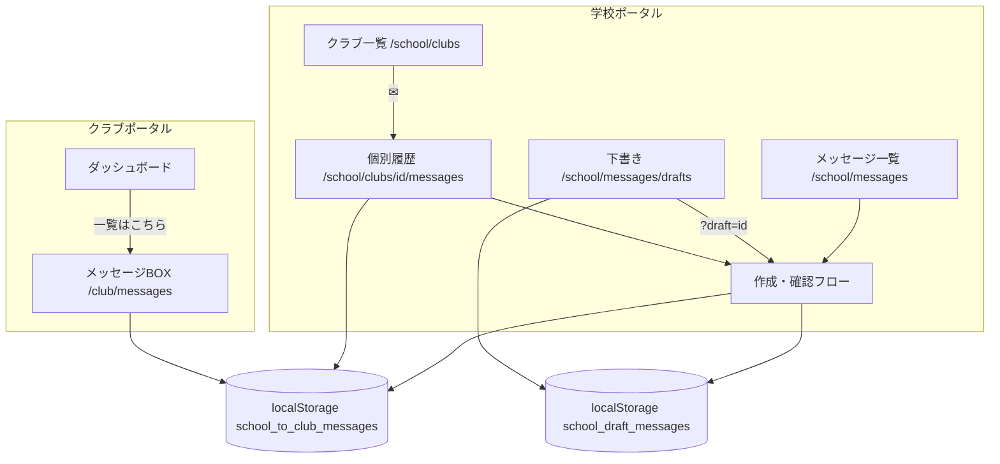

# 学校・クラブ間 メッセージBOX機能 完全仕様書

| 項目 | 内容 |
|------|------|
| 文書名 | 学校・クラブ間 メッセージBOX機能 完全仕様書 |
| 版 | 1.0（実装完了版） |
| 対象読者 | 開発者、導入支援、プロダクトオーナー |
| 関連ルート（学校） | `/school/messages`、`/school/messages/drafts`、`/school/clubs/{clubId}/messages` |
| 関連ルート（クラブ） | `/club/messages`、`/club/dashboard`（メッセージBOXプレビュー） |
| データ永続化（デモ） | ブラウザ `localStorage` |

---

## 1. 全体概要・基本方針

- **目的**: 学校管理者（および監査、システム）から、各部活動（クラブ）への連絡・通達を円滑に行うためのメッセージインフラ。
- **通信方向**: 学校からクラブへの【完全な一方通行連絡】（クラブ側からの返信は不可、受領確認のみ）。
- **データ永続化**: サーバー不要でモック動作するよう、ブラウザの `localStorage` を活用。例外処理（`try-catch`）を徹底し、データ空時のクラッシュを完全防止。
- **変更通知**: 送信・既読・受領確認・下書き保存時にカスタムイベント `kurasaokaikei-portal-messages-changed` および `kurasaokaikei-portal-drafts-changed`（下書き）を発火し、同一タブ内の UI を更新。`storage` イベントも併用。

### 1.1 localStorage キー一覧

| キー | 用途 | 正本 |
|------|------|------|
| `school_to_club_messages` | 送信済みメッセージ（学校・クラブ双方が参照） | ○ |
| `portal_messages` | 旧キー（初回読み込み時に `school_to_club_messages` へ一度だけ移行） | レガシー |
| `school_draft_messages` | 学校ポータルの下書き配列 | ○ |

### 1.2 主要実装ファイル

| 領域 | ファイル |
|------|----------|
| メッセージ本体 | `src/lib/portalMessages.ts` |
| 下書き | `src/lib/portalDraftMessages.ts` |
| 学校・一覧/作成 | `src/components/school/SchoolMessagesView.tsx` |
| 学校・下書き一覧 | `src/components/school/SchoolDraftsView.tsx` |
| 学校・クラブ宛作成 | `src/components/school/SchoolClubComposeForm.tsx` |
| 学校・担当者宛作成 | `src/components/school/SchoolStaffComposeForm.tsx` |
| 学校・個別クラブ履歴 | `src/components/school/SchoolClubMessageView.tsx` |
| 学校・履歴テーブル UI | `src/components/school/SchoolMessageHistoryUi.tsx` |
| ページタイトル（子帯） | `src/components/shared/MessageBoxTitleBand.tsx` |
| クラブ・メッセージBOX | `src/components/club/ClubMessagesView.tsx` |
| クラブ・一覧行 | `src/components/club/ClubMessageListItem.tsx` |
| クラブ・詳細＋確認 | `src/components/club/ClubMessageDetailPanel.tsx` |
| クラブ・送信元バッジ | `src/components/club/ClubMessageSenderBadge.tsx` |
| 学校サイドメニュー | `src/components/layout/school/SchoolSidebar.tsx` |

---

## 2. データモデル

### 2.1 PortalMessage（送信済み・正本）

```typescript
type PortalMessage = {
  id: string
  subject: string
  body: string
  sentAt: string              // ISO 8601
  targetClubId: string        // "all" = 全クラブ、個別クラブID、担当者は "staff-all" 等
  targetClubName: string
  readByClubIds: string[]     // クラブごとの既読
  confirmedByClubIds: string[] // クラブごとの「メッセージを確認しました」
  kind: "general" | "settlement_deadline"
  sender?: "school" | "audit" | "system"
  audience?: "club" | "staff"  // 未指定は club（既存互換）
}
```

### 2.2 SchoolMessageDraft（下書き）

```typescript
type SchoolMessageDraft = {
  id: string
  updatedAt: string           // ISO 8601（一覧の日時表示に使用）
  audience: "club" | "staff"
  targetId: string
  targetName: string
  subject: string
  body: string
}
```

### 2.3 クラブ向け表示モデル（ClubPortalMessageView）

一覧・詳細・ダッシュボードプレビュー共通。`PortalMessage` からクラブ ID 単位で変換。

- `date`: `YYYY/MM/DD`（例: `2026/05/25`）
- `time`: `HH:mm`（例: `22:30`）
- `isRead`: `readByClubIds` に当該クラブ ID が含まれるか
- `isConfirmed`: `confirmedByClubIds` に当該クラブ ID が含まれるか
- `sender` / `senderLabel`: 送信元バッジ用

### 2.4 送信元（クラブ表示）

| sender 値 | バッジ表示 | 配色（デモ） |
|-----------|------------|----------------|
| `school` | 学校 | 青背景・白文字 `#2563EB` |
| `audit` | 監査 | オレンジ背景・白文字 `#EA580C`（送信ロジックは将来、`sendAuditPortalMessage` スタブあり） |
| `system` | クラサポ | 緑背景・白文字 `#059669` |

---

## 3. 管理者（学校ポータル）側の仕様

### A. サイドメニューの階層化（親子関係）

- 「メッセージBOX」を親メニューとし、クリックするとアコーディオン形式で以下の2つの子メニューが展開する。
  1. **「メッセージ一覧」** → `/school/messages`（送信履歴の確認および新規作成の入り口）
  2. **「下書き」** → `/school/messages/drafts`（下書き保存されたメッセージの再編集・管理画面）

- 親メニューはページ遷移せず展開のみ（クラブ管理・設定と同様の UI パターン）。

### B. メッセージ新規作成＆確認フロー

#### B-1. タブ構成（メッセージ一覧画面）

- **クラブ宛て** タブ: クラブ向け送信履歴＋「クラブへ新規作成」
- **管理担当者宛て** タブ: 担当者向け送信履歴（デモ）＋「管理担当者へ新規作成」

#### B-2. 入力フォーム

- 件名のプレースホルダーに「例：」を明記。
  - クラブ宛て例：**「例：2026年度収支報告書提出期限のお知らせ」**
  - 管理担当者宛て例：**「例：2026年度決算の監査依頼」**
- 送信先・件名・本文は必須（クラブ宛て）。管理担当者宛ては件名・本文必須。

#### B-3. 作成画面のボタン（入力ステップ）

- 直接「送信」は行わない。
- **「確認画面へ」**（メインのアクション色 `#4A90E2`）と **「下書き保存」**（アウトライン）の2つのボタンを**左寄せ**（タイト幅 `max-w-3xl`）で配置。
- **「キャンセル」**: 一覧へ戻る（入力内容は破棄せず一覧に戻る操作；一覧から再度作成を開いた場合は新規）。

#### B-4. 確認画面（ワンクッション）

- 「確認画面へ」押下後、入力内容（送信先・件名・本文）を**編集不可のプレビュー**で表示。
- 最下部に次の3ボタンを左寄せで配置:
  1. **「送信」**: 正式送信。`school_to_club_messages` に保存。編集中の下書き ID がある場合は下書きを削除。
  2. **「下書き保存」**: 現在内容を `school_draft_messages` に保存（新規または上書き）。
  3. **「キャンセル」**: 入力画面（フォーム）に戻る。**入力内容は保持**。
- 確認画面の戻るリンク表記: 「入力画面に戻る」。

#### B-5. 個別クラブからの作成（✉ 動線）

- クラブ管理 ＞ クラブ一覧の ✉ から作成画面に進んだ場合:
  - **送信先は最初からそのクラブ名で固定**（読み取り専用表示、変更不可）。
  - 上記と同様に「確認画面へ」「下書き保存」フローを利用。
  - 「一覧に戻る」「履歴一覧に戻る」は個別履歴画面へ。画面最上部「クラブ一覧に戻る」で `/school/clubs` へ。

### C. 送信履歴一覧（メッセージ一覧 / 下書き）

#### C-1. ページタイトル（子帯）

- **「集金管理 ＞ 集金実績」**のページタイトルと完全に統一:
  - 白背景、`rounded-t-lg`、`border`、左 **5px** アクセント（学校メッセージBOX は `#4A90E2`）
  - 見出し `text-xl font-semibold`、テーマ色の文字色
  - 補足文 `text-sm text-[#6B7280] mt-0.5`（任意）
- 背景色の横長「色帯」は**使用しない**。

#### C-2. レイアウト幅

- コンテンツは **`max-w-3xl`・左寄せ**（`mx-0 w-full max-w-3xl`）。
- 学校ヘッダー（紺色帯）は AppShell 共通のまま。その下のページ本体が上記幅。

#### C-3. テーブル（メッセージ一覧・下書き一覧共通）

- **見出し（ヘッダー行）**: `日付` ｜ `時間` ｜ `送信先` ｜ `件名`
  - 見出しの文字**のみ中央寄せ**（`text-center`）
  - ヘッダー背景: `#EFF6FF`、sticky
- **グリッド列幅（共通）**: `grid-cols-[6.5rem_3.5rem_8.5rem_minmax(0,1fr)]`
- **データ行**:
  - 日付 `YYYY/MM/DD`、時間 `HH:mm`、送信先、件名
  - 縦軸のラインが揃う配置。データは**左寄せ**
  - 送信先表示（クラブ宛て）: `全クラブ宛て` / `個別：{クラブ名}`
  - 件名・送信先が長い場合は `truncate` + `title` で全文ツールチップ
  - **行全体クリック**で詳細画面へ（下書き一覧はクリックで `/school/messages?draft={id}` へ遷移し再編集）

#### C-4. 詳細画面（送信済み）

- 一覧から行選択で同一画面内に詳細パネル表示（タブ維持）。
- 日時（結合表示）、件名、送信先、本文（`pre`・改行保持）。
- 「一覧に戻る」で一覧へ。

#### C-5. 下書き一覧

- ルート: `/school/messages/drafts`
- テーブル形式はメッセージ一覧と同一（ステータス列なし）。
- 空時文言: **「下書きはありません」**
- 行クリック → メッセージ一覧の作成画面を、下書き内容・タブ（club/staff）で開く。

### D. クラブ管理 ＞ クラブ一覧（個別対応動線）

#### D-1. 遷移

- 各クラブ行の **✉（メールマーク）** → `/school/clubs/{clubId}/messages`

#### D-2. 個別メッセージ履歴画面

- **フィルタ**: `loadSchoolClubMessagesForClub(clubId)`  
  - 送信先が **「すべて（全クラブ）」=`all`** または **当該クラブ ID** のメッセージのみ
  - クラブ宛て（`audience !== "staff"`）のみ
- 右上 **「クラブへ新規作成」**: 宛先固定の作成フローへ。
- 「クラブ一覧に戻る」→ `/school/clubs`

#### D-3. ステータス列（個別画面のみ）

- 全体メッセージBOX（メッセージ一覧タブ）には**ステータス列を表示しない**。
- 個別画面のみ、列を追加: `日付` ｜ `時間` ｜ `送信先` ｜ `件名` ｜ **`ステータス`**
  - グリッド: `grid-cols-[6.5rem_3.5rem_8.5rem_minmax(0,1fr)_5.5rem]`
- **確認済**: クラブが「メッセージを確認しました」を押した場合、緑系バッジ **「確認済」**（`#D1FAE5` / `#047857`）
- **未確認**: グレー文字 **「未確認」**
- 判定: 当該 `clubId` の `confirmedByClubIds` に含まれるか

#### D-4. 戻り先

- 個別履歴・作成・詳細の「クラブ一覧に戻る」は **クラブ一覧**（`/school/clubs`）へ。

---

## 4. クラブポータル側の仕様

### A. 画面レイアウト

- **「← クラブポータルへ」の戻るリンクは完全に削除**（サイドメニュー・ダッシュボードから遷移する前提）。
- **集金実績と同様の左右余白**: ページ本体を `px-6 py-4 pb-8` のコンテナでラップ。
- タイトル（子帯）と一覧ブロックを**同一コンテナ幅**にし、タイトル直下に白パネル（左 5px アクセント `#4A90E2`、`rounded-b-lg`）で一覧＋詳細を接続。左右の縦ラインを一致させる。

### B. ページタイトル（子帯）

- 管理者側と同じ **集金実績型**（白背景・左 5px・テーマ色見出し）。
- タイトル文言: **「メッセージBOX」**
- 補足例: `{クラブ名}（{クラブId}）宛て`
- 上部に `ClubPortalYearBar`（年度・作業者）はメッセージBOX専用ページでも表示。

### C. メッセージ受信一覧（1行の配列・並び順）

データは左から以下の順番で1行ずつ表示（`ClubMessageListItem`）:

1. **【未読の赤丸】** — 未読時のみ `●`（赤 `#EF4444`）。既読時は表示なし（プレースホルダーなし）。
2. **【バッジ】** — 送信元（学校 / 監査 / クラサポ）。上記 §2.4 の配色。
3. **【日付】** — `YYYY/MM/DD`
4. **【時間】** — `HH:mm`
5. **【件名】** — 未読は太字、既読は通常色。長い場合は `truncate`。

- 行クリックで右ペイン（`lg` 以上）または選択状態で詳細表示。
- 選択時に未読なら `markPortalMessageRead` で既読化。

### D. 画面構成（`/club/messages`）

- **2カラム**（`lg:grid-cols-2`）:
  - 左: `ClubMessageInboxList`（一覧）
  - 右: `ClubMessageDetailPanel`（詳細）または「左の一覧からメッセージを選択してください」
- モバイルは1カラム縦積み、一覧最小高さ `320px`。

### E. メッセージ詳細＆受領確認

- 詳細に件名・本文・送信元バッジ・日時を表示。
- 下部に **「メッセージを確認しました」** ボタン（ピンク `#E66A84`、クラブブランド）。
- 押下後: `markPortalMessageConfirmed(messageId, clubId)` — 既読も同時付与。`confirmedByClubIds` にクラブ ID を追加。
- 確認後: グレー非活性表示 **「確認済」**（ボタンは非表示）。
- **返信機能はなし**（一方通行）。

### F. ダッシュボード連動（`/club/dashboard`）

- 中央カード「メッセージBOX」: 左アクセント `#4A90E2`、コンパクト一覧（`variant="compact"`）。
- 右上 **「一覧はこちら ➔」** → `/club/messages`
- データ源はメッセージBOX専用ページと**同一**（`getPortalMessages` / `school_to_club_messages`）。
- 未読件数サマリー表示あり（コンパクト時）。

### G. 受信対象のフィルタ（クラブ側）

- `getMessagesForClub(clubId)`:
  - `targetClubId === "all"` **または** `targetClubId === clubId`
  - `audience` が `staff` のメッセージは**除外**

---

## 5. 日時・表示フォーマット

| 用途 | 関数 | 形式 |
|------|------|------|
| 一覧・日付列 | `formatPortalMessageDate` | `YYYY/MM/DD` |
| 一覧・時間列 | `formatPortalMessageTime` | `HH:mm` |
| 詳細ヘッダー等 | `formatPortalMessageDateTime` | `YYYY/MM/DD HH:mm` |

---

## 6. API・関数（デモ・クライアント）

### 6.1 読み込み・保存

- `loadPortalMessages()` — try-catch、配列以外は空配列
- `savePortalMessages(messages)` — try-catch、失敗時は保存スキップ
- `loadSchoolClubOutboundMessages()` / `loadSchoolStaffOutboundMessages()`
- `loadSchoolClubMessagesForClub(clubId)`
- `loadSchoolDraftMessages()` / `saveSchoolDraft()` / `deleteSchoolDraft()` / `getSchoolDraftById()`

### 6.2 送信

- `sendPortalMessage(input)` — クラブ宛てまたは汎用
- `sendStaffPortalMessage(input)` — `audience: "staff"`
- `sendSystemPortalMessage(input)` — `sender: "system"`
- `sendAuditPortalMessage(input)` — `sender: "audit"`（スタブ）
- `sendSettlementDeadlineNotice()` — 全クラブ宛て決算期限通知（システム種別）

### 6.3 クラブ操作

- `markPortalMessageRead(messageId, clubId)`
- `markPortalMessageConfirmed(messageId, clubId)`
- `getMessagesForClub(clubId)` / `getClubPortalMessageViews(clubId)`

---

## 7. UI 定数・テーマ

| 名称 | 値 | 用途 |
|------|-----|------|
| 学校メッセージBOXアクセント | `#4A90E2` | タイトル左線、テーブル、ボタン |
| 学校コンテンツ最大幅 | `max-w-3xl` | 一覧・作成・下書き |
| クラブメッセージBOXアクセント | `#4A90E2` | 子帯・パネル左線（ダッシュボードカードと統一） |
| クラブページ余白 | `px-6 py-4 pb-8` | 集金実績と同型 |
| 空一覧（学校） | `メッセージがありません` | |
| 空一覧（クラブ） | `メッセージはまだありません` | |

---

## 8. エラー防止・互換

- 全 `localStorage` 読み書きを try-catch で保護。
- 旧 `portal_messages` キーは初回に `school_to_club_messages` へ移行。
- 保存データの `subject` / `title`、`sentAt` / `createdAt` の両方を読み込み時に正規化。
- `sender` 文字列（`学校` / `監査` / `クラサポ` / `クラサポ会計`）を enum に正規化。
- レガシーデモクラブ受信: `LEGACY_INBOX_CLUB_ID = "legacy-demo"`（`clubPortalData.ts`）。

---

## 9. 画面遷移図（概要）



---

## 10. 完了条件チェックリスト（受け入れ）

- [ ] 学校サイドメニューでメッセージBOX配下に「メッセージ一覧」「下書き」が表示される
- [ ] 作成は「確認画面へ」→ 確認画面で「送信」「下書き保存」「キャンセル」が動作する
- [ ] メッセージ一覧の表が日付｜時間｜送信先｜件名で、見出しのみ中央寄せ
- [ ] クラブ一覧の ✉ から個別履歴・宛先固定作成・確認済ステータスが動作する
- [ ] クラブ `/club/messages` に戻るリンクがなく、タイトル幅と一覧幅が揃っている
- [ ] クラブ一覧行の並び: ● → バッジ → 日付 → 時間 → 件名
- [ ] クラブ詳細で「メッセージを確認しました」→ 学校個別画面に確認済が反映される
- [ ] localStorage 破損・空でも画面が落ちない

---

## 改訂履歴

| 版 | 日付 | 内容 |
|----|------|------|
| 1.0 | 2026-05-25 | 実装完了に伴う完全仕様書初版（本ドキュメント） |
