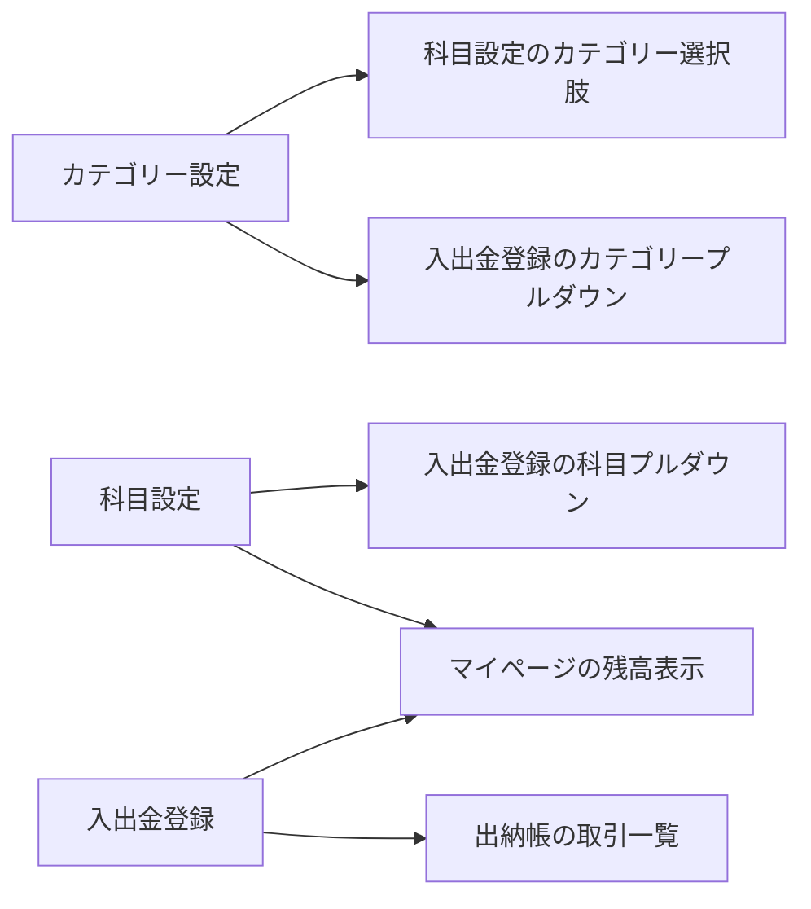

# クラサポ会計 開発マスターガイド

**バージョン**: v2.9  
**最終更新日**: 2026年2月6日  
**ステータス**: 監査済み・最終確定版

---

> **重要**: 本ドキュメントは監査済みの最終仕様書です。  
> 特に「カラーシステム」「UI厳格ルール」「禁止事項」は勝手な変更を禁じます。  
> 仕様変更が必要な場合は、**先に本ドキュメントを更新してから**実装してください。

---

## 目次

1. [プロジェクト概要](#1-プロジェクト概要)
2. [技術スタック](#2-技術スタック)
3. [カラーシステム（最終確定版）](#3-カラーシステム最終確定版)
4. [画面構成・サイトマップ](#4-画面構成サイトマップ)
5. [勘定科目体系](#5-勘定科目体系)
6. [UI厳格ルール](#6-ui厳格ルール)
7. [禁止事項](#7-禁止事項)
8. [画面別詳細仕様](#8-画面別詳細仕様)
9. [システム連動・データ永続化](#9-システム連動データ永続化)
10. [計算ロジック定義](#10-計算ロジック定義)
11. [決算処理ワークフロー](#11-決算処理ワークフロー)
12. [実装チェックリスト](#12-実装チェックリスト)
13. [変更履歴](#13-変更履歴)

---

## 1. プロジェクト概要

| 項目 | 内容 |
|------|------|
| **名称** | クラサポ会計 (Classapo Accounting) |
| **コンセプト** | 「できるクラブは会計もスマートに。」 |
| **対象ユーザー** | 大学スポーツ・部活動の会計担当者 |

### 1.1 核心的価値

| 機能 | 説明 |
|------|------|
| **AI入力自動化** | Gemini 1.5 Flashによるレシート画像解析で入力負担を激減 |
| **高度な決算ロジック** | 「プラス入力」で完結する繰延・精算フロー |
| **セルフチェック機能** | 異常検知アラートによる透明性の高い会計運営 |

---

## 2. 技術スタック

| カテゴリ | 技術 | 備考 |
|----------|------|------|
| **Frontend/Backend** | Next.js 14 (App Router) | TypeScript |
| **Styling** | Tailwind CSS + shadcn/ui | - |
| **Database** | PostgreSQL | - |
| **ORM** | Prisma | - |
| **AI** | Google Gemini 1.5 Flash API | OCR解析・整合性チェック |

---

## 3. カラーシステム（最終確定版）

> **⚠️ 変更禁止**: 本セクションのカラーコードは監査済みです。  
> 実装においてこれ以外のカラーを使用することを禁じます。

### 3.1 機能別テーマカラー

| 機能 | カラーコード | カラー名 | 主な用途 |
|------|-------------|---------|----------|
| マイページ | `#E66A84` | ピンク | Dashboard、残高カード |
| 入出金登録 | `#A3BC68` | 黄緑 | 新規登録、編集モーダル |
| 集計・帳簿 | `#68A384` | 青緑 | 出納帳、集計表 |
| 集金管理 | `#D99529` | オレンジ | 集金一覧、納入状況 |
| 部員管理 | `#9D8CC3` | パープル | 部員一覧、保護者情報 |
| 設定 | `#77B8DA` | ブルー | 科目設定、カテゴリー設定 |
| 操作ガイド | `#4A90E2` | 濃いブルー | ヘルプ、チュートリアル |

### 3.2 システムカラー

| 用途 | カラーコード | 適用箇所 |
|------|-------------|----------|
| エラー/警告 | `#EF4444` | アラート、未処理通知、証憑不足行 |
| 背景（全体） | `#F5F5F0` | ページ背景 |
| テキスト（主） | `#374151` | 本文、ラベル |
| テキスト（副） | `#6B7280` | 補足説明、プレースホルダー |

### 3.3 実装箇所

- `src/components/layout/Header.tsx` - ルート判定でテーマカラー適用
- `src/components/layout/Sidebar.tsx` - アイコン色にテーマカラー適用
- 各ページコンポーネント - テーマ色として一貫使用

---

## 4. 画面構成・サイトマップ

### 4.1 クラブ向け画面（単体版）

```
/(dashboard)/
├── dashboard/              # マイページ (#E66A84)
├── accounting/
│   ├── register/
│   │   ├── new/            # 新規登録 (#A3BC68)
│   │   └── history/        # 登録履歴
│   ├── ledger/
│   │   ├── cash-bank/      # 現金預金出納帳 (#68A384)
│   │   └── subject/        # 科目別台帳
│   ├── summary/
│   │   ├── annual/         # 年間収支集計表
│   │   └── monthly/        # 月次収支集計表
│   └── report/             # 収支報告書
├── collection/             # 集金管理 (#D99529)
├── members/                # 部員管理 (#9D8CC3)
├── settings/
│   ├── club/               # クラブ設定 (#77B8DA)
│   ├── category/           # カテゴリー設定
│   ├── account-titles/     # 科目設定
│   └── fiscal-years/       # 会計年度設定
└── guide/                  # 操作ガイド (#4A90E2)
```

### 4.2 大学向け画面（for School版）

```
/(university)/university/
├── dashboard/              # 統合ダッシュボード
└── approvals/              # 承認待ち一覧
```

---

## 5. 勘定科目体系

### 5.1 グループ分類

| グループ | 科目例 | 用途 |
|----------|--------|------|
| **現金・預金** | 現金、普通預金（複数口座対応） | 残高管理 |
| **資産** | 未収入金、仮払金 | 繰延処理 |
| **負債** | 未払金、仮受金（預り金） | 繰延処理 |
| **収入** | 部費、寄付金、助成金、雑収入、その他 | 入金記録 |
| **支出** | 消耗品費、大会参加費、遠征費、備品費、通信費、その他 | 出金記録 |

### 5.2 繰延処理用固定科目

> 以下の4科目は繰延処理専用。プルダウンの選択肢として固定表示する。

| 科目名 | 区分 | ヘルプテキスト |
|--------|------|----------------|
| 未収入金 | 資産 | 当年度中に受け取ることが決まっているが、まだ回収できていないお金 |
| 仮払金 | 資産 | 当年度中に支払ったけど、次年度に精算する予定のお金 |
| 未払金 | 負債 | 当年度中に支払う義務があるのに、まだ支払っていないお金 |
| 仮受金 | 負債 | 当年度中に受け取ったけど、次年度に精算する予定のお金 |

---

## 6. UI厳格ルール

> **⚠️ 変更禁止**: 本セクションのルールは監査済みの最終仕様です。

### 6.1 金額表示の共通ルール

| ルール | 内容 | 必須 |
|--------|------|:----:|
| 通貨記号の排除 | 数値に「￥」「¥」「円」を一切表示しない | ✅ |
| 単位の明記 | テーブル右上に「(単位：円)」と一括表示 | ✅ |
| 3桁カンマ区切り | `Number.toLocaleString()` を使用 | ✅ |
| 右寄せ配置 | `text-right tabular-nums` | ✅ |

### 6.2 テーブル・リスト配置の黄金律

> **全画面共通**: この配置ルールはすべてのテーブル・リストに適用する。

| データ種別 | 配置 | Tailwind CSS | 具体例 |
|-----------|------|--------------|--------|
| **見出し（ヘッダー）** | 中央寄せ | `text-center` | 収入金額、支出金額、残高 |
| **文字データ** | 左寄せ | `text-left` | 科目名、カテゴリー名、日付 |
| **数値データ** | 右寄せ | `text-right tabular-nums` | 金額、残高、人数 |

### 6.3 金額ラベルの統一ルール

| 画面 | ラベル | 必須形式 |
|------|--------|----------|
| 入出金登録（全タブ） | 金額 | **「金額（円）」** |
| 編集モーダル | 金額 | **「金額（円）」** |
| 科目設定（新規追加） | 期首残高 | **「期首残高（円）」** |
| 科目設定（編集時） | 残高 | **「残高（円）」** |

---

## 7. 禁止事項

> **⚠️ 厳守**: 以下の実装は明示的に禁止。違反は即座に修正すること。

### 7.1 通貨記号に関する禁止

| 禁止事項 | ❌ 禁止コード | ✅ 正解コード |
|----------|-------------|--------------|
| 入力フィールド内の￥表示 | `<span className="absolute">¥</span>` | プレフィックスなし |
| パディングによる記号スペース | `pl-8` | `pl-3` |
| 数値への通貨記号付与 | `¥{amount.toLocaleString()}` | `{amount.toLocaleString()}` |

**禁止例（絶対配置のspan）:**
```tsx
// ❌ 禁止
<div className="relative">
  <span className="absolute left-3 top-1/2 -translate-y-1/2">¥</span>
  <input className="pl-8 ..." />
</div>

// ✅ 正解
<label>金額（円）</label>
<input className="pl-3 text-right ..." />
```

### 7.2 ラベルに関する禁止

| 禁止事項 | ❌ 禁止 | ✅ 正解 |
|----------|--------|--------|
| 「（円）」の欠落 | `<label>金額</label>` | `<label>金額（円）</label>` |
| 「（円）」の欠落 | `<label>期首残高</label>` | `<label>期首残高（円）</label>` |

### 7.3 配置に関する禁止

| 禁止事項 | ❌ 禁止 | ✅ 正解 |
|----------|--------|--------|
| 数値の左寄せ | `<td className="text-left">` | `<td className="text-right tabular-nums">` |
| 見出しの左寄せ | `<th className="text-left">` | `<th className="text-center">` |

### 7.4 カラーに関する禁止

- セクション3で定義されていないカラーの使用禁止
- 「似たような色」での代替は不可

---

## 8. 画面別詳細仕様

### 8.1 マイページ（Dashboard）

#### レイアウト構造（3カラム・グリッド）

| 位置 | カード名 | 高さ配分 |
|------|----------|----------|
| **左ブロック** | 現在の残高 | 100% |
| **中央ブロック** | お知らせ | 100% |
| **右ブロック（上段）** | 重要：未処理・エラー通知 | 50% |
| **右ブロック（下段）** | 2025年度の部員数 | 50% |

#### カード共通ルール

- 各カードの左端に機能テーマカラーの垂直ライン（5px）を配置
- 数値はすべて右寄せ
- 項目名と数値の間に全角スペース10個分の余白

#### 残高カードのドリルダウン機能

> マイページの科目クリックで出納帳へ遷移し、自動フィルタリングする。

**URLパラメータ仕様:**
```
遷移先: /accounting/ledger/cash-bank?account_id={accountTitleId}
```

**マイページ側の実装:**
```typescript
onClick={() => router.push(`/accounting/ledger/cash-bank?account_id=${item.id}`)}
```

**出納帳側の実装:**
```typescript
useEffect(() => {
  const accountIdFromUrl = searchParams.get("account_id")
  if (accountIdFromUrl) {
    const matchingAccount = accountTitles.find(
      (t) => t.id === accountIdFromUrl && t.group === "cash"
    )
    if (matchingAccount) {
      setCashAccountId(accountIdFromUrl)
    }
  }
}, [searchParams, accountTitles, isInitialized])
```

### 8.2 入出金登録（新規登録）

#### タブ構成

| タブ | 証憑プレビュー | レイアウト |
|------|:-------------:|----------|
| 収入 | ✅ 表示 | 2カラム（左:フォーム、右:プレビュー） |
| 支出 | ✅ 表示 | 2カラム |
| 振替 | ❌ 非表示 | 1カラム（中央配置） |
| 集金 | ❌ 非表示 | 1カラム |
| 繰延の計上・消込 | ❌ 非表示 | 1カラム |

#### 入力項目の動的変更

| タブ | 科目ラベル | 決済手段ラベル | 科目フィルター |
|------|-----------|---------------|---------------|
| 収入 | 科目 | 入金先 | グループ「収入」のみ |
| 支出 | 科目 | 出金元 | グループ「支出」のみ |
| 振替 | - | 出金元 → 入金先 | グループ「現金・預金」のみ |

### 8.3 現金預金出納帳

#### 期首残高の表示

| 行 | 日付 | 科目名 | 収入金額 | 支出金額 | 残高 |
|:--:|------|--------|:--------:|:--------:|:----:|
| 1 | 2025-04-01 | 期首残高 | （初期残高） | - | （初期残高） |
| 2〜 | （取引日） | （取引内容） | ... | ... | （累計） |

#### 累計計算ロジック

```typescript
// 計算式（厳守）
runningBalance = previousRowBalance + incomeAmount - expenseAmount

// 初期値
initialBalance = accountTitle.openingBalance ?? 0
```

### 8.4 科目設定

#### 新規追加フォーム

| 項目 | 必須 | 備考 |
|------|:----:|------|
| グループ | ✅ | 現金・預金 / 収入 / 支出 |
| カテゴリー | ✅* | *現金・預金は「共通」固定 |
| 科目名 | ✅ | - |
| 期首残高（円） | - | 運用開始時の金額 |

#### 編集機能

- 鉛筆マーク（編集）クリックで「科目名」「残高」を編集可能
- 残高変更時は出納帳の期首残高・マイページの資産合計に即時反映

---

## 9. システム連動・データ永続化

### 9.1 データ永続化

| 対象 | 保存先 | タイミング |
|------|--------|-----------|
| クラブ情報 | LocalStorage | 変更時即時 |
| カテゴリー | LocalStorage | 変更時即時 |
| 科目 | LocalStorage | 変更時即時 |
| 取引データ | LocalStorage | 登録時即時 |

### 9.2 画面間連動



### 9.3 リアルタイム更新

- `setInterval` による500ms間隔のデータ監視
- 複数タブでの操作にも対応

---

## 10. 計算ロジック定義

### 10.1 マイページ残高計算

```typescript
// 現金預金合計
cashTotal = Σ(現金・預金グループの各科目残高)

// 資産合計
assetTotal = Σ(資産グループの各科目残高)

// 負債合計
liabilityTotal = Σ(負債グループの各科目残高)

// 実質残高（次期繰越金）
realBalance = cashTotal + assetTotal - liabilityTotal
```

### 10.2 繰延処理の残高増減

| 処理区分 | 科目区分 | 残高への影響 |
|----------|----------|:------------:|
| 計上（来年度のお金として予約） | 資産（未収入金・仮払金） | **増加** |
| 計上（来年度のお金として予約） | 負債（未払金・仮受金） | **増加** |
| 消込（前年度の予約を精算） | 資産（未収入金・仮払金） | **減少** |
| 消込（前年度の予約を精算） | 負債（未払金・仮受金） | **減少** |

---

## 11. 決算処理ワークフロー

> 年度末の「締め」を以下の順序で強制し、正確な繰越を行う。

| ステップ | 処理内容 | 完了条件 |
|:--------:|----------|----------|
| 1 | 異常アラートの解消 | 赤字表示（証憑不足）・重複エラーがゼロ |
| 2 | 実残高エビデンスの提出 | 通帳残高画像/現金残高画像をアップロード |
| 3 | 残高照合確認 | 画像とシステム残高の一致を承認 |
| 4 | 繰延処理 | 未解決取引を次年度精算リストへ移動 |
| 5 | 決算整合性確認 | 資産合計 - 負債合計 = 次期繰越金 が成立 |

---

## 12. 実装チェックリスト

> 新規画面を実装する際は、以下のチェックリストで仕様適合を確認すること。

### UI/UXチェック

- [ ] 金額表示に￥記号を使用していない
- [ ] 金額ラベルに「（円）」が含まれている
- [ ] テーブル見出しが中央寄せ（`text-center`）になっている
- [ ] 数値データが右寄せ（`text-right tabular-nums`）になっている
- [ ] 文字データが左寄せになっている
- [ ] 3桁カンマ区切りが適用されている（`toLocaleString()`）

### カラー・スタイルチェック

- [ ] テーマカラーがセクション3の定義通りである
- [ ] エラー表示に`#EF4444`を使用している
- [ ] 背景色に`#F5F5F0`を使用している

### データ連携チェック

- [ ] LocalStorageへの永続化が実装されている
- [ ] マスタデータの変更が関連画面に反映される
- [ ] ドリルダウン連携のURLパラメータが正しい

---

## 13. 変更履歴

| バージョン | 日付 | 変更内容 |
|-----------|------|----------|
| v2.8 | 2026.2.6 | セクション18（金額表示・画面連携）を追加 |
| v2.9 | 2026.2.6 | 監査結果に基づき厳格化、禁止事項を追加 |
| | | カラーシステムを最終確定版として凍結 |
| | | ドリルダウン連携の技術仕様を詳細化 |
| | | 累計残高計算式を明記 |
| | | 実装チェックリストを追加 |
| | | ドキュメント構造を全面リデザイン |

---

*このドキュメントは開発の唯一の正解です。迷った時はここに戻ってください。*
