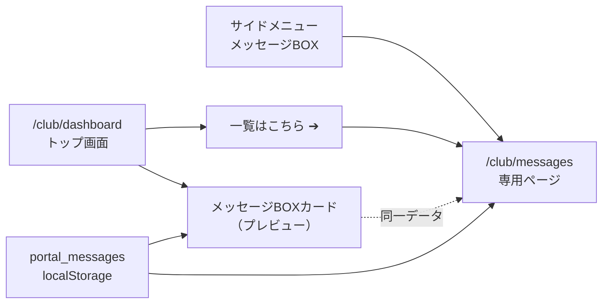

# クラブポータル：トップ画面レイアウト・メッセージBOX 仕様書

| 項目 | 内容 |
|------|------|
| 文書名 | クラブポータル：トップ画面レイアウト・メッセージBOX 仕様書 |
| 版 | 1.1 |
| 対象読者 | 開発者、導入支援、プロダクトオーナー |
| 関連画面 | `/club/dashboard`、`/club/messages`、`/club/settlement` |
| 実装方式（デモ） | Next.js App Router、ブラウザ `localStorage`（キー `portal_messages` 等）、クライアントサイド |

---

## 1. 概要

クラブポータルのトップ画面（ダッシュボード）のレイアウトを整理し、「お知らせ」を **メッセージBOX** に名称統一したうえで、トップ上のプレビューと専用ページ・サイドメニューを **同一データ** で連動させる。

学校ポータルから配信したメッセージや、決算期限などのシステム通知を、クラブ担当者が一覧・詳細で確認できる導線を提供する（デモ段階では localStorage 連動）。



---

## 2. トップ画面（`/club/dashboard`）レイアウト

### 2.1 画面構成の原則

| 項目 | 仕様 |
|------|------|
| シェル | `ClubAppShell`（サイドバー + ピンクヘッダー + メイン） |
| サブヘッダー | `ClubPortalYearBar`（年度切替・作業者表示）をダッシュボード本体の直上に配置 |
| 本体の縦幅 | **ビューポート高さの約 2/3（`67vh`）** に固定。サイドバー・ヘッダーには適用しない |
| 削除した文言 | 「今期の決算データはまだ登録されていません〜」等、旧「お知らせ」向けの決算案内テキストは **トップから完全削除**（決算はサイドメニュー「決算」`/club/settlement` へ分離） |

### 2.2 3カラム・グリッド（本体 `67vh` 内）

| 列 | ブロック名 | テーマカラー（左アクセント） | 備考 |
|----|------------|------------------------------|------|
| 左 | 現在の現金預金残高 | `#E66A84`（ピンク） | 通常時は現金預金のみ（グレー帯「現金預金」なし）。繰延残高がある場合のみ資産・負債・実質残高を追加表示。科目が多い場合はカード内のみスクロール |
| 中央（上） | 現在の部員数 | `#9D8CC3`（パープル） | **上段**に配置 |
| 中央（下） | メッセージBOX | `#4A90E2`（青） | **下段**に配置。本仕様書 §3 参照 |
| 右（上） | 証憑未登録数 | `#EF4444`（赤） | **上段**に配置 |
| 右（下） | 決算ステータス | — | **下段**に配置 |

中央カラムは縦に 2 段（部員数 → メッセージBOX）とする。

### 2.3 年度切替・作業者表示

| 項目 | 仕様 |
|------|------|
| 年度切替 | 共通ヘッダー第3段（`PortalUnifiedHeader`）に配置 |
| 現在の作業者 | 共通ヘッダー **第1段（大学名帯）の右端** に `現在の作業者：{氏名}` を表示 |
| 未宣言時 | `現在の作業者：未選択` |
| データ源 | 作業者選択モーダルで保存した `kurasaokaikei-current-workers`（`UserInfoContext.currentWorkers`） |

---

## 3. メッセージBOX（トップ画面・中央下段カード）

### 3.1 名称・見出し

- 旧称「お知らせ」は使用しない。見出しは **「メッセージBOX」** に統一する。
- 見出し行は下線（`border-b-2 border-[#4A90E2]`）付き。

### 3.2 「一覧はこちら」リンク

| 項目 | 仕様 |
|------|------|
| ラベル | **一覧はこちら ➔** |
| 配置 | カード内見出し行の **右端（右上）**。タイトルと `justify-between` で横並び |
| スタイル | `text-xs font-medium text-[#4A90E2]`、ホバー時 underline |
| 遷移先 | **`/club/messages`**（`clubPath("/messages")`） |
| 方式 | Next.js `<Link>` による **クライアントサイドルーティング**（サイドメニュー「メッセージBOX」と同一 URL） |
| 表示条件 | メッセージ件数に関わらず **常時表示**（空状態でもリンク可能） |

### 3.3 一覧プレビュー（カード内）

| 項目 | 仕様 |
|------|------|
| コンポーネント | `ClubMessageInboxList`（`variant="compact"`） |
| データ | `getPortalMessages(activeClub)` — 専用ページと同一 |
| 空状態 | カード中央に **「メッセージはまだありません」**（定数 `CLUB_MESSAGE_EMPTY_TEXT`） |
| 未読サマリー | 未読がある場合、一覧下に「未読: N件」を表示（任意） |

---

## 4. メッセージBOX（専用ページ `/club/messages`）

### 4.1 ルーティング・シェル

| 項目 | 内容 |
|------|------|
| パス | `/club/messages` |
| ページ | `src/app/club/messages/page.tsx` → `ClubMessagesView` |
| レイアウト | クラブ共通 `club/layout.tsx`（`ClubAppShell` + サイドメニュー） |
| サイドメニュー | 「メッセージBOX」項目の `href` は `/club/messages`（トップの「一覧はこちら」と同一） |

### 4.2 タイトル帯（小帯）の統一

入出金登録・集計・帳簿などと同様、**コンテンツ先頭に `ClubPortalYearBar` を必ず配置**する（年度切替・作業者の小帯）。

その下にページ固有の白背景ヘッダー帯を置く。

| 要素 | 仕様 |
|------|------|
| 戻りリンク | 「← クラブポータルへ」→ `/club/dashboard` |
| タイトル | `h1`: **メッセージBOX** |
| サブテキスト | 宛先クラブ名（ID）— ログインクラブまたはデモ（従来データ） |

### 4.3 2ペイン構成（`lg` 以上）

| ペイン | 内容 |
|--------|------|
| 左 | メッセージ一覧（`ClubMessageInboxList` / `variant="default"`） |
| 右 | 選択メッセージの詳細（件名・本文・送信元バッジ・日付） |

一覧で行を選択すると右ペインに表示。未読の場合は選択時に `markPortalMessageRead` で既読化（デモ）。

### 4.4 空状態・未ログイン

| 状態 | 表示 |
|------|------|
| データなし（受信 0 件） | 一覧ペイン中央: **「メッセージはまだありません」** |
| クラブ未ログインかつ従来デモ以外 | 「クラブでログインするとメッセージを表示できます」+ ログイン画面へのリンク |
| 従来デモ（`isLegacyGlobalPortal`） | 一覧は空表示可能。宛先表示は「デモ（従来データ）」 |

### 4.5 一覧行の UI ルール（データ連動時）

表示順（左から右）:

```text
[未読赤丸 ●] [送信元バッジ] 件名 …………………… 日付
```

| 要素 | 仕様 |
|------|------|
| 未読赤丸 | `isRead === false` のとき、バッジ **左側** に直径 8px 相当の赤丸（`#EF4444`）。既読時はスペーサーのみでレイアウトを維持 |
| 送信元バッジ | 次表参照。コンポーネント `ClubMessageSenderBadge` |
| 件名 | 未読は `font-semibold`、既読はグレー系 |
| 日付 | 右端、`text-xs` / compact 時 `text-[10px]` |

**送信元バッジ**

| 送信元（`sender`） | ラベル | 配色（目安） |
|--------------------|--------|--------------|
| `school` | **学校** | 青系（`#DBEAFE` / `#1E40AF`） |
| `system` | **クラサポ会計** | 緑系（`#D1FAE5` / `#065F46`） |

---

## 5. データ連動（デモ実装）

### 5.1 ストレージ

| キー | 用途 |
|------|------|
| `portal_messages` | 学校→クラブ／システム→クラブのメッセージ配列（正本） |
| 変更通知 | カスタムイベント `PORTAL_MESSAGES_CHANGED_EVENT` + `storage` イベントで UI 再取得 |

### 5.2 取得 API（クラブ側）

| 関数 | 説明 |
|------|------|
| `getPortalMessages(activeClub)` | `clubPortalData.ts` 経由。ダッシュボード・専用ページで共通利用 |
| `getClubPortalMessageViews(clubId)` | `portal_messages` からクラブ宛てをフィルタし表示モデルへ変換 |

### 5.3 学校側との連動

- 学校ポータル `/school/messages` から配信したメッセージが、対象クラブのメッセージBOX に反映される（デモ）。
- 決算提出期限などは `system` 送信元として **クラサポ会計** バッジで表示。

---

## 6. 関連ファイル一覧（実装参照）

| 領域 | パス |
|------|------|
| トップ画面 | `src/app/club/dashboard/page.tsx` |
| 専用ページ | `src/app/club/messages/page.tsx`、`src/components/club/ClubMessagesView.tsx` |
| 一覧 UI | `src/components/club/ClubMessageInboxList.tsx`、`ClubMessageListItem.tsx`、`ClubMessageSenderBadge.tsx` |
| 小帯 | `src/components/club/ClubPortalYearBar.tsx` |
| データ | `src/lib/portalMessages.ts`、`src/lib/clubPortalData.ts` |
| サイドメニュー | `src/components/layout/Sidebar.tsx`（メッセージBOX → `/club/messages`） |
| シェル | `src/components/layout/ClubAppShell.tsx` |

---

## 7. 受け入れ条件（チェックリスト）

- [ ] トップに旧決算案内テキストがなく、本体が約 `67vh` で 3 カラム表示される
- [ ] 中央カラムで「部員数」が上、「メッセージBOX」が下
- [ ] `ClubPortalYearBar` で年度切替と作業者が同一行・同一文字サイズ感で表示される
- [ ] トップ中央下段カードの右上に「一覧はこちら ➔」があり、`/club/messages` へ遷移する
- [ ] サイドメニュー「メッセージBOX」と「一覧はこちら」が **同じページ** を開く
- [ ] 専用ページ先頭に `ClubPortalYearBar` がある
- [ ] 空状態で「メッセージはまだありません」が中央表示される
- [ ] 一覧行が `[未読●] [学校 or クラサポ会計] 件名` の順で表示される

---

## 改訂履歴

| 版 | 日付 | 内容 |
|----|------|------|
| 1.1 | 2026-07-17 | 中央列の上下を入れ替え（上: 現在の部員数 / 下: メッセージBOX）。右列も入れ替え（上: 証憑未登録数 / 下: 決算ステータス） |
| 1.0 | 2026-05-25 | 初版（トップレイアウト・メッセージBOX・導線の確定仕様） |
