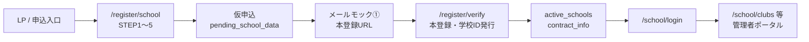

# 学校新規申込オンボーディング・フロー 仕様書

| 項目 | 内容 |
|------|------|
| 文書名 | 学校新規申込オンボーディング・フロー 仕様書 |
| 版 | 1.0 |
| 対象読者 | 開発者、導入支援、プロダクトオーナー |
| 関連画面 | `/register/school`、`/register/verify`、`/school/login`、`/school/*`（管理者ポータル） |
| 実装方式（デモ） | ブラウザ `localStorage` / `sessionStorage`、クライアントサイドのみ（サーバー永続化なし） |

---

## 1. 概要

学校が WEB サイト（LP）から自ら申し込みを行い、システムが自動的に固有の「学校ID」を発行し、運営側の手作業を挟むことなく、即座に専用の管理者ポータルが立ち上がるセルフサーブ型のオンボーディング・フロー。

**フロー全体（デモ実装）**

---

## 2. 画面構成および遷移（`/register/school`）

ステッパー UI を用い、同一ルート内で **5 つのステップ** を管理する。

| 実装 | パス | コンポーネント |
|------|------|----------------|
| 申込フォーム | `/register/school` | `SchoolRegisterForm` |
| 本登録（メールリンク） | `/register/verify?token=...` | `SchoolRegisterVerifyView` |
| 学校ログイン | `/school/login` | `SchoolLoginView` |

---

### STEP 1：学校情報の入力

- **入力項目**:
  - 学校名（例：クラサポ大学）
  - 代表者氏名［姓］（例：倉部） / ［名］（例：太郎）
  - 代表者氏名フリガナ［姓］（例：クラブ） / ［名］（例：タロウ）
  - 郵便番号、住所（都道府県・市区町村・以降の住所）、電話番号
- **補助機能**: 郵便番号から住所自動入力（zipcloud API、失敗時はデモ用フォールバック）
- **アクション**: 枠線付きの「キャンセル」ボタン（1 つに集約）。キャンセル時はトップ（`/`）へ戻る想定

---

### STEP 2：担当者情報の入力

- **入力項目**:
  - 管理部署、役職（※任意項目）
  - 担当者氏名［姓］（例：会計） / ［名］（例：花子）
  - 担当者氏名フリガナ［姓］（例：カイケイ） / ［名］（例：ハナコ）
  - 電話番号
  - メールアドレス（例：hanako@example.com）
  - メールアドレス確認用（※貼り付け・コピペ禁止。手入力必須）
- **メール確認欄の制御（実装）**:
  - `onPaste` / `onDrop` で貼り付け禁止
  - `Ctrl+V` / `Cmd+V` を `onKeyDown` で無効化
  - `onContextMenu` で右クリックメニュー無効化
  - `autoComplete="off"`（確認欄）
  - リアルタイムでメール形式・一致チェック
- **アクション**: 「戻る」「キャンセル」ボタンを両方配置

---

### STEP 3：お申込み情報の入力 ＆ パスワード設定

- **入力項目**:
  - **ご利用プラン**（プルダウン、上限クラブ数を内包）
    - ライトプラン（最大10クラブ）
    - スタンダードプラン（最大100クラブ）
    - プラスプラン（上限なし）
  - **決算日設定**（月・日のプルダウン。選択された月に合わせて「日」の選択肢を 28/30/31 日等に動的制御）
  - **お支払いサイクル**（［月払い］［年払い］のラジオ選択）
  - **お支払い日**
    - 月払い時：「10日」「26日」「末日」から選択
    - 年払い時：「決算月（N月）の月末」に自動固定（選択不可・表示のみ）
  - **お支払方法**（自動振替 / 銀行振込 / クレジット払い）
  - **管理者パスワード** / **確認用パスワード**
    - 強度規定：8 文字以上、半角英大文字・小文字・数字・記号（`!@#$%^&*` 等）をそれぞれ 1 文字以上含む（ハイフン `-` も記号として可。例：`Kurasapo-111`）

- **動的注釈（注意書き）** — お支払いサイクル直下に `text-xs text-slate-400` で表示:
  - **年払い選択時**:
    > ※年払いは決算月の月末に次年度分を先払いしていただくサイクルとなります。初年度は申込翌月末に当年度分（1年分）をご請求させていただきます。年間利用料となりますので、期中の利用開始でも1年分のご利用料となります。
  - **月払い選択時**:
    > ※月払いは、ご指定のお支払日に当月分を先払いいただきます。初年度は申込翌月末に「会計期間開始月〜ご利用開始月分」を一括でのご請求となります。本サービスは年間利用料契約となりますので、期中の利用開始でも1年分のご利用料となります。なお、期中で退会される場合は、最後のお支払い時に残債（未払いの残月数分）を精算の上、一括でご請求させていただきます。

---

### STEP 4：確認画面 ＆ 同意

- ユーザーが入力した全情報を一覧サマリー表示（学校・担当者・契約・パスワードマスク）
- **利用規約への同意チェックボックス**（必須。現状はダミーリンク）

---

### STEP 5：仮申し込み完了画面（デモ用メールモック①）

- 画面上に **「【デモ用】担当者宛ての受信メール（シミュレーション）」** ボックスを表示
- **件名**: 【クラサポ会計】学校登録を完了してください
- **本文**: 担当者名、本登録 URL の案内
- **本登録 URL**: `{origin}/register/verify?token={verificationToken}`  
  （例：`http://localhost:3000/register/verify?token=...`）
- **ボタン**: 「本登録URLを開く（デモ）」— 同一 URL へ遷移
- **データ保存**: `localStorage.pending_school_data` に仮申込データ＋トークンを単一エンベロープで保存
- **補足**: 実メール送信は行わず、コンソールにシミュレーション出力（`simulateVerificationEmail`）

---

## 3. 本登録（`/register/verify`）

メール内リンク（`?token=`）または旧フロー（`?id=SCH-xxxxx`）でアクセスし、本登録を完了する。

### 3.1 処理内容

1. `pending_school_data` を読み込み（デモでは URL トークン不一致でも pending があれば続行可）
2. **学校ID 初発行**（形式：`SCH-` + 5 桁数字、重複回避）
3. `active_schools` / `kurasaokaikei-school-registrations` に本登録データを保存
4. `contract_info` に契約・学校・担当者情報を反映（`schoolId` 付き）
5. `pending_school_data` を削除
6. React Strict Mode 対策：`sessionStorage` に `kurasaokaikei-verify-result-{token}` で結果キャッシュ（二重実行防止）

### 3.2 本登録完了画面（デモ用メールモック②）

- 発行された **学校ID**（例：`SCH-12345`）を大きく表示、コピーボタン付き
- **「【デモ用】担当者宛ての受信メール（自動送信）」** ボックス（枠線付き）
  - **件名**: 【クラサポ会計】本登録完了・学校ID発行のお知らせ
  - **本文**:
    - お申し込み完了の案内
    - ■学校ID：［発行された学校ID］
    - ■ログインURL：`{origin}/school/login`
- **ボタン**: 「学校管理者ログイン画面へ」→ `/school/login`

### 3.3 エラー時

- pending なし / 既に本登録済み等：認証エラーメッセージと申込フォームへのリンク

---

## 4. 学校ログインと管理者ポータル連動

### 4.1 ログイン（`/school/login`）

| 認証方式 | 条件 |
|----------|------|
| デモ管理者 | ID `admin` / PW `admin` |
| 空欄ログイン | ID・PW とも空欄で成功（デモ） |
| 本登録学校 | `active_schools` の **学校ID** ＋ 申込時の **管理者パスワード** |

**ログイン成功時の処理**

1. `kurasaokaikei-school-admin-session` にセッション保存（`loginId`, `loggedInAt`）
2. `current_school` に学校名・会計期間・契約情報一式を保存（`persistCurrentSchool`）
3. `current_school_user` にヘッダー表示用の要約をミラー保存
4. カスタムイベント `kurasaokaikei-school-session-changed` を発火
5. **`window.location.assign("/school")`** で管理者ポータルへフル遷移（ヘッダー再描画を確実化）

### 4.2 管理者ポータル表示連動

| 表示箇所 | データ取得 | 表示内容 |
|----------|------------|----------|
| **共通ヘッダー** | `getSchoolHeaderDisplay()` | 申込時の学校名、会計期間 |
| **契約状況**（`/school/contract`） | `getSchoolContractDisplay()` | プラン、支払いサイクル、支払い日、注釈全文、学校情報、ログインID |

**ヘッダー表示の解決順**（契約状況画面と同様）:

1. `localStorage.current_school`
2. ログインセッションの `loginId` → `active_schools` / `contract_info`
3. `contract_info` のみ
4. デモ固定値（`東京都市大学` 等）

**レイアウト**

- `/school/login` のみサイドバー・ヘッダーなし（`SchoolLayoutGate`）
- それ以外は `SchoolAppShell`（サイドバー + `SchoolHeader` + コンテンツ）

---

## 5. localStorage / sessionStorage キー一覧

| キー | タイミング | 内容 |
|------|------------|------|
| `pending_school_data` | STEP5 仮申込完了 | `{ ...PendingSchoolData, token }` 単一エンベロープ |
| `active_schools` | 本登録完了 | `{ [schoolId]: SchoolRegistration }` |
| `kurasaokaikei-school-registrations` | 本登録完了 | 登録履歴（旧フロー互換含む） |
| `contract_info` | 本登録完了 | 契約状況画面・ポータル表示用の契約スナップショット |
| `kurasaokaikei-school-admin-session` | ログイン成功 | `{ loginId, loggedInAt }` |
| `current_school` | ログイン成功 | ログイン中学校の表示用データ（契約含む） |
| `current_school_user` | ログイン成功 | ヘッダー用要約（学校名・会計期間） |
| `kurasaokaikei-verify-result-{token}` | 本登録処理後 | sessionStorage。学校IDキャッシュ |

---

## 6. データモデル（主要型）

### PendingSchoolData（仮申込）

- `school`: 学校名、代表者（姓名結合で保存）、住所、電話
- `contact`: 部署、役職、担当者、メール、電話
- `contract`: `plan`, `settlementMonth`, `settlementDay`, `paymentCycle`, `monthlyBillingDay`, `paymentMethod`
- `adminPassword`: 管理者パスワード（平文・デモのみ）
- `termsAcceptedAt`: 同意日時

### SchoolRegistration（本登録後）

- 上記 + `schoolId`, `status: "active"`, `activatedAt`

### 学校ID形式

- `SCH-` + 5 桁数字（例：`SCH-48291`）

---

## 7. 実装ファイル参照

| 領域 | ファイル |
|------|----------|
| 申込フォーム UI | `src/components/register/SchoolRegisterForm.tsx` |
| ステッパー | `src/components/register/RegisterStepper.tsx` |
| デモメール UI | `src/components/register/DemoMailInbox.tsx` |
| 本登録画面 | `src/components/register/SchoolRegisterVerifyView.tsx` |
| 登録・ID発行ロジック | `src/lib/schoolRegistration.ts` |
| 契約情報 | `src/lib/schoolContractInfo.ts` |
| フォームユーティリティ・注釈文言 | `src/lib/registerFormUtils.ts` |
| パスワード強度 | `src/lib/registerPasswordUtils.ts` |
| ログインセッション | `src/lib/schoolLoginSession.ts` |
| ログイン中データ | `src/lib/currentSchool.ts` |
| ヘッダー表示 | `src/lib/schoolHeaderDisplay.ts`, `src/components/layout/school/SchoolHeader.tsx` |
| 契約状況表示 | `src/lib/getSchoolContractDisplay.ts`, `src/components/school/SchoolContractView.tsx` |
| レイアウト | `src/components/layout/school/SchoolLayoutGate.tsx`, `SchoolAppShell.tsx` |
| ルート | `src/app/register/school/page.tsx`, `src/app/register/verify/page.tsx`, `src/app/school/login/page.tsx` |

---

## 8. デモ実装の制約・既知事項

- **サーバー API なし**: すべてブラウザ内ストレージ。別端末・別ブラウザではデータ非共有。
- **パスワード**: 平文保存（本番ではハッシュ化・サーバー認証が必須）。
- **メール**: 送信せず UI モックとコンソール出力のみ。
- **利用規約**: ダミーリンク（`#`）。
- **複数学校の申込**: 最後に本登録した `contract_info` が単一キーのため、ログイン時は **学校ID に紐づく `active_schools` を優先**して表示を出し分ける。
- **デモログイン**（`admin` / 空欄）: 固定のデモ学校名・契約表示にフォールバック。

---

## 9. テスト観点（受け入れ）

1. STEP1〜4 を入力し STEP5 で仮申込メールモックと本登録 URL が表示されること
2. 本登録 URL から学校ID が発行され、ID通知メールモック②が表示されること
3. 発行された学校IDと申込パスワードでログインできること
4. ログイン直後のヘッダーに **申込時の学校名** が表示されること
5. `/school/contract` にプラン・支払いサイクル・支払い日・注釈が申込内容と一致すること
6. 別学校名で再申込・ログインした場合、ヘッダー・契約が **新しい学校** の内容に切り替わること

---

## 10. 関連ドキュメント

- [クラサポ会計 for school システム全体設計・仕様書](../system-specification-for-school.md) — 組織階層、管理者ポータル、クラブ管理など全体像
- [system_spec.md](../system_spec.md) — 技術・マルチテナント設計（存在する場合）

---

*最終更新: 2026年5月（オンボーディング・フロー実装完了時点）*
