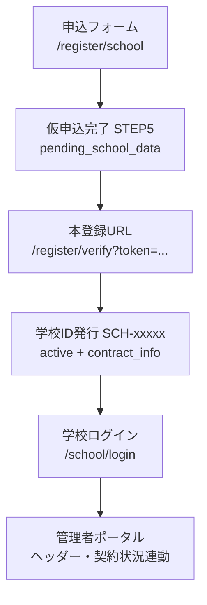

# 学校新規申込＆アカウント自動発行フロー 仕様書

| 項目 | 内容 |
|------|------|
| 文書名 | 学校新規申込＆アカウント自動発行フロー 仕様書 |
| 版 | 1.1（確定版） |
| 最終更新 | 2026年5月23日 |
| 対象読者 | 開発者、導入支援、プロダクトオーナー |
| 関連 URL | `/register/school`、`/register/verify`、`/school/login`、`/school/contract` ほか `/school/*` |
| 実装形態（デモ） | ブラウザ `localStorage` / `sessionStorage`、クライアントサイドのみ |

---

## 1. 全体概要

学校の管理者が WEB 上から申し込みを行い、システムが重複のない「学校ID」を自動発行する。運営側の手作業を一切挟まず、即座に学校専用の管理者ポータルが立ち上がるセルフサーブ型のオンボーディング・フロー。

テスト環境（ローカル）での確実なデモと実務的な安全性を両立させるため、画面上でのメールシミュレーション（モック）およびコピペ防止ロジックを搭載する。

---

## 2. 新規申込フォーム構成（`/register/school`）

ステッパー UI を使用し、1 つのルート内で以下の **5 ステップ** を管理する。

| STEP | ラベル | 概要 |
|------|--------|------|
| 1 | 学校情報 | 学校・代表者・住所 |
| 2 | 担当者 | 担当者・メール（確認欄はコピペ禁止） |
| 3 | 契約・PW | プラン・決算・支払い・管理者パスワード |
| 4 | 確認 | サマリー・利用規約同意 |
| 5 | 完了 | 仮申込メールモック・本登録 URL |

**実装**: `SchoolRegisterForm`（`src/components/register/SchoolRegisterForm.tsx`）

---

### STEP 1：学校情報の入力

- **入力項目**:
  - 学校名（プレースホルダー: `例：クラサポ大学`）
  - 代表者氏名：［姓］（`例：倉部`） / ［名］（`例：太郎`）に **完全分割**
  - 代表者氏名（フリガナ）：［姓］（`例：クラブ`） / ［名］（`例：タロウ`）に **完全分割**
  - 郵便番号、住所（都道府県・市区町村・以降の住所）、電話番号
- **補助**: 郵便番号から住所自動入力（zipcloud API、失敗時デモ用フォールバック）
- **アクション**: ［キャンセル］ボタン（トップ `/` へ遷移）

---

### STEP 2：担当者情報の入力

- **入力項目**:
  - 管理部署、役職（※任意）
  - 担当者氏名：［姓］（`例：会計`） / ［名］（`例：花子`）に **完全分割**
  - 担当者氏名（フリガナ）：［姓］（`例：カイケイ`） / ［名］（`例：ハナコ`）に **完全分割**
  - 電話番号
  - メールアドレス（`例：hanako@example.com`）
  - メールアドレス（確認用）：**貼り付け（コピペ）を完全に禁止**（手入力を強制）

- **コピペ防止（実装）**:
  - `onPaste` / `onDrop` で貼り付け禁止
  - `Ctrl+V` / `Cmd+V` を `onKeyDown` で無効化
  - `onContextMenu` で右クリックメニュー無効化
  - 確認欄は `autoComplete="off"`

- **バリデーション**: メールアドレスと確認用が一致しない場合、赤字でエラーを表示し「次へ」をブロック。形式不正時も同様。

- **アクション**: ［戻る］［キャンセル］ボタンを両方配置

---

### STEP 3：お申込み・パスワード設定

- **入力項目**:
  - **ご利用プラン**（プルダウン、上限クラブ数をラベルに内包）
    - ライトプラン（最大10クラブ）
    - スタンダードプラン（最大100クラブ）
    - プラスプラン（上限なし）
  - **決算日設定**（月・日。選択月に応じて日の最大値を 28/30/31 に動的制御）
  - **お支払いサイクル**：［月払い］［年払い］のラジオ選択
  - **お支払い日**:
    - 月払い時：「10日」「26日」「末日」から選択
    - 年払い時：「決算月（N月）の月末」に自動固定（変更不可・表示のみ）
  - **お支払方法**: 自動振替 / 銀行振込 / クレジット払い
  - **管理者パスワード** / **確認用パスワード**

- **強度規定（バリデーション）**:
  - 8 文字以上
  - 半角英 **大文字**・**小文字**・**数字**・**記号** をそれぞれ 1 文字以上必須
  - 記号例: ハイフン `-`、アンダースコア `_`、`!@#$%^&*()` 等（実装 Regex: `registerPasswordUtils.ts` の `HAS_SYMBOL`）
  - 例として有効: `Kurasapo-111`
  - 不一致時: 「パスワードが一致しません」

- **サイクル別動的注釈（注意書き）** — お支払いサイクル直下に表示:

  **年払い選択時**:

  > ※年払いは決算月の月末に次年度分を先払いしていただくサイクルとなります。初年度は申込翌月末に当年度分（1年分）をご請求させていただきます。年間利用料となりますので、期中の利用開始でも1年分のご利用料となります。

  **月払い選択時**:

  > ※月払いは、ご指定のお支払日に当月分を先払いいただきます。初年度は申込翌月末に「会計期間開始月〜ご利用開始月分」を一括でのご請求となります。本サービスは年間利用料契約となりますので、期中の利用開始でも1年分のご利用料となります。なお、期中で退会される場合は、最後のお支払い時に残債（未払いの残月数分）を精算の上、一括でご請求させていただきます。

---

### STEP 4：入力内容の確認

- 入力された全情報をサマリー表示（学校・担当者・契約・パスワードはマスク表示）
- **利用規約への同意チェックボックス**（必須。現状はダミーリンク）

---

### STEP 5：仮申し込み完了

- 画面上に **「【デモ用】担当者宛ての受信メール（シミュレーション）」** ボックスを表示
- **件名**: 【クラサポ会計】学校登録を完了してください
- **本文**: 担当者宛て挨拶、本登録用 URL
- **本登録 URL**: `{origin}/register/verify?token={verificationToken}`  
  （ローカル例: `http://localhost:3000/register/verify?token=...`）
- **データ保存**: `localStorage` キー `pending_school_data` に仮申込データ＋トークンを **単一エンベロープ** で保存
- **補足**: 実メール送信は行わず、コンソールに送信シミュレーションを出力

---

## 3. メール認証＆学校ID発行（`/register/verify`）

**実装**: `SchoolRegisterVerifyView`（`src/components/register/SchoolRegisterVerifyView.tsx`）

### 3.1 認証ロジック

- URL パラメータ `token` から `pending_school_data` を読み出し本登録を実行
- デモ仕様: URL トークンと保存トークンが異なっても pending があれば続行可
- React Strict Mode 対策: `sessionStorage` に `kurasaokaikei-verify-result-{token}` で結果をキャッシュ（二重実行防止）
- 旧フロー互換: `?id=SCH-xxxxx` パラメータ（非推奨）

### 3.2 ID 発行

- 認証成功の瞬間に、重複のない正式な **学校ID** を自動発行
- **形式**: `SCH-` + ランダム 5 桁数字（例: `SCH-48291`）
- `active_schools` に登録し、ステータスを **`active`** に更新
- `contract_info` に契約・学校・担当者情報を反映（`schoolId` 付き）
- `pending_school_data` を削除

### 3.3 本登録完了画面（ID 通知メールモック②）

- 発行された学校IDを大きく表示（コピーボタン付き）
- 画面下部に **「【デモ用】担当者宛ての受信メール（自動送信）」** ボックス
  - **件名**: 【クラサポ会計】本登録完了・学校ID発行のお知らせ
  - **本文**:
    - お申し込み完了・学校ID の保管案内
    - ■学校ID：［発行された学校ID］
    - ■ログインURL：`{origin}/school/login`
- 「学校管理者ログイン画面へ」ボタンで `/school/login` へ遷移

### 3.4 エラー時

- pending なし / 既に本登録済み等 → 認証エラー表示、申込フォームへのリンク

---

## 4. ログイン ＆ ポータルデータ連動

### 4.1 認証（`/school/login`）

| 方式 | 条件 |
|------|------|
| 本登録学校 | 発行された **学校ID** ＋ STEP 3 で設定した **管理者パスワード** |
| デモ管理者 | ID `admin` / PW `admin` |
| デモ空欄 | ID・PW とも空欄で成功 |

**ログイン成功時**:

1. `kurasaokaikei-school-admin-session` にセッション保存
2. `current_school` / `current_school_user` にログイン中学校の表示データを保存（`persistCurrentSchool`）
3. `kurasaokaikei-school-session-changed` イベントを発火
4. `window.location.assign("/school/clubs")` でフル遷移（ヘッダー再描画を確実化）

**実装**: `SchoolLoginView`、`schoolLoginSession.ts`

#### 4.1.1 パスワード入力 UI（ログイン・申込共通）

| 要件 | 仕様 |
|------|------|
| 初期値 | パスワード欄は **常に空文字 `""`**。ダミーの黒丸は出さない |
| 自動補完 | `autocomplete` は維持（学校ログイン: `current-password`、新規申込: `new-password`） |
| 表示切替 | 右端に Lucide `Eye` / `EyeOff`。クリックで `type="password"` ⇔ `type="text"` |
| 自動入力の見え方 | ログイン画面は `deferAutofillUntilFocus` でフォーカス前 `readOnly`（フォーカス後は通常入力） |

**適用画面**: 学校ログイン（`SchoolLoginView`）、クラブログイン（`ClubLoginForm`）、新規申込 STEP 3（`SchoolRegisterForm`）

**共通コンポーネント**: `src/components/ui/password-input.tsx`（`"use client"` 必須）

### 4.2 共通ヘッダーの学校名連動

- 申込時の **学校名**・**会計期間** を動的表示
- 取得: `getSchoolHeaderDisplay()`（`current_school` → セッションの学校ID → `contract_info` → デモ固定）
- `SchoolHeader` は `useLayoutEffect` とセッション変更イベントで再読込

### 4.3 契約状況画面の連動（`/school/contract`）

申込時に選択した以下を `localStorage` から動的に一覧表示する。

| 表示項目 | 内容例 |
|----------|--------|
| ご契約プラン | ライトプラン（最大10クラブ） 等 |
| お支払い回数（サイクル） | 月払い / 年払い |
| お支払い日 | 毎月26日 / 決算月（3月）の月末 等 |
| お支払いに関する注釈 | 年払い・月払いそれぞれの **長文**（STEP 3 と同一文言） |
| 学校情報・ログインID | 申込内容の反映 |

**取得**: `getSchoolContractDisplay()`（解決順はヘッダーと同様）

**実装**: `SchoolContractView`、`getSchoolContractDisplay.ts`、`schoolContractInfo.ts`

---

## 5. localStorage / sessionStorage キー

| キー | 用途 |
|------|------|
| `pending_school_data` | 仮申込（token 含む単一オブジェクト） |
| `active_schools` | 本登録済み学校一覧（schoolId キー） |
| `kurasaokaikei-school-registrations` | 登録履歴（互換） |
| `contract_info` | 契約状況・ポータル表示用スナップショット |
| `kurasaokaikei-school-admin-session` | ログインセッション |
| `current_school` | ログイン中の学校データ（契約含む） |
| `current_school_user` | ヘッダー表示用要約 |
| `kurasaokaikei-verify-result-{token}` | sessionStorage・本登録結果キャッシュ |

---

## 6. 実装ファイル一覧

| 領域 | パス |
|------|------|
| 申込フォーム | `src/components/register/SchoolRegisterForm.tsx` |
| ステッパー | `src/components/register/RegisterStepper.tsx` |
| デモメール UI | `src/components/register/DemoMailInbox.tsx` |
| 本登録画面 | `src/components/register/SchoolRegisterVerifyView.tsx` |
| 登録・ID 発行 | `src/lib/schoolRegistration.ts` |
| 契約情報 | `src/lib/schoolContractInfo.ts` |
| フォーム・注釈 | `src/lib/registerFormUtils.ts` |
| パスワード強度 | `src/lib/registerPasswordUtils.ts` |
| ログイン | `src/lib/schoolLoginSession.ts` |
| パスワード入力 UI | `src/components/ui/password-input.tsx` |
| 学校ログイン画面 | `src/components/auth/SchoolLoginView.tsx` |
| クラブログイン画面 | `src/components/auth/ClubLoginForm.tsx` |
| ログイン中データ | `src/lib/currentSchool.ts` |
| ヘッダー表示 | `src/lib/schoolHeaderDisplay.ts` |
| 契約表示 | `src/lib/getSchoolContractDisplay.ts` |
| 契約画面 UI | `src/components/school/SchoolContractView.tsx` |
| ヘッダー UI | `src/components/layout/school/SchoolHeader.tsx` |
| レイアウト | `src/components/layout/school/SchoolLayoutGate.tsx` |

---

## 7. デモ実装の制約

- サーバー永続化・実メール送信なし（ブラウザ内のみ）
- パスワードは平文保存（本番ではハッシュ化必須）
- 利用規約リンクはダミー
- 複数学校申込時は `active_schools` をログイン学校IDで優先表示

---

## 8. 受け入れテスト観点

1. STEP 1〜5 を完了し、仮申込メールモックと本登録 URL が表示される
2. 本登録で `SCH-xxxxx` が発行され、ID 通知メールモックが表示される
3. 学校ID と申込パスワードでログインできる
4. ログイン直後のヘッダーに申込時の学校名が表示される
5. 契約状況にプラン・サイクル・支払日・長文注釈が一致して表示される
6. 別学校名で再申込・ログイン後、表示が新しい学校に切り替わる
7. 学校・クラブログインおよび新規申込のパスワード欄が初期空欄で、目のアイコンで表示／非表示が切り替わる

---

## 9. トラブルシュート（開発時）

| 症状 | 想定原因 | 対処 |
|------|----------|------|
| トップ `/` が真っ白、`Error in shell` | 破損した `.next` キャッシュ（`Cannot find module './xxxx.js'` 等） | 全 `node` 停止 → `.next` 削除 → `npm run dev` を **1 プロセスのみ** 起動 |
| `window is not defined` | SSR 時の `localStorage` 直参照 | `"use client"` + `useEffect` 内、または `typeof window === "undefined"` ガード（本プロジェクトの storage ユーティリティはガード済み） |
| `/` と `/school/login` のループ | 本プロジェクトに `middleware.ts` は未配置。`SchoolLayoutGate` はログイン画面のみシェル除外 | 新規ミドルウェア追加時は `/` をリダイレクト対象に含めない |

---

## 10. 関連ドキュメント

- [学校新規申込オンボーディング・フロー 仕様書](./school_onboarding_spec.md)（詳細版・同一フローの別名ドキュメント）
- [クラサポ会計 for school システム全体設計](../system-specification-for-school.md)
