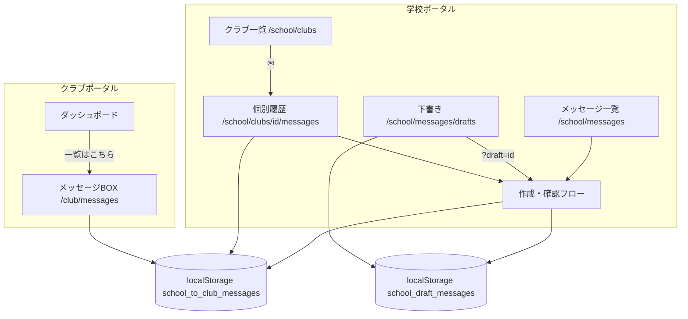

# クラサポ会計 機能詳細仕様書 v2.12（2026年度運用 正本）

- **対象システム**: クラサポ会計（Next.js / クライアントサイド LocalStorage 実装）
- **対象会計年度**: **2026年度（2026/04/01 〜 2027/03/31）固定運用**
- **本ドキュメントの位置づけ**: 開発者がこのファイル単体を読めば、現行実装の挙動（振替・集計・履歴・編集動線、**管理者ポータル / クラブポータル**、**学校・クラブ間メッセージBOX**）を完全に把握できる正本仕様書。
- **v2.12 追記（2026-05）**: **§0.0 共通UIデザイン規約**、**§7 学校・クラブ間メッセージBOX機能**（下書き・確認画面・個別✉連動・確認済バッジ・クラブ受領確認）を統合。実装正本は `src/lib/portalMessages.ts` / `src/lib/portalDraftMessages.ts`。
- **v2.11 追記（2026-05）**: 統合ログインハブ（`/`）、学校・クラブログイン認証、クラブ動的データ出し分け、クラブヘッダー刷新を §0.4 に反映。
- **v2.10 追記（2026-05）**: 学校 `/school` デモ UI（管理者ポータル・契約状況・設定子画面・共通ロゴ）およびクラブ「クラブポータル」表記を §0.2〜0.3・§2 に反映。
- **過去の v2.8 / 2025年度仕様は本書では取り扱わない**（旧仕様は `docs/spec.md` を参照）。

---

## 0.0 共通UIデザイン規約（ページタイトル・コンテンツ幅）

本節は **集金管理 ＞ 集金実績**（`src/app/club/collection/history/page.tsx`）および **メッセージBOX** で共通する「ページタイトル（子帯）」と横幅の正本である。

### 0.0.1 ページタイトル（子帯）— 集金実績と同一デザイン

**使用コンポーネント**: `MessageBoxTitleBand`（`src/components/shared/MessageBoxTitleBand.tsx`）

| 項目 | 仕様 |
| --- | --- |
| 外枠 | `rounded-t-lg border border-b-0 border-gray-200 px-6 py-4`、背景 **白** |
| 左アクセント | `borderLeftWidth: 5`、`borderLeftColor` = 画面テーマ色 |
| 見出し | `h2` — `text-xl font-semibold`、色はテーマ色（例: 集金 `#D99529`、メッセージBOX `#4A90E2`） |
| 補足行 | 任意。`text-sm text-[#6B7280] mt-0.5` |
| **使用しない** | テーマ色で画面幅いっぱいに敷く「色付き横長帯」＋白文字（旧デモ案は廃止） |

**集金実績での参照例**（インライン実装と同等）:

```tsx
<div
  className="rounded-t-lg border border-b-0 border-gray-200 px-6 py-4"
  style={{ borderLeftWidth: 5, borderLeftColor: THEME_COLOR, backgroundColor: "white" }}
>
  <h2 className="text-xl font-semibold" style={{ color: THEME_COLOR }}>集金実績</h2>
  <p className="text-sm text-[#6B7280] mt-0.5">{organizationName}　{fiscalPeriod}</p>
</div>
```

### 0.0.2 コンテンツ幅・左右余白（ジャストフィット）

| 画面区分 | 外側コンテナ | コンテンツ最大幅 | 配置 |
| --- | --- | --- | --- |
| クラブ会計・集金・帳簿等 | `px-6 py-8`（ページルート） | 画面フル幅（タイトル下の白パネルと連結） | 左寄せ |
| 学校メッセージBOX | `SchoolAppShell` 内 | **`max-w-3xl`**（`SCHOOL_MESSAGE_PAGE_CONTENT_CLASS`） | **左寄せ**（`mx-0`） |
| クラブメッセージBOX | `px-6 py-4 pb-8`（`ClubMessagesView`） | タイトル帯と同一ラッパー内でフル幅 | 左寄せ。タイトル左端と一覧パネル左端を縦ラインで一致 |

**原則**: タイトル（子帯）を包むコンテナと、その直下のメインコンテンツ（テーブル・2カラム一覧等）は **同一の水平パディング・最大幅** を共有し、左右に「心地よい空白」を確保する。

### 0.0.3 学校メッセージ一覧テーブル（ヘッダー・グリッド）

| 項目 | 値 |
| --- | --- |
| 見出し列 | `日付` ｜ `時間` ｜ `送信先` ｜ `件名`（見出し文字のみ `text-center`） |
| 個別クラブ履歴のみ追加列 | `ステータス` |
| グリッド（4列） | `grid-cols-[6.5rem_3.5rem_8.5rem_minmax(0,1fr)]` |
| グリッド（5列・個別のみ） | `grid-cols-[6.5rem_3.5rem_8.5rem_minmax(0,1fr)_5.5rem]` |
| ヘッダー背景 | `#EFF6FF`、`sticky top-0` |

---

## 0. 統合システム全体構造（マルチテナント・5/27デモ向け）

本アプリケーションは **1つの Next.js アプリ内** に、権限ごとに URL プレフィックスで分離した **3つの入り口** と **共通 LP** を持つ。

| 区分 | URL プレフィックス | 想定利用者 | 現状（2026-05 デモ） |
| --- | --- | --- | --- |
| **LP（入り口）** | `/` | 全員 | **統合ログインハブ**（学校・クラブ・部員の3カード） |
| **学校** | `/school` | 学校管理者（クラブ登録・決算承認） | **管理者ポータル**（サイドメニュー・契約状況・設定子画面などデモ UI 実装済） |
| **クラブ** | `/club` | クラブ会計担当（集金・入出金・部員管理） | **クラブポータル**（既存機能の正本・旧 `/dashboard` 等） |
| **部員・保護者** | `/member` | 部員・保護者（請求確認・オンライン決済） | プレースホルダ画面のみ |

- **技術**: Next.js 14 **App Router**。実体は `src/app/` 配下のディレクトリがそのまま URL になる（ルートグループ `(dashboard)` は廃止し、クラブは `src/app/club/` に集約）。
- **旧 URL**: `/dashboard`・`/accounting/*` 等は `next.config.js` の `redirects` により `/club/*` へ転送（ブックマーク互換）。
- **パス定数**: `src/lib/routes.ts` の `clubPath()` / `CLUB_PREFIX` をサイドバー・編集動線で参照。

### 0.1 ディレクトリマップ（App Router）

```
src/app/
├── page.tsx                 # LP（/）
├── school/
│   ├── layout.tsx           # SchoolAppShell（専用サイドバー＋ヘッダー）
│   ├── page.tsx             # 管理者ポータル（年度切替・サマリーカード）
│   ├── clubs/               # クラブ管理（子：一覧・登録）
│   ├── messages/            # メッセージBOX（一覧・下書き・作成）
│   │   └── drafts/          # 下書き一覧
│   ├── clubs/[clubId]/messages/  # クラブ個別送信履歴（✉）
│   ├── settings/            # 設定（親→3子画面、/settings は category へリダイレクト）
│   ├── contract/            # 契約状況
│   └── guide/               # 操作ガイド
├── club/                    # クラブ担当者向け（正本）
│   ├── layout.tsx           # AppShell（サイドバー＋ヘッダー）
│   ├── page.tsx             # /club → /club/dashboard へリダイレクト
│   ├── dashboard/
│   ├── accounting/          # 入出金・帳簿・集計
│   ├── collection/          # 集金管理
│   ├── members/
│   ├── settings/
│   ├── guide/
│   └── budget/              # 予実管理
├── member/
│   └── page.tsx             # 部員・保護者マイページ（プレースホルダ）
├── (parent)/                # 旧保護者ルート（/parent・将来 /member に統合予定）
├── (university)/            # 大学向け試作（/university/*）
└── api/

public/
└── kurasapo_logo_fix_RGB.png   # 学校・クラブ共通ブランドロゴ（静的配信）
```

### 0.2 ポータル名称（UI 表記の正本）

| 区分 | 正式名称 | 旧称（非推奨） | トップ URL | 実装参照 |
| --- | --- | --- | --- | --- |
| 学校 | **管理者ポータル** | マイページ / マイポータル | `/school` | `SCHOOL_PAGE_TITLES.home`（`src/lib/schoolTheme.ts`） |
| クラブ | **クラブポータル** | マイページ | `/club/dashboard` | `Sidebar.tsx` 先頭メニュー / `ClubPortalHeader.tsx` |

### 0.4 統合ログインハブ・認証・クラブヘッダー（2026-05 実装）

#### 0.4.1 統合ログインハブ（`/`）

- `LoginHubView`：学校（ネイビー `#005088`）→ `/school/login`、クラブ（ピンク `#E66A84`）→ インラインフォーム、部員（グレー）→ 準備中モーダル。

#### 0.4.2 学校ログイン（`/school/login`）

- デモ認証：`admin` / `admin` または空欄で成功 → `/school/clubs`。
- `schoolLoginSession.ts`（`kurasaokaikei-school-admin-session`）。
- `/school/login` は `SchoolLayoutGate` により `SchoolAppShell`（サイドバー）を表示しない。

#### 0.4.3 クラブログイン・セッション

| キー | 保存先 | 内容 |
| --- | --- | --- |
| `kurasaokaikei-school-clubs` | localStorage | 学校登録クラブ一覧（ID・password 等） |
| `kurasaokaikei-current-club` | localStorage | クラブログイン後のセッション |
| `kurasaokaikei-school-impersonate-club` | sessionStorage | 学校「クラブページへ」なりすまし |

- 認証成功後は常に `/club/dashboard` へ遷移（URLにクラブIDを含めない）。
- `ClubSessionProvider` + `clubPortalData.ts`：学校登録クラブで未使用データの場合は残高0・メッセージ空・決算「作成中」。セッションなしの直接アクセスは従来のグローバル `classapo_*` デモデータ。

#### 0.4.4 クラブポータルヘッダー（`ClubPortalHeader.tsx`）

- 旧ベージュ1行目を廃止。ピンク `#E66A84` 1本帯を `sticky top-0`。
- 左：`[クラブ名] ポータル`（白）、右：会計期間 ＋ ログアウト（`logoutClubSession()` → `/`）。
- `AppShellHeader` が `/club/*` で `ClubPortalHeader`、それ以外で `LegacyAppHeader` を切替。

**主要ファイル**

```
src/components/auth/LoginHubView.tsx
src/components/auth/SchoolLoginView.tsx
src/components/auth/ClubLoginForm.tsx
src/components/layout/ClubPortalHeader.tsx
src/lib/clubLoginSession.ts
src/lib/schoolLoginSession.ts
src/lib/clubPortalData.ts
src/lib/activeClubSession.ts
src/contexts/ClubSessionContext.tsx
```

### 0.3 学校管理者ポータル（`/school`）— 5/27デモ UI 仕様

**シェル**: `SchoolAppShell`（`src/components/layout/school/`）。クラブ向け `AppShell` とは独立。テーマは濃いネイビー（`SCHOOL_THEME.navy` = `#172554`）。

#### 0.3.1 ブランドロゴ（学校・クラブ共通）

| 項目 | 仕様 |
| --- | --- |
| 画像ファイル | `public/kurasapo_logo_fix_RGB.png` |
| コンポーネント | `KurasapoBrandLogo`（`src/components/layout/KurasapoBrandLogo.tsx`） |
| 配置 | サイドバー最上部（`SchoolSidebar` / `Sidebar` の border-b 直下エリア） |
| サイズ | `w-full max-w-[224px] h-auto object-contain`（サイドバー幅 `w-64` ＋ 左右 `px-4` 内で横幅いっぱい）。固定 `h-8` / `h-10` は使用しない |
| 配置揃え | `flex w-full justify-center` で中央寄せ |
| 学校用補助テキスト | **なし**（旧「for School」バッジは削除済み） |
| クラブ用 | ロゴ単体のみ（上記と同一画像・同一コンポーネント） |

#### 0.3.2 サイドメニュー（`SchoolSidebar.tsx`）

順序・展開式親子は実装の `menuItems` と一致。

| # | メニュー | パス | 備考 |
| --- | --- | --- | --- |
| 1 | 管理者ポータル | `/school` | トップ |
| 2 | クラブ管理（親） | `/school/clubs` | 展開式 |
| 2a | └ クラブ一覧 | `/school/clubs` | 子 |
| 2b | └ クラブ登録 | `/school/clubs/register` | 子 |
| 3 | **メッセージBOX**（親） | `/school/messages` | 展開式 |
| 3a | └ メッセージ一覧 | `/school/messages` | 子 |
| 3b | └ 下書き | `/school/messages/drafts` | 子 |
| 4 | 設定（親） | `/school/settings` | 展開式。`/school/settings` 単体アクセス時は **共通カテゴリー設定** へリダイレクト |
| 4a | └ 共通カテゴリー設定 | `/school/settings/category` | 子 |
| 4b | └ 共通科目設定 | `/school/settings/account-titles` | 子 |
| 4c | └ 担当者設定 | `/school/settings/staff` | 子 |
| 5 | 契約状況 | `/school/contract` | §0.3.4 |
| 6 | 操作ガイド | `/school/guide` | デモ用ヘルプ |

ロゴ直下に「学校管理」ラベル（`text-xs`）を表示。

#### 0.3.3 管理者ポータル・サマリーカード（`SchoolMypageView.tsx`）

- 年度切替: `2024年度` / `2025年度` / `2026年度`（デモでは **2026年度** のみ4カード表示、他年度は「過去年度のデータはありません」）
- 2×2 カード（左→右・上→下）:

| カード | 遷移先 | 説明文（デモ） |
| --- | --- | --- |
| クラブ一覧 | `/school/clubs` | 登録クラブ数: 0個 等 |
| 契約状況 | `/school/contract` | プラン・次回更新日 |
| メッセージBOX | `/school/messages` | メッセージ一覧へ |
| **操作ガイド** | `/school/guide` | 「操作ガイド・マニュアル」「（5/27デモ用ヘルプページへ一発で遷移できます）」 |

> 旧デモの右下「設定」カードは **操作ガイド** カードに差し替え済み（`/school/settings/*` へのショートカットではない）。

#### 0.3.4 契約状況画面（`/school/contract`）

`SchoolContractView` — 3 ブロックのカード（左ボーダー 5px ネイビー）。

1. **ご契約情報** — デモ固定値（`SCHOOL_CONTRACT_DEMO`）
2. **学校情報** — 申込時情報（縦並びラベル＋値）
3. **ログイン情報** — ID・メール・パスワード（変更リンクはデモ用見た目のみ）

**ご契約情報行のレイアウト**（`ContractInfoRow`）:

| 要素 | Tailwind / 挙動 |
| --- | --- |
| 行全体 | `flex items-baseline` |
| 項目名 | `w-1/3 shrink-0 min-w-[11rem]` 左寄せ・幅約1/3固定 |
| 内容 | `flex-1 whitespace-nowrap` 左寄せ。全行の**書き出し位置が縦一列**に揃う（おおよそ全体幅の 1/3 付近から開始） |
| 長文 | **折り返さない**。プラン名等は右方向へ1行で延長（サイドバー外にはみ出す場合は親の `overflow-x-auto` で横スクロール可） |

3等分 `grid-cols-3` は使用しない。

#### 0.3.5 その他学校画面（デモプレースホルダ）

| パス | 見出し例 |
| --- | --- |
| `/school/settings/category` | ⚙️ 学校共通カテゴリー設定 |
| `/school/settings/account-titles` | ⚙️ 学校共通科目設定 |
| `/school/settings/staff` | ⚙️ 学校管理者・担当者設定 |
| `/school/clubs` | 🏢 東京都市大学 - 登録クラブ一覧 |
| `/school/messages` | メッセージBOX（メッセージ一覧） |
| `/school/messages/drafts` | メッセージBOX（下書き） |
| `/school/clubs/{clubId}/messages` | クラブ個別メッセージ履歴 |
| `/school/guide` | 📖 操作ガイド・マニュアル |

定数・ルート一覧は `src/lib/schoolTheme.ts` の `SCHOOL_ROUTES` / `SCHOOL_PAGE_TITLES` を正とする。URL 一覧はリポジトリ直下 `ROUTES.md` も参照。

---

## 目次

- [0.0 共通UIデザイン規約](#00-共通uiデザイン規約ページタイトルコンテンツ幅)
- [0.2 ポータル名称](#02-ポータル名称ui-表記の正本)
- [0.3 学校管理者ポータル](#03-学校管理者ポータルschool--527デモ-ui-仕様)
- [1. システム概要（2026年度運用）](#1-システム概要2026年度運用)
- [2. 画面構成とカラーシステム](#2-画面構成とカラーシステム)
- [3. 会計ロジック（振替・集計・バリデーション）](#3-会計ロジック振替集計バリデーション)
- [4. データベース / LocalStorage 構造](#4-データベース--localstorage-構造)
- [5. 登録履歴・出納帳の表示仕様](#5-登録履歴出納帳の表示仕様)
- [6. 編集・キャンセル動線](#6-編集キャンセル動線)
- [7. 学校・クラブ間 メッセージBOX機能](#7-学校クラブ間-メッセージbox機能)
- [付録 A. ユーティリティ関数一覧](#付録-a-ユーティリティ関数一覧)
- [付録 B. 用語集](#付録-b-用語集)

---

## 1. システム概要（2026年度運用）

### 1.1 プロジェクト

| 項目 | 値 |
| --- | --- |
| 名称 | クラサポ会計 |
| コンセプト | 「できるクラブは会計もスマートに。」 |
| 想定利用者 | **学校管理者**（`/school`）・**クラブ会計担当**（`/club`）・**部員・保護者**（`/member`）。クラブ向け会計・集金機能は §6 以降の詳細仕様の主対象 |
| データ保持 | クライアントサイド（ブラウザ `localStorage`） |
| サーバー連携 | OCR API（Gemini）に画像をPOSTする `POST /api/ocr` のみ |
| 認証 | 単一マシン前提のため、本格認証は持たず「担当者設定の先頭名」を作業者として扱う |

### 1.2 技術スタック

| 領域 | 採用 |
| --- | --- |
| フレームワーク | Next.js 14.0.4（App Router） |
| ランタイム | React 18.2 |
| 言語 | TypeScript 5 |
| スタイリング | Tailwind CSS 3.3 / `tailwind-merge` / `class-variance-authority` |
| UIプリミティブ | Radix UI 各種 / lucide-react |
| 日付 | `date-fns` |
| AI | `@google/generative-ai`（OCR連携） |
| バリデーション | `zod` / `react-hook-form` |

### 1.3 稼働ポート / 起動

- **開発サーバー稼働ポート: `3000`（Next.js 既定）**
- 起動コマンド: `npm run dev`
- ポート競合時の解放（Windows / PowerShell）:

```powershell
Get-NetTCPConnection -LocalPort 3000 | ForEach-Object { Stop-Process -Id $_.OwningProcess -Force }
```

### 1.4 2026年度完全固定

- **会計年度開始日**: `YYYY-04-01`。各画面の `getFiscalYearStart()` は「現在月 ≥ 4月なら今年、< 4月なら昨年」を年度年として `YYYY-04-01` を返す。
- 登録履歴・現金預金出納帳・収支集計表は **`date >= fiscalYearStart` の取引のみ** をスコープに集計する。
- `defaultUserInfo.fiscalPeriod = "2026.4.1～2027.3.31"`（`UserInfoContext.tsx`）。
- 旧 2025 年度データから 2026 年度へシフトする 1 回限りのマイグレーション `applyCollectionScheduleFiscalYear2026MigrationOnce()` が `getCollectionSchedules()` 呼び出し時に自動適用される（集金スケジュールの `targetMonth` / `dueDate` を 2025FY → 2026FY に置換）。

### 1.5 画面表示における日付フォーマット（v2.9.37）

一般ユーザー・事務局が **閲覧する取引日**（`Transaction.date` 等）は、保存値が `YYYY-MM-DD`（ISO 8601 の日付部分）であっても、画面上は **一律 `YYYY/MM/DD`（スラッシュ区切り）** で表示する。曜日は含めない。

| 対象（例） | 実装 |
| --- | --- |
| 入出金登録 → **登録履歴**（§5.1） | `formatDateDisplay`（`src/utils/dateDisplay.ts`） |
| 入出金登録 → 集金タブ（§6.8.7 E-5） | 同上（閲覧時ロック表示） |
| 現金預金出納帳・科目別台帳 | 各画面の `formatDateDisplay` / `replace(/-/g, '/')` |

登録日時（`createdAt` / `lastEditedAt`）は従来どおり `YYYY/MM/DD HH:mm`（例: 登録履歴の登録日列）。

---

## 2. 画面構成とカラーシステム

### 2.1 クラブ向けサイドバー（`src/components/layout/Sidebar.tsx`）

先頭に **ブランドロゴ**（§0.3.1）を配置。メニュー定義（順序・色は実装の `menuItems` と一致）。パスは `clubPath()` により `/club` プレフィックス付き。

| 親メニュー | パス（相対） | アイコン色 | サブメニュー |
| --- | --- | --- | --- |
| **クラブポータル** | `/dashboard` → `/club/dashboard` | `#E66A84`（ピンク） | — |
| 入出金登録 | `/accounting/input` | `#A3BC68`（黄緑） | 新規登録 `/accounting/register/new` / 登録履歴 `/accounting/register/history` |
| **集計・帳簿** | `/accounting/ledger` | `#68A384`（青緑） | 収支集計表 `/accounting/summary` / 現金・預金出納帳 `/accounting/ledger/cash-bank` / 科目別台帳 `/accounting/ledger/subject` / 収支報告書 `/accounting/report` |
| 集金管理 | `/collection` | `#D99529`（オレンジ） | 集金実績 / 集金予定一覧 / 集金設定 |
| 予実管理 | `/budget` | `#1A237E`（ディープインディゴ） | 予算書 / 前年度比 |
| 部員管理 | `/members` | `#9D8CC3`（パープル） | 部員一覧 / 部員登録 |
| 設定 | `/settings` | `#77B8DA`（ブルー） | クラブ設定 / 担当者設定 / カテゴリー設定 / 科目設定 |
| 操作ガイド | `/guide` | `#4A90E2`（濃ブルー） | — |

> 重要: 「集金・帳簿」表記は **「集計・帳簿」** に統一済み。サイドバー、ページ見出し（`/accounting/ledger/page.tsx`）、操作ガイド本文すべてで一貫している。

### 2.2 ページ全体トーン

- 共通背景: `#F5F5F0`
- 共通テキスト: `#374151` / セカンダリ `#6B7280` / ミュート `#9CA3AF`
- 各ドメインのアクセントは上記カラー Hex を **左ボーダー 5px** とヘッダ帯背景に使用。

### 2.3 主要画面一覧

| 区分 | 画面 | パス |
| --- | --- | --- |
| 入出金 | 新規登録 | `/accounting/register/new` |
| 入出金 | 登録履歴 | `/accounting/register/history` |
| 入出金 | 個別編集 | `/accounting/register/edit/[id]` |
| 入出金 | CSV一括編集 | `/accounting/register/csv/[id]` |
| 集計・帳簿 | 収支集計表（年/月切替） | `/accounting/summary` |
| 集計・帳簿 | 月次明細 | `/accounting/summary/monthly` |
| 集計・帳簿 | 年次明細 | `/accounting/summary/annual` |
| 集計・帳簿 | 現金・預金出納帳 | `/accounting/ledger/cash-bank` |
| 集計・帳簿 | 科目別台帳 | `/accounting/ledger/subject` |
| 集計・帳簿 | 収支報告書 | `/accounting/report` |
| 集金 | 集金実績 / 予定 / 設定 | `/collection/{history,schedule,settings}` |
| 部員 | 部員一覧 / 部員登録 / 個別 | `/members/{list,register,[id]}` |
| 設定 | クラブ / 担当者 / カテゴリー / 科目 | `/settings/{club,staff,category,account-titles}` |
| その他 | 操作ガイド | `/club/guide` |

> 上記パスは旧表記（`/dashboard` 等）を含む場合がある。正本は **`/club/*`**。`Header.tsx` の `pageTitleMap` キーは `clubRelativePath` 基準の相対パス。

### 2.4 学校向け画面一覧（管理者ポータル）

§0.3 を正とする。実装ファイルは `src/app/school/**` および `src/components/school/**`。

---

## 3. 会計ロジック（振替・集計・バリデーション）

### 3.1 取引タイプ

`Transaction.type` は 5 種類：

| `type` | 用途 | 金額の符号扱い |
| --- | --- | --- |
| `income` | 収入（手動・OCR・CSV） | 入金（口座 +） |
| `expense` | 支出（手動・OCR・CSV） | 出金（口座 −） |
| `transfer` | **振替（旧データ互換 / 通常は使わない）** | 出納帳上は出金扱い |
| `collection` | 集金（部員からの入金） | 入金（口座 +） |
| `deferred` | 計上（未収/未払/仮払/仮受）と精算 | 計上は支出側で残高 −、精算は別系統 |

> **重要**: 現行運用では振替は `type` を `transfer` 単独にせず、**`expense` と `income` の 2 レコード対**で 1 件の振替を表現する（後述 3.3）。`type==="transfer"` は旧データ互換のために残されている。

### 3.2 金額入力バリデーション

`src/utils/amountInput.ts` の各関数で統一管理：

- `isAllowedSignedIntegerTyping(value)`: 入力途中の整数のみ許可（カンマ・全角は除外）。
- `formatAmountInputDisplay(value)`: 3桁カンマで表示用整形。
- `parseSubmitAmount(value)`: submit 時に `Number` 化。整数以外/NaN を弾く。
- 振替フォームでは `Math.abs(parseSubmitAmount(...))` を必ず通し、**負の数を入れても自動的に絶対値化**される。

### 3.3 振替ロジック（最重要）

#### 3.3.1 物理データ構造

1 件の振替は **同一 `transferGroupId` を持つ 2 つの `Transaction`** として保存される。

| 役割 | `type` | `counterparty` | `accountTitle` | `category` | `memo` 接頭辞 |
| --- | --- | --- | --- | --- | --- |
| 出金元レコード | `expense` | 出金元口座名（From） | 入金先口座名（To） | `共通` | `振替（出金）→ <To>` |
| 入金先レコード | `income` | 入金先口座名（To） | 出金元口座名（From） | `共通` | `振替（入金）← <From>` |

ユーザーメモがある場合は `振替（出金）→ <To> / <userMemo>` のように ` / <userMemo>` が末尾に付与される。

`transferGroupId` は `crypto.randomUUID()`（未対応環境は `tg_<ts>_<rand>` フォールバック）。

#### 3.3.2 符号ロジック（出金マイナス／入金プラス）

現金・預金出納帳での残高計算は **`counterparty` に登場する口座を「自口座」とみなす**：

```
isIncome  = type === "income" || type === "collection"
isExpense = type === "expense" || type === "transfer" || type === "deferred"
runningBalance += (isIncome ? amount : 0) - (isExpense ? amount : 0)
```

このため上記マッピングにより：

- **出金元口座（From）の出納帳**: `counterparty===From` の `expense` レコードがヒット → `−amount`
- **入金先口座（To）の出納帳**: `counterparty===To` の `income` レコードがヒット → `+amount`

つまり「From は減る・To は増える」が**口座台帳上で必ず成立**する。

#### 3.3.3 バリデーション

新規登録画面（`/accounting/register/new`、振替タブ）の `handleSubmit`：

1. `date` / `fromAccountTitle` / `toAccountTitle` のいずれか欠落 → アラート。
2. From と To が同一 → アラート。
3. `parseSubmitAmount(formData.amount)` が NaN または 0 → アラート。
4. `Math.abs(rawAmount)` で常に正の数に変換。
5. ペアを `addTransaction()` × 2 で保存し、両者に同じ `transferGroupId` を付与。

#### 3.3.4 `isTransferLeg(t)` 判定

集計系画面で「振替の片側レコードを除外」するための共通判定（`src/utils/localStorage.ts`）：

```ts
export const isTransferLeg = (
  t: Pick<Transaction, "type" | "memo" | "transferGroupId">
): boolean => {
  if (t.transferGroupId) return true
  if (t.type === "expense" && /^振替（出金）/.test(t.memo ?? "")) return true
  if (t.type === "income"  && /^振替（入金）/.test(t.memo ?? "")) return true
  return false
}
```

- **新データ**: `transferGroupId` の有無で一意に判定。
- **旧データ**: `transferGroupId` を持たない 2025FY 以前のレコードでも、memo 接頭辞でフォールバック判定。

### 3.4 集計除外ルール（収支集計表・科目別台帳・収支報告書）

以下のすべての集計画面で **2 つの除外ルール**を厳守する：

1. `isTransferLeg(t) === true` の取引は集計から除外。
2. `t.accountTitle` が「現金・預金口座名（`AccountTitle.group === "cash"` の `name` 集合）」に一致する取引は科目集計に出現させない。

実装箇所（いずれも `useMemo` の filter チェーン）：

| 画面 | ファイル | 関連 useMemo |
| --- | --- | --- |
| 収支集計表 | `src/app/(dashboard)/accounting/summary/page.tsx` | `incomeTitles` / `expenseTitles` / `incomeByMonthAndTitle` / `expenseByMonthAndTitle` |
| 月次明細 | `src/app/(dashboard)/accounting/summary/monthly/page.tsx` | 同上 |
| 年次明細 | `src/app/(dashboard)/accounting/summary/annual/page.tsx` | 同上 |
| 科目別台帳 | `src/app/(dashboard)/accounting/ledger/subject/page.tsx` | `filteredTransactions` で `isTransferLeg` の早期 `return false` |
| 収支報告書 | `src/app/(dashboard)/accounting/report/page.tsx` | `incomeByCategory` / `expenseByCategory` |

`cashAccountNameSet` の生成例（収支集計表）：

```ts
const cashAccountNameSet = useMemo(
  () => new Set(accountTitles.filter((a) => a.group === "cash").map((a) => a.name)),
  [accountTitles]
)
```

> 補足: 口座残高を扱う計算（収支報告書の `accountBalances`、出納帳の `runningBalance`）は振替を**含めて**反映する必要があるため、これらの計算には `isTransferLeg` フィルタを**適用しない**。

### 3.5 集金（Collection）

- 集金設定（`CollectionSchedule`）に対し、部員ごとに `CollectionRecord` を作成し、入金イベントごとに `PaymentHistoryEntry` を `paymentHistory[]` に追加。
- `linkedTransactionId` で `Transaction(type==="collection")` と相互参照。
- 集金トランザクションは出納帳では入金扱い（`isIncome === true`）、収支集計表では `isTransferLeg(t)` ではないため通常通り集計対象。

### 3.6 計上（Deferred）

`type === "deferred"` は未収・未払・仮払・仮受の計上と精算で使用。出納帳の残高計算上は支出扱い（`isExpense`）。集計表では本書バージョン時点では特別な扱いをしない。

### 3.7 作業者（Operator）の自動記録

- `UserInfoContext` の `currentOperatorName`: `userInfo.staffNames` の先頭の非空文字。未登録なら `"未設定"`。
- `Transaction.createdBy`: 新規登録時に必ず `currentOperatorName` を保存。
- `Transaction.updatedBy` / `Transaction.lastEditedAt`: 編集時に必ず更新。`updateTransaction()` 側で `lastEditedAt` が未指定なら `new Date().toISOString()` を自動付与。
- 振替の編集時は、**`createdBy` と `createdAt` は元レコードを引き継ぐ**（履歴の「初回登録者」を保つ）。

---

## 4. データベース / LocalStorage 構造

### 4.1 LocalStorage キー

`src/utils/localStorage.ts` の `STORAGE_KEYS`:

| 定数 | キー名 | 内容 |
| --- | --- | --- |
| `CATEGORIES` | `classapo_categories` | カテゴリー（部門）マスタ |
| `ACCOUNT_TITLES` | `classapo_account_titles` | 勘定科目マスタ（現金・預金 / 収入 / 支出） |
| `TRANSACTIONS` | `classapo_transactions` | 取引レコード（全 type 共通） |
| `MONTHLY_NOTES` | `classapo_monthly_notes` | 収支集計表の月次メモ |
| `MEMBERS` | `classapo_members` | 部員マスタ |
| `COLLECTION_SCHEDULES` | `classapo_collection_schedules` | 集金予定 |
| `COLLECTION_RECORDS` | `classapo_collection_records` | 集金実績 |
| `COLLECTION_RESET_MARKER` | `classapo_collection_reset_marker` | 集金データ初期化バージョン |
| `SYSTEM_SETTINGS` | `classapo_system_settings` | システム設定（期首繰越金等） |
| `BUDGET_SETTINGS` | `classapo_budget_settings` | 予算設定 |
| `CSV_IMPORT_BATCHES` | `classapo_csv_import_batches` | CSV取込履歴 |
| `CLUB_PROFILE` | `classapo_club_profile` | 担当者名簿（最大5名） |
| `CURRENT_OPERATOR` | `classapo_current_operator` | 現在作業者（任意） |
| （メッセージBOX）`school_to_club_messages` | `school_to_club_messages` | 学校→クラブ送信済みメッセージ（正本。旧 `portal_messages` から初回移行） |
| （メッセージBOX）`school_draft_messages` | `school_draft_messages` | 学校ポータル下書き配列 |

**メッセージBOX カスタムイベント**: `kurasaokaikei-portal-messages-changed` / `kurasaokaikei-portal-drafts-changed`（同一タブ UI 更新。`storage` イベントも併用）

### 4.1.1 メッセージBOX 型定義（正本: `src/lib/portalMessages.ts` / `portalDraftMessages.ts`）

```typescript
export const SCHOOL_TO_CLUB_MESSAGES_KEY = "school_to_club_messages"
export const SCHOOL_DRAFT_MESSAGES_KEY = "school_draft_messages"
export const ALL_CLUBS_TARGET_ID = "all"

export type PortalMessageKind = "general" | "settlement_deadline"
export type PortalMessageAudience = "club" | "staff"
export type PortalMessageSender = "school" | "audit" | "system"

export type PortalMessage = {
  id: string
  subject: string
  body: string
  sentAt: string              // ISO 8601（読み込み時 createdAt も正規化）
  targetClubId: string        // "all" = 全クラブ、個別クラブ ID、担当者 "staff-all" 等
  targetClubName: string
  readByClubIds: string[]     // クラブごとの既読（単一 status フィールドは使用しない）
  confirmedByClubIds: string[] // クラブごとの受領確認（「確認しました」押下）
  kind: PortalMessageKind
  sender?: PortalMessageSender
  audience?: PortalMessageAudience  // 未指定は club（既存互換）
}

export type SchoolMessageDraft = {
  id: string
  updatedAt: string
  audience: PortalMessageAudience
  targetId: string
  targetName: string
  subject: string
  body: string
}

export type ClubPortalMessageView = {
  id: string
  subject: string
  body: string
  date: string              // YYYY/MM/DD
  time: string              // HH:mm
  isRead: boolean           // readByClubIds に当該 clubId が含まれるか
  isConfirmed: boolean      // confirmedByClubIds に当該 clubId が含まれるか
  sender: PortalMessageSender
  senderLabel: string       // 学校 / 監査 / クラサポ
}
```

**受領確認の実装**: クラブ詳細の「メッセージを確認しました」押下で `markPortalMessageConfirmed(messageId, clubId)` が `confirmedByClubIds` にクラブ ID を追加。学校個別履歴の「確認済」バッジはこの配列を参照（`status: 'confirmed'` の単一フィールドは**未使用**）。

### 4.2 `Transaction` 型（正本）

```ts
export interface Transaction {
  id: string
  date: string                                // YYYY-MM-DD
  type: "income" | "expense" | "transfer" | "collection" | "deferred"
  amount: number                              // 常に正の整数（円）
  counterparty: string                        // 自口座名（出納帳のキー）
  category: string                            // カテゴリー名 or "共通"（振替）
  accountTitle: string                        // 科目名 or 対向口座名（振替）
  memo: string
  receiptUrl: string | null

  // --- CSV 取込関連 ---
  csvImportId?: string | null
  originalFileName?: string | null

  // --- 集金ドリルダウン補助 ---
  collectionMemberId?: string
  collectionScheduleId?: string

  // --- 振替の対を束ねるID（同IDの2件で1組） ---
  transferGroupId?: string | null

  // --- 作業者 / 編集履歴 ---
  createdBy?: string | null                   // 初回登録者
  updatedBy?: string | null                   // 最終編集者
  lastEditedAt?: string | null                // 最終編集ISO
  createdAt: string                           // 初回登録ISO（不変）
}
```

### 4.3 関連マスタ型

```ts
export interface Category { id; name; order; isUsed }
export interface AccountTitle {
  id; group: "cash" | "income" | "expense"; name;
  categoryIds: string[];                       // cash は []（共通）
  balance: number | null; order; isUsed
}
export interface CsvImportBatch  { id; fileName; contentHash; registeredAt; transactionIds[] }
export interface MonthlyNote     { key: "<subjectId>_<year>-<month>"; subjectId; year; month; note }
export interface Member          { id; name; grade: 1..4; email; status: "active"|"retired"; retiredAt; createdAt }
export interface CollectionSchedule { id; name; amount; targetMonth: "YYYY-MM"; dueDate; ... }
export interface CollectionRecord   { id; scheduleId; memberId; status; paidAt; paidAmount?; linkedTransactionId?; paymentHistory? }
export interface SystemSettings  { openingCarryover; openingCarryoverLocked; yearRolloverCompletedAt }
export interface BudgetSetting   { id; fiscalYear; categoryId; accountTitleId; amount; updatedAt }
```

### 4.4 主要 CRUD API（`localStorage.ts` から export）

| 関数 | 役割 |
| --- | --- |
| `getTransactions()` / `saveTransactions(list)` | 取引の全件取得 / 一括保存 |
| `addTransaction(omit)` | 新規追加。`id` と `createdAt` を自動付与 |
| `updateTransaction(id, updates)` | 部分更新。`lastEditedAt` が未指定なら自動付与。`id` / `createdAt` は保護 |
| `deleteTransaction(id)` | 削除。CSV由来なら所属バッチからも除去 |
| `isTransferLeg(t)` | 振替片側判定（前述 3.3.4） |
| `getCategories` / `saveCategories` | カテゴリーマスタ |
| `getAccountTitles` / `saveAccountTitles` | 科目マスタ |
| `getSystemSettings` / `saveSystemSettings` | システム設定 |
| `getClubProfile` / `saveClubProfile` | 担当者設定（最大5名） |
| `getCurrentOperator` / `setCurrentOperator` | 現在の作業者 |
| `getBudgetSettings` / `saveBudgetSettings` / `upsertBudgetSetting` | 予算 |
| `getCsvImportBatches` / `createCsvImportBatchAndTransactions` / `deleteCsvImportBatch` / `syncCsvImportBatchFromTransactions` | CSV |
| `getMonthlyNote` / `saveMonthlyNote` | 月次メモ |
| `getMembers` / `addMember` / `updateMember` | 部員 |
| `getCollectionSchedules` / `addCollectionSchedule` / `addCollectionScheduleForMembers` / `updateCollectionSchedule` / `deleteCollectionSchedule` | 集金予定 |
| `getCollectionRecords` / `saveCollectionRecords` / `updateCollectionRecord` / `syncCollectionRecordsForMember` / `syncAllCollectionRecords` | 集金実績 |

### 4.5 マイグレーション

| 定数 | 内容 |
| --- | --- |
| `COLLECTION_RESET_VERSION = "2026-02-25-reset-v1"` | 集金データ初期化 1 回限り |
| `COLLECTION_SCHEDULE_FISCAL_2026_MIGRATION_VERSION = "2026-05-06-fy2026-v1"` | 集金スケジュールの 2025FY → 2026FY シフト |
| `TX_ORIGINAL_FILENAME_BACKFILL_VERSION = "2026-04-30-v1"` | CSV取込明細への `originalFileName` 遡及付与 |

---

## 5. 登録履歴・出納帳の表示仕様

### 5.1 登録履歴（`/accounting/register/history`）

#### 5.1.1 スコープ

- 表示対象は **`date >= getFiscalYearStart()` の取引のみ**（2026FY なら `2026-04-01` 以降）。
- 800ms ポーリングで `getTransactions()` / `getCsvImportBatches()` を再読込（他画面の変更に追随）。

#### 5.1.2 タブ

- `すべて`: 振替を 1 行集約した手動・CSV・集金・計上の全件一覧。
- `CSV`: 取込ファイル単位のサマリ。

#### 5.1.3 カラム比率（合計24 で 100% を分配）

> 履歴一覧テーブルは **`table-fixed` + `<colgroup>`** で `(ratio / 24) * 100%` を各列に割り当てる。
> 仕様議論段階では「合計26」での比率調整を試みたが、最終調整で **合計24** に圧縮した（下記が実装値）。

| 順 | 列 | 比率 | 用途 |
| --- | --- | ---: | --- |
| 1 | 日付 | 2 | **`YYYY/MM/DD`**（`formatDateDisplay`・`whitespace-nowrap` + 省略） |
| 2 | 現金・預金口座 | 4.5 | 通常: 自口座（`counterparty`）。振替: 「振替 From → To」 |
| 3 | 入金額 | 2 | 右寄せ・タブラー数字 |
| 4 | 出金額 | 2 | 右寄せ・タブラー数字 |
| 5 | カテゴリー | 2.5 | `category` |
| 6 | 科目 | 2.5 | `accountTitle`（振替時は「ー」） |
| 7 | メモ | 4 | ユーザーメモ。空なら「ー」 |
| 8 | 登録日 | 2 | **2段表示**：1段目 `createdAt`、2段目 `lastEditedAt + " 編集"`（あれば） |
| 9 | 作業者 | 1.5 | **2段表示**：1段目 `createdBy`、2段目 `updatedBy`（あれば） |
| 10 | 編集 | 1 | 鉛筆アイコン（通常編集 or 振替編集へ） |
| 合計 | | **24** | |

#### 5.1.4 2段表示の具体ルール

**登録日列**:

```
2026/05/01 10:00          ← createdAt（必ず表示、書式 YYYY/MM/DD HH:mm）
2026/05/09 17:59 編集     ← lastEditedAt が非null のときのみ。グレー・小フォント
```

**作業者列**:

```
山田 太郎                  ← createdBy（必ず表示。「未設定」になることもあり）
佐藤 花子                  ← updatedBy が非null のときのみ。グレー・小フォント
```

- 列幅が狭いので `whitespace-nowrap overflow-hidden text-ellipsis` で省略。
- `title` 属性で `登録: <createdBy> / 編集: <updatedBy>` をホバー表示。

#### 5.1.5 振替の集約レンダリング

`allRows: HistoryRow[]` を `useMemo` で構築：

1. **`transferGroupId` を持つレコードを `Map<gid, Transaction[]>` で束ねる** → `kind: "transfer"` の行に変換。
2. 残った `transferGroupId` 無しの旧データを `memo` プレフィックスで判定し、**同日付・同金額**で出金 1 件 + 入金 1 件を 1:1 ペアリング（`Map<date_amount, income[]>` から shift）。
3. ペアにならなかった単独レコードは `kind: "single"` として通常表示。

振替行の表示内容：

| 列 | 内容 |
| --- | --- |
| 日付 | 代表レコード（expense 優先）の `date` |
| 現金・預金口座 | バッジ `[振替]` + `<From> → <To>`。`flex-wrap` + `break-words` + `text-[12.5px]` で 1 行に収まらない場合のみ折り返し。`title` 属性に全文 |
| 入金額 / 出金額 | 同額（`Math.abs(amount)`） |
| カテゴリー / 科目 | 一律「ー」 |
| メモ | `extractTransferUserMemo()` でユーザー入力部のみ抽出（` / <userMemo>` 以降）。空なら「ー」 |
| 登録日 | expense / income の `createdAt` のうち**新しい方**、`lastEditedAt` は両者の最大 |
| 作業者 | `createdBy` / `updatedBy` は expense → income の順で最初の非空文字を採用 |
| 編集 | クリックで `handleRowEdit()` → 振替編集モードへ |

ソートキー: `date DESC, createdAt DESC`。

#### 5.1.6 編集ボタン挙動

- 通常レコード → `getEditUrl(t, editReturnTo)` で `/accounting/register/edit/[id]` または CSV 一括編集へ。
- 振替行 → `withReturnTo("/accounting/register/new?tab=transfer&editTransfer=<expId>:<incId>", editReturnTo)`。

### 5.2 現金・預金出納帳（`/accounting/ledger/cash-bank`）

#### 5.2.1 カラム比率（合計32 で 100% を分配）

| 順 | 列 | 比率 |
| --- | --- | ---: |
| 1 | 日付 | 3 |
| 2 | カテゴリー | 3 |
| 3 | 科目 | 3 |
| 4 | 入金額 | 3 |
| 5 | 出金額 | 3 |
| 6 | 残高 | 3 |
| 7 | メモ | 6 |
| 8 | レシート・証憑 | 3 |
| 9 | 編集 | 2 |
| 10 | 削除 | 2 |
| 合計 | | **32** |

#### 5.2.2 抽出ロジック

- 検索条件: 現金・預金口座（必須）・開始日・終了日。
- フィルタ: `t.counterparty === selectedCashAccount.name` かつ `startDate <= t.date <= endDate`。
- 開始残高 = 期首繰越（`AccountTitle.balance`）+ 期首〜開始日前日までの収支。
- 月別に集計し、月末に「N月合計」サブトータル行を挿入。

#### 5.2.3 残高計算

```
isIncome  = type === "income" || type === "collection"
isExpense = type === "expense" || type === "transfer" || type === "deferred"
runningBalance += (isIncome ? amount : 0) − (isExpense ? amount : 0)
```

これにより振替も含めて自口座（`counterparty`）が一致するレコードがすべて反映される。

#### 5.2.4 レシート・証憑列の表示統一

| 行 | 表示 |
| --- | --- |
| 通常 `income` / `expense` で `receiptUrl` あり | リンクまたはサムネ |
| 通常 `income` / `expense` で `receiptUrl` なし | 赤背景アラート（`bg-[#FEE2E2]`）+「未登録」 |
| `type === "collection"` | **「ー」のみ**（赤背景アラートの対象外） |
| `isTransferLeg(t)` | **「ー」のみ**（赤背景アラートの対象外） |

> 登録履歴・出納帳の両画面で「ー」表記を統一済み。集金行も振替行も同様に視覚ノイズを抑制。

#### 5.2.5 振替時のレシート添付

新規登録画面の振替タブでは **レシート添付エリア自体を非表示** とする（右ペインの OCR ／ レシート表示は `activeTab === "income" || "expense"` のときのみ描画）。これにより振替で添付を促す動線は完全に消える。

### 5.3 科目別台帳（`/accounting/ledger/subject`）

- 期間フィルタは出納帳と同じ（期首〜本日デフォルト）。
- 科目選択 = `AccountTitle`（収入 or 支出グループ）。
- フィルタで **`isTransferLeg(t)` を early return false** することで、振替片側レコードが科目別台帳に出現しない。
- レシート・証憑列のシンボルも「ー」に統一。

### 5.4 収支集計表（`/accounting/summary`）

#### 5.4.1 ビューモード

- `annual`: 4月〜翌3月の **`FISCAL_MONTHS = [4,5,6,7,8,9,10,11,12,1,2,3]`** 順に月別マトリクスを表示。
- `monthly`: 1 ヶ月単位の科目別収支。

#### 5.4.2 集計対象の絞り込み

```
incomeSources = transactions.filter(t =>
    (t.type === "income" || t.type === "collection") && !isTransferLeg(t)
  ).filter(t => !cashAccountNameSet.has(t.accountTitle))

expenseSources = transactions.filter(t =>
    t.type === "expense" && !isTransferLeg(t)
  ).filter(t => !cashAccountNameSet.has(t.accountTitle))
```

- **振替の2レコードは集計から完全除外**。
- **現金・預金口座名（`AccountTitle.group === "cash"` の `name`）は科目として一切登場しない**。
- マスタに登録された収入・支出科目のみが行に並ぶ（実取引由来のフォールバック科目もマスタ照合済）。

### 5.5 収支報告書（`/accounting/report`）

- カテゴリー別の `incomeByCategory` / `expenseByCategory` で `isTransferLeg(t)` を除外。
- 口座残高 `accountBalances` は振替を**含めて**反映（出納帳ロジックと同一）。

---

## 6. 編集・キャンセル動線

### 6.1 通常取引の編集動線

- 履歴行・出納帳行の鉛筆アイコン → `getEditUrl(t, returnTo)`：
  - 通常: `/accounting/register/edit/[id]?returnTo=<currentUrl>`
  - CSV由来: `/accounting/register/csv/[batchId]?returnTo=<currentUrl>`
- `useUserInfo().currentOperatorName` を読み、保存時に `updateTransaction(id, { ..., updatedBy: currentOperatorName })` を実行（`lastEditedAt` は自動付与）。

### 6.2 振替の編集動線（登録履歴・出納帳で共通）

#### 6.2.1 遷移パス

両画面とも以下を URL に組み立てて遷移：

```
/accounting/register/new?tab=transfer&editTransfer=<expenseId>:<incomeId>&returnTo=<元URL>
```

- 登録履歴（`handleRowEdit`）: `row.expenseTx.id` / `row.incomeTx.id` を直接使用。
- 出納帳（`handleEdit`）: `resolveTransferPair(t)` で対のID解決。
  - 第一優先: `transferGroupId` で同 group の expense / income を引く。
  - フォールバック: `memo` プレフィックス + 同日付 + 同金額のヒューリスティック。
  - 解決できなければ通常編集 (`getEditUrl`) に退避。

#### 6.2.2 編集モード初期化

新規登録ページの `useEffect`（`transferEditInitDoneRef` で 1 回限定）：

1. `searchParams.get("editTransfer")` を `:` で分割し `expenseId` / `incomeId` を取得。
2. 両IDが揃ったら `getTransactions()` から該当2件を取得。
3. フォームを以下でプリフィル：
   - `date` = expense.date（or income.date）
   - `fromAccountTitle` = expense.counterparty
   - `toAccountTitle`   = income.counterparty
   - `amount` = `String(Math.abs(expense.amount))`（表示はカンマ整形）
   - `memo` = `extractTransferUserMemo(expense)` または income 側
4. `setTransferEditState({ expenseId, incomeId })` を立てる。
5. `setActiveTab("transfer")` でタブを切替。

#### 6.2.3 振替編集モード時の UI

- 振替フィールドの上部に **アンバーの編集モードバナー** を表示：
  > 振替の編集モードです。登録すると元の振替（出金・入金の対）は置き換えられます。
- バナー右端に「編集をやめる」リンクボタン（`setTransferEditState(null)` で通常登録に戻す）。
- フォーム下部の送信ボタンを **キャンセル / 振替を更新する** の 2 ボタン横並びに切り替える（後述 6.3）。
- 通常登録モードでは従来通り全幅の「登録する」ボタンのみ。

#### 6.2.4 振替更新時の保存ロジック（`handleSubmit` 内）

`activeTab === "transfer" && transferEditState` の場合の処理順：

1. 既存対の元レコードを `getTransactions()` から探し、`originalExp` / `originalInc` として保持（`createdBy` / `createdAt` 引継ぎ用）。
2. `deleteTransaction(transferEditState.expenseId)` と `deleteTransaction(transferEditState.incomeId)` で旧対を削除。
3. 新しい `transferGroupId` を生成し、新しい `addTransaction()` 2 件を作成。各レコードに：
   - `createdBy` = 元データの `createdBy` ?? `currentOperatorName`（初回登録者を保つ）
   - `updatedBy` = `currentOperatorName`
   - `lastEditedAt` = `new Date().toISOString()`
4. 新レコードの `createdAt` は `addTransaction` が現在時刻を打つため、**元の `createdAt` を保ちたい場合は `saveTransactions(list)` で直接書き戻し**する（実装済み）。
5. `alert("振替を更新しました")` → `setTransferEditState(null)` → `resetForm()`。

### 6.3 キャンセルボタン

#### 6.3.1 位置・並び

振替編集モードのみ表示。**フォーム右端寄せ**で 2 ボタンを横並び：

```
[                                          [キャンセル]  [振替を更新する] ]
                                              ↑左            ↑右（メイン）
```

レイアウト：

```tsx
<div className="flex w-full justify-end gap-3">
  <Button type="button" variant="outline" onClick={cancelHandler}
          className="shrink-0 py-3 px-5 text-sm font-medium rounded-lg
                     border border-gray-300 bg-white text-[#6B7280]
                     hover:bg-gray-50 hover:text-[#374151]">
    キャンセル
  </Button>
  <Button type="submit"
          className="shrink-0 py-3 px-6 text-sm font-semibold text-white rounded-lg shadow-sm"
          style={{ backgroundColor: "#A3BC68" /* 入出金テーマ */ }}>
    振替を更新する
  </Button>
</div>
```

#### 6.3.2 動作

- **キャンセル**: `setTransferEditState(null)` でモードを解除し、`router.back()` で 1 つ前の画面（出納帳・登録履歴・他）へ戻る。入力内容は保存されない。
- **振替を更新する**: `type="submit"` でフォーム送信 → 上記 6.2.4 の保存処理。

#### 6.3.3 通常登録時

通常の収入・支出・集金・計上タブでは **従来どおり全幅の「登録する」ボタンのみ**。キャンセルは表示されない（必要な場合はサイドバー等で別画面へ移動）。

### 6.4 タブ切替時のクリーンアップ

`handleTabChange()` で振替タブから離脱したとき、`transferEditState` を `null` にリセットする。これにより：

- 振替編集中に他タブへ移動 → 戻ってきた際に編集モードが残らない。
- URL から `editTransfer` クエリが消えても初期化フラグ（`transferEditInitDoneRef`）で再プリフィルしない。

### 6.5 整合性チェック（科目・カテゴリー操作の保護）

**対象画面**: 設定 → 科目設定（`src/app/(dashboard)/settings/account-titles/page.tsx`）

データの整合性を守るため、**仕訳（`transactions`）** と **集金設定（`CollectionSchedule[]`、`getCollectionSchedules()`）** を実時間でスキャンして判定する。旧 `AccountTitle.isUsed` フラグへの依存は廃止。

#### 6.5.1 カテゴリー紐付けの解除制限

- **トリガ**: 編集モード中の科目に紐付くカテゴリーのチェックボックスを**外そう**としたとき。
- **判定（いずれか該当でブロック）**:
  1. **仕訳**: 当該 **(カテゴリー名 × 科目名)** の組合せで `Transaction` が 1 件以上存在するか。
     - 判定関数: `hasTransactionForTitleAndCategory(titleName, categoryName)`
     - 実装: `transactions.some(t => t.accountTitle === titleName && t.category === categoryName)`
     - `Transaction.category` には **カテゴリー名**（id ではない）が格納される前提で照合する。
  2. **集金設定**: 当該 **(カテゴリー名 × 科目名)** の組合せが、いずれかの `CollectionSchedule` で使用されているか。
     - 判定関数: `hasCollectionScheduleForTitleAndCategory(titleName, categoryName)`
     - 集金スケジュール上の表示名は、仕訳生成ロジックと揃えて次の **実効名** で照合する:
       - カテゴリー: `schedule.categoryName?.trim() || "集金"`
       - 科目（収入科目）: `schedule.accountTitleName?.trim() || schedule.name?.trim() || "会費収入"`
     - **仕訳が 0 件でも**、集金設定に残っているだけでブロックされる。
- **ブロック時の挙動**: `window.alert()` でメッセージを表示し、チェック状態を変更しない。
  - 仕訳起因:  
    > このカテゴリーには既にこの科目の仕訳データが存在するため、変更できません。カテゴリーを変更する場合は、対象の仕訳をすべて削除するか、別の科目に振り替えて、残高を0にする必要があります。
  - 集金設定起因:  
    > このカテゴリーと科目の組み合わせは、集金設定で使用されています。変更するには、先に集金設定（集金管理画面）から該当の設定を削除するか、別のカテゴリー・科目に変更してください。

- **保存時の二重防御**: `handleSaveEdit()` 内でも、編集前 → 編集後で外された `categoryIds` を 1 件ずつ、上記 1. 2. の両方で再検証し、引っかかれば該当メッセージで `alert` → 保存中止。
- **対象外**: 現金・預金グループ（`group === "cash"`）はカテゴリーを持たない（`categoryIds: []`）ため、本チェックの対象外。
- **追加方向の変更**は常に許可（チェックを付ける操作は仕訳・集金設定の有無に関係なく自由）。

#### 6.5.2 科目の削除制限

- **トリガ**: 科目行の削除ボタン（ゴミ箱アイコン）クリック。
- **判定（いずれか該当でブロック）**:
  1. **仕訳**: その科目名を使用している `Transaction` が 1 件でも存在するか。
     - 判定関数: `hasTransactionForTitle(titleName)`
     - 実装: `transactions.some(t => t.accountTitle === titleName || t.counterparty === titleName)`
     - `counterparty` 側も走査することで、**現金・預金口座（出納帳上は `counterparty` に登場）も保護**される。
     - 振替（`expense`/`income` 対）はどちらも `accountTitle` に対向口座名、`counterparty` に自口座名を持つため両側で確実に検知される。
  2. **集金設定**: その科目名が、いずれかの `CollectionSchedule` の **実効収入科目名**（`accountTitleName` → `name` → `"会費収入"` のフォールバック）と一致するか。
     - 判定関数: `hasCollectionScheduleForTitle(titleName)`
     - **仕訳が 0 件でも**、集金設定に科目が残っているだけで削除不可。
- **ブロック時の挙動**: `window.alert()` でメッセージを表示し、削除処理を中止。
  - 仕訳起因:  
    > この科目は既に使用されているため削除できません。削除するには、この科目に関連するすべての仕訳データを削除し、残高を0の状態にする必要があります。
  - 集金設定起因:  
    > この科目は集金設定に登録されているため削除できません。先に集金設定からこの科目を取り除いてください。

- **UI**: `hasTransactionForTitle(title.name) || hasCollectionScheduleForTitle(title.name)` のとき削除アイコンを `disabled` + `text-gray-400 cursor-not-allowed` とし、`title` に「仕訳または集金設定で使用中のため削除不可」を表示。

#### 6.5.3 許可される操作

| 操作 | 仕訳または集金設定あり | 両方なし |
| --- | --- | --- |
| 科目名の変更 | ✅ 可 | ✅ 可 |
| カテゴリーの**追加**（チェックを付ける） | ✅ 可 | ✅ 可 |
| カテゴリーの**解除**（チェックを外す） | ❌ 当該組合せが仕訳または集金設定で使用中は不可 | ✅ 可 |
| 科目の削除 | ❌ 不可 | ✅ 可 |
| 期首残高の編集 | ✅ 可 | ✅ 可 |

#### 6.5.4 関連定数（コードから抜粋）

```ts
const MSG_CATEGORY_UNLINK_BLOCKED =
  "このカテゴリーには既にこの科目の仕訳データが存在するため、変更できません。" +
  "カテゴリーを変更する場合は、対象の仕訳をすべて削除するか、別の科目に振り替えて、残高を0にする必要があります。"

const MSG_CATEGORY_UNLINK_BLOCKED_COLLECTION =
  "このカテゴリーと科目の組み合わせは、集金設定で使用されています。変更するには、先に集金設定（集金管理画面）から該当の設定を削除するか、別のカテゴリー・科目に変更してください。"

const MSG_ACCOUNT_TITLE_DELETE_BLOCKED =
  "この科目は既に使用されているため削除できません。" +
  "削除するには、この科目に関連するすべての仕訳データを削除し、残高を0の状態にする必要があります。"

const MSG_ACCOUNT_TITLE_DELETE_BLOCKED_COLLECTION =
  "この科目は集金設定に登録されているため削除できません。先に集金設定からこの科目を取り除いてください。"
```

#### 6.5.5 データ同期

科目設定ページは 500ms ごとの `setInterval` で `getCategories()`、`getTransactions()`、**`getCollectionSchedules()`** を再読込し、他画面（入出金登録・集金設定等）の更新を即座に反映する。

#### 6.5.6 集金設定との整合性維持（補足）

- **データソース**: `localStorage` キー `classapo_collection_schedules`（`CollectionSchedule` 配列）。
- **科目設定との照合**: 集金 UI で選択した **カテゴリー名**・**収入科目名** が `categoryName` / `accountTitleName` に保存される。未設定時の既定は §6.5.1 の **実効名** と一致させ、仕訳生成時の `Transaction.category` / `Transaction.accountTitle` と齟齬が出ないようにする。
- **ブロックの優先順**: カテゴリー解除では「仕訳」を先に検査し、次に「集金設定」を検査する。どちらで引っかかったかに応じて **異なるアラート文言** を出し、ユーザーが先に手を付けるべき画面を区別しやすくする。

### 6.6 名称重複禁止（科目名・カテゴリー名）

**対象画面**:
- 設定 → 科目設定（`src/app/(dashboard)/settings/account-titles/page.tsx`）
- 設定 → カテゴリー設定（`src/app/(dashboard)/settings/category/page.tsx`）

マスタデータの一意性を保つため、新規登録時および既存マスタの名称編集時に名称重複を検出してブロックする。

#### 6.6.1 正規化ロジック（共通）

`src/utils/nameNormalize.ts` に共通ユーティリティを実装：

```ts
export const normalizeNameForCompare = (raw: string): string => {
  if (!raw) return ""
  return raw.normalize("NFKC").trim().toLowerCase()
}

export const isDuplicateName = (
  candidate: string,
  existingNames: string[],
  excludeName?: string
): boolean => { /* 上記 normalize で照合し、excludeName を除外して判定 */ }
```

正規化ステップ:

| ステップ | 効果 |
| --- | --- |
| `normalize("NFKC")` | Unicode 互換等価変換。**全角英数 → 半角英数**、半角カナ → 全角カナ、互換漢字 → 標準漢字 など |
| `trim()` | 前後空白の除去 |
| `toLowerCase()` | **大文字 / 小文字を区別しない** |

連続空白の圧縮は行わない（意味のある区切りを尊重）。

#### 6.6.2 適用ルール

| 対象 | 新規登録 | 名称編集 |
| --- | --- | --- |
| **科目名** | グループ（現金・預金 / 収入 / 支出）を**跨いだグローバル**で重複禁止 | 同上。自分自身の旧名は重複判定から除外 |
| **カテゴリー名** | グローバルで重複禁止 | 同上。自分自身の旧名は除外 |

> 科目名はグループ跨ぎでもグローバル重複禁止。例: 「現金」を現金・預金グループに登録した状態で、収入グループにも「現金」を登録することはできない（出納帳・履歴での識別を一意に保つため）。

#### 6.6.3 ブロック時のメッセージ

| 重複種別 | アラート文言 |
| --- | --- |
| 科目名 | この科目名はすでに登録されています。別の名前を入力してください。 |
| カテゴリー名 | このカテゴリー名はすでに登録されています。別の名前を入力してください。 |

#### 6.6.4 実装箇所

| 画面 | 関数 | 検証内容 |
| --- | --- | --- |
| 科目設定 | `handleAddAccountTitle()` | `isDuplicateName(trimmedName, accountTitles.map(t => t.name))` |
| 科目設定 | `handleSaveEdit(id)` | `isDuplicateName(nextName, ..., target.name)`（自身除外） |
| カテゴリー設定 | `handleAddCategory()` | `isDuplicateName(trimmed, categories.map(c => c.name))` |
| カテゴリー設定 | `handleSaveEdit(id)` | `isDuplicateName(trimmed, ..., target.name)`（自身除外） |

#### 6.6.5 入力例と判定

NFKC + 小文字化 + trim による正規化結果（同じ正規化結果になる文字列は「重複」とみなす）：

| 入力 | 正規化結果 |
| --- | --- |
| `"部費"` / `" 部費 "` / `"部費　"` | `"部費"` |
| `"ABC"` / `"abc"` / `"Ａｂｃ"` / `"ＡＢＣ"` | `"abc"` |
| `"1組"` / `"１組"` | `"1組"` |
| `"カテゴリ"` / `"ｶﾃｺﾞﾘ"` | `"カテゴリ"` |
| `"Ⅳ"`（ローマ数字） / `"IV"` | `"iv"` |

これにより視覚的に同じに見えるが文字コードが異なる名称も、確実に重複として弾かれる。

### 6.7 名称変更の集金設定への自動波及

**対象画面**:
- 設定 → カテゴリー設定（`src/app/(dashboard)/settings/category/page.tsx`）
- 設定 → 科目設定（`src/app/(dashboard)/settings/account-titles/page.tsx`）

**背景**: `CollectionSchedule.categoryName` / `accountTitleName` / `counterpartyName` はいずれも **ID ではなく名称（文字列）** で保存されている（型定義は §4.3 を参照）。このため、マスタ側で名称を変更しても集金設定の表示・連動仕訳生成は古い名称のまま取り残されてしまう。これを防ぐため、マスタ保存と同時に集金設定側も自動的に書き換える。

#### 6.7.1 波及対象

| マスタ | グループ | 変更フィールド | 波及先 |
| --- | --- | --- | --- |
| カテゴリー（`Category.name`） | — | 旧名 → 新名 | `CollectionSchedule.categoryName` が旧名と**厳密一致**する全件 |
| 科目（`AccountTitle.name`） | `income`（収入科目） | 旧名 → 新名 | `CollectionSchedule.accountTitleName` が旧名と**厳密一致**する全件 |
| 科目（`AccountTitle.name`） | `cash`（現金預金口座） | 旧名 → 新名 | `CollectionSchedule.counterpartyName` が旧名と**厳密一致**する全件（**入金先口座**の参照） |
| 科目（`AccountTitle.name`） | `expense`（支出科目） | 旧名 → 新名 | 集金設定では参照されないため波及なし（no-op） |

- 照合は trim 後の **厳密一致**（NFKC/小文字化は行わない。重複検証 §6.6 と用途が異なり、ここでは「以前そのマスタ名で保存された値」を確実に拾うため）。
- **収入科目**は `accountTitleName` に加え、当該フィールドが空で `name` に旧科目名が入っているレコードも置換対象とする（v2.9.18）。
- フィールドが空・未設定（フォールバック表示で「集金」「会費収入」「現金」になっていた）のレコードは**書き換えない**。元から特定マスタを参照していないため意図せぬ上書きを避ける。
- **口座名・科目名・カテゴリー名の変更は、集金設定（マスタ）内の該当文字列へ即座かつ完全に自動置換される**。これにより集金登録時の仕訳迷子（入金先未設定・出納帳未反映）を防止する（v2.9.18）。
- グループに応じて書き換え先フィールドが異なる点に注意：「現金預金口座」のリネームは `accountTitleName` ではなく `counterpartyName` を対象とする。これは集金設定 UI が `AccountTitle.group === "cash"` の中から「入金先口座」を選び、その `name` を `counterpartyName` に保存しているためである。

#### 6.7.2 実装

`src/utils/localStorage.ts` に共通ヘルパーを追加：

```ts
export const propagateMasterRename(kind: "category" | "income" | "cash", oldName, newName)
// 内部で集金設定 + 仕訳を同時置換:
export const renameCategoryInCollectionSchedules / renameCategoryInTransactions
export const renameAccountTitleInCollectionSchedules / renameAccountTitleInTransactions  // 収入科目
export const renameCashAccountInCollectionSchedules / renameCashAccountInTransactions   // counterpartyName / Transaction.counterparty
```

- 戻り値: **書き換えた件数**（UI 側でトーストに「N 件にも反映」と表示するために利用）。
- `oldName === newName` または空文字のときは即時 `0` を返す（no-op）。
- 1 件以上の書き換えがあるときのみ `saveCollectionSchedules()` を呼んで永続化する。

設定ページ側の呼び分け（`handleSaveEdit()`）:

- **カテゴリー設定**: `propagateMasterRename("category", oldName, newName)`（名称が変わったときのみ）。
- **科目設定**: `target.group` で分岐。
  - `"income"` → `propagateMasterRename("income", …)`
  - `"cash"`   → `propagateMasterRename("cash", …)`
  - `"expense"` → なし

#### 6.7.3 UI フィードバック

- カテゴリー設定: 連動更新があったとき、トーストを `"カテゴリー名を更新（集金設定 N 件にも反映）"` に切り替え。なければトーストは出さない（従来通り）。
- 科目設定: 連動更新があったとき、トーストを `"更新完了（集金設定 N 件にも反映）"` に切り替え。なければ従来通り `"更新完了"`。**現金預金口座のリネームでも同じトースト**を共通利用する（呼び出し側で `propagated` 件数を統一して扱う）。

#### 6.7.4 §6.5 / §6.6 との関係

- §6.5 の **削除制限・カテゴリー解除制限** は維持。仕訳または集金設定で使用中の科目・組合せは依然として削除・解除できない。
- §6.6 の **名称重複禁止** は維持。新名が既存マスタと重複する場合は §6.7 の波及処理が走る前にブロックされる。
- 名称の**書き換え自体は常に許可**（仕訳・集金設定の有無に関係ない）。書き換え後、参照していた集金設定が新名にスナップして整合性を保つ。

#### 6.7.5 仕訳側との関係（v2.9.18 改訂）

- マスタ名称変更時、**既存の `Transaction` も同時に置換**する（`rename*InTransactions` / `propagateMasterRename`）。これにより現金・預金出納帳の `counterparty` 一致が外れたまま残る「仕訳迷子」を防ぐ。
- 集金設定読み込み時は `repairCollectionSchedulesAgainstMasters` が走り、マスタに存在しない古い口座名・科目名・カテゴリー名（例: `ゆうちょ銀行000` → 現行 `ゆうちょ銀行`）を **部分一致が1件だけ**のとき現行名へ自動救済する。
- 集金設定編集画面（`/collection/settings`）でも、入金先の復元時に trim 一致＋部分一致フォールバックを行い、空欄にならないようにする。

#### 6.7.6 確認手順（現金預金口座のリネーム）

1. 集金管理画面で、入金先口座に「クラサポ銀行」を選択した集金設定を 1 件以上作成。
2. 設定 → 科目設定で、現金・預金グループの「クラサポ銀行」を「クラサポ銀行（メイン）」にリネーム → 保存。
   - トーストに「更新完了（集金設定 N 件にも反映）」が表示されることを確認。
3. 集金設定の編集画面を開き、入金先が **「クラサポ銀行（メイン）」** に自動で切り替わっていることを確認（「未設定」や空欄にならない）。
4. 集金実績画面のテーブルでも入金先口座カラムが新名になっていることを確認。

### 6.8 集金画面でのマイナス入力（返金）の台帳反映

**対象画面**:
- 入出金登録 → 集金タブ（`src/app/(dashboard)/accounting/register/new/page.tsx`、`handleColRegister` / `handleSaveHistoryEdit`）
- 連動: 現金・預金出納帳 / 科目別台帳 / 収支集計表 / 月次・年次明細

**背景**: 部員からの過入金に対する返金などで、集金画面の入力欄に **負の金額**（例: `-1000`）を入力できる。従来は集金実績ステータス（`CollectionRecord`）が「入金済」に切り替わるだけで、`transactions` 側に正しい `amount: -1000` が永続化されず、現金預金出納帳・科目別台帳・収支集計表に**反映されていなかった**。

#### 6.8.1 仕様

| 動作 | 内容 |
| --- | --- |
| **保存対象** | プラス・マイナスを問わず `addTransaction({ type: "collection", amount: <±n>, … })` で `transactions` に**必ず永続化**する。 |
| **複数行入力** | 同一部員で「行を追加」により複数の入力行を表示できる。**「登録する」1回**で、金額が **0 以外の行を上から順に**すべて処理する。各行は同じ `computeCollectionAllocations`（既存 `paidByIndex` を逐次更新）を通り、配分ごとに**独立した** `Transaction` として保存される（1行目のみ台帳化されることはない）。 |
| **返金と出金額** | 返金は **`expense` には振らない**。`type: "collection"` のまま **`amount` を負値**とし、現金預金出納帳・科目別台帳では **入金（収入）側のマイナス**として表示・集計する。 |
| **金額の符号** | ユーザー入力金額をそのまま `Transaction.amount` に保存（`Math.abs` は適用しない）。`-1000` は `-1000` のまま記録される。 |
| **アロケーション** | 1 部員に複数の集金スケジュールがある場合、**各行ごとに** `computeCollectionAllocations(schedules, paidByIndex, amount)` を実行し、その時点の残高（`paidByIndex[i]`）に応じて自動配分する。複数行を連続登録する場合は、**前行の配分結果を `paidByIndex` に反映した後**に次行を処理する。返金（負の金額行）は最後のスケジュールから順に取り崩す。配分ごとに別 tx を `addTransaction` する。 |
| **メモ** | 帳簿側 `Transaction.memo` は仕様固定の `"[N月分] 集金（部員氏名）"`。集金画面に入力されたメモは `CollectionRecord.paymentHistory[].memo` に保持され、編集 UI で参照できる。 |
| **集金実績** | `paidByIndex` の合算で `paidAmount` を更新し、`status` は `toCollectionStatus(paid, schedule.amount)` で再計算。`paymentHistory` には符号付き履歴（`-deduct` を含む）を保存。 |

#### 6.8.2 台帳側の反映

`Transaction.type === "collection"` は出納帳ロジック上 `isIncome` 扱い (`type === "income" || type === "collection"`)。負の `amount` を保持していれば自然に減算される：

| 画面 | 反映の挙動 |
| --- | --- |
| **現金・預金出納帳**（`/accounting/ledger/cash-bank`） | `runningBalance += amount`。`amount = -1000` なら残高が **1000 円減少**。「入金額」カラムにも `-1,000` がそのまま表示される。 |
| **科目別台帳**（`/accounting/ledger/subject`） | 該当 `accountTitle` の累計に `amount` を符号付きで加算 → 累計が 1000 円減少。 |
| **収支集計表 / 月次・年次明細**（`/accounting/summary` ほか） | `isTransferLeg(t) === false` の `collection` を `incomeSources` として積算（§3.4）。負の `amount` は収入合計を 1000 円**減らす**方向に作用。 |
| **収支報告書**（`/accounting/report`） | `incomeByCategory` で同様に積算。 |

> いずれも **`Transaction.amount` の符号をそのまま使う**ことで、現金預金口座と収入科目の両方で整合した相殺が成立する。

#### 6.8.3 sync の上書き禁止（重要バグ修正）

過去の実装では `getTransactions()` 内で常時呼ばれる `syncCollectionTransactionsFromRecords()` が、`CollectionRecord.status === "COMPLETED"` の場合に既存 collection 取引の `amount` を `schedule.amount`（**正の値**）で上書きしていた。これにより集金画面で `-1000` を保存しても直後に `+amount` に書き戻されるバグがあった。

v2.9.6 で次の通り修正:

```ts
records.forEach((record, recordIndex) => {
  if (record.status !== "COMPLETED") return
  // v2.9 §6.8: paymentHistory ベースのレコードは集金画面側で個別 tx を完全管理しているため、
  // sync 側の上書きを行わない（マイナス入力＝返金の amount を保持するため必須）。
  if ((record.paymentHistory?.length ?? 0) > 0) return
  // …（旧データ向け 1 件補完ロジック）
})
```

- **新しい集金画面で記録されたレコード**（`paymentHistory.length > 0`）は sync をスキップ。`addTransaction` / `updateTransaction` 経由でユーザーが入力した符号付き金額・配分・編集結果がそのまま帳簿に残る。
- **旧データ**（`paymentHistory` を持たず `paidAmount` のみ）は従来通り 1 件の collection 取引を補完。

#### 6.8.4 確認手順

1. 集金タブで対象部員に **`-1000`** を入力 → 「登録する」。
2. 集金実績の `status` が **入金済** になっていることを確認（残額に応じて表示は変わる）。
3. 現金・預金出納帳で対象口座を選択 → 対象日付の行で **「入金額: -1,000」**、残高が **1000 円減少**していることを確認。
4. 科目別台帳で対象科目を選択 → 該当行で **`-1,000`** が表示され、累計合計が **1000 円減少**していることを確認。
5. 収支集計表（年/月）で同月の該当科目の収入合計が **1000 円減少**していることを確認。
6. ブラウザを再読み込みし、5 分以上経過しても上書きされず値が保持されることを確認（`getTransactions()` の sync スキップが効いている）。
7. **複数行**: 「行を追加」で 2 行目を出し、1 行目に `5000`、2 行目に `-1000`（返金）を入力して「登録する」→ 現金預金出納帳および科目別台帳に **2 件の明細**（入金額 `5,000` と `-1,000`）が、それぞれ `[N月分] 集金（氏名）` メモで表示されること。

#### 6.8.5 制約・補足

- 集金画面の UI 上は、合計入金額がスケジュール総額を超えるマイナス（つまり残額がマイナスになるケース）も許容する（最後のスケジュールへ吸収される）。負の `paidAmount` を持つ `CollectionRecord` が一時的に発生する場合があるが、`toCollectionStatus` はその場合の閾値判定（`paid >= schedule.amount` → COMPLETED 等）に従う。
- 振替（§3.3）と異なり、集金は単一レコード（自口座 = `counterparty`、相手科目 = `accountTitle`）。`isTransferLeg(t)` には該当しないため、集計表で除外されることはない。
- 複数行のうち **金額が空または 0 の行**は登録対象外（スキップ）。**少なくとも 1 行**に 0 以外の金額が必要。
- 既存 `Transaction.amount` のプラス前提を仮定している箇所（金額表示など）への影響: 出納帳・台帳・集計表の表示は `toLocaleString()` 経由でマイナス値も自然に表示される（`"-1,000"`）。

#### 6.8.6 複数行 UI（入出金登録 → 集金タブ）

| 項目 | 内容 |
| --- | --- |
| **状態** | `colPaymentRows: Record<memberId, ColPaymentLine[]>`。既定は各行員 1 行（未保存時は `getPaymentLines` が仮の 1 行を返す）。 |
| **行を追加** | 最下行の操作欄のリンク。押下で当該部員の入力行を 1 行増やす。 |
| **この行を削除** | 2 行以上あるとき各行に表示。1 行のみのときは表示しない。 |
| **登録する** | 最下行のみに表示。押下で当該部員の **全行**を `handleColRegister` に渡し、上記 §6.8.1 のとおり順次 `Transaction` 化する。 |

#### 6.8.7 部員単位の完全 1 行入力化（rowSpan 結合と 1 仕訳保存）

> **現行（v2.9.27）**: 集金入力テーブルは **§6.8.7 E-5**（登録後の表示維持含む）、チェックボックス連動は **E-6**、入金済後の編集モードは **E-8**、データマスタ連動・会計波及は **E-7** を参照。以下 A〜D は v2.9.9 時点の記録。

v2.9.9 で、集金入力テーブルの入力 UI を **「部員ごとに 1 入力＝1 仕訳」**へ統合した。
1 人の部員に対する集金予定が複数あっても、入力フォームは 1 セットだけ表示され、
**「登録する」1 回押下＝1 件の `Transaction`** が作成される。

##### A. rowSpan 結合範囲

| カラム | 結合 | 内容 |
| --- | --- | --- |
| 氏名 / 学年 | 部員（rowSpan） | 既存 |
| カテゴリー / 科目 / 集金予定額 | 予定（per-row） | 各スケジュールごと |
| 当月集金予定総額 | 部員（rowSpan） | 合計予定額 |
| 入金実績 | 部員（rowSpan） | `getTotalPaid(member.id)`（負値は赤） |
| **入金額** | **部員（rowSpan）** | **`<input type="number">` 1 つ。** 初期値 = `expected - paid`（>0 のとき） |
| **入金日** | **部員（rowSpan）** | **`DatePickerField` 1 つ。** 初期値 = 一括日付 |
| **メモ** | **部員（rowSpan）** | **`<input type="text">` 1 つ。** プレースホルダ: 未/過入金ガイド |
| **操作** | **部員（rowSpan）** | **「登録する」ボタン 1 つ。** 旧「行を追加」「この行を削除」は撤去 |

> 予定が 1 つもない部員（`expected <= 0`）の場合、入力 4 セルは結合された「予定なし」表示に置き換える。

##### B. 入力値のデフォルト

- 未入力時、`getPaymentRow(memberId)` が `colPayments` に値がなければ次を返す:
  - `amount = String(Math.max(0, expected - paid))`（不足分がある場合）
  - `amount = ""`（予定 0 または既に過入金）
- ユーザーが手入力すると `colPayments[memberId]` が更新され、以降はそちらが優先。

##### C. 保存: 1 入力 = 1 仕訳

```ts
// 代表スケジュール = 画面表示順（カテゴリー → 科目 → id）の先頭
const head = schedules[0]
const tx = addTransaction({
  type: "collection",
  amount,            // 入力値そのまま（符号保持。負値＝返金）
  counterparty: head.counterpartyName,
  category: head.categoryName,
  accountTitle: head.accountTitleName ?? head.name,
  memo: formatCollectionMemo(member.name, head.targetMonth),  // [N月分] 集金（氏名）
  collectionMemberId: member.id,
  collectionScheduleId: head.id,
})

// 集金実績側へ按分（CollectionRecord のみ更新。tx は 1 件のみ）
const allocations = computeCollectionAllocations(schedules, paidByIndex, amount)
schedules.forEach((s, i) => {
  const alloc = allocations[i]
  if (alloc === 0) return
  updateCollectionRecord(recordOf(s).id, {
    paidAmount: rec.paidAmount + alloc,
    paymentHistory: [...rec.paymentHistory, { amount: alloc, date, memo, transactionId: tx.id }],
    status: toCollectionStatus(newPaid, s.amount),
  })
})
```

##### D. 台帳への反映

| 画面 | 反映 |
| --- | --- |
| 現金預金出納帳 | **1 行**（`tx.amount` を入金額に表示。返金時は負値） |
| 科目別台帳 | **代表科目** にのみ計上（複数予定がある場合、最終的に代表 1 科目に集約される） |
| 収支集計表 / 月次・年次 | 代表科目の収入として加算（負値は減算） |

> 代表科目以外（例: 部費 + 合宿費 を持つ部員が部費を先頭にすると、合宿費科目には計上されない）。
> 科目別に厳密分割したい場合は、行ごとに別途登録する運用とする。

##### E. UI の境界線強化（v2.9.33 更新）

| 境界の種類 | クラス | 備考 |
| --- | --- | --- |
| **部員ブロック最下端**（部員と部員の間） | `border-b-2 border-gray-500` | **現状維持**。最重要の境界としてはっきり区切る。 |
| **部員内・集金設定（科目）ブロック間** | `border-b border-gray-300` | 細線・淡いグレー。網掛け（`bg-gray-200`）時も **完全に消えない** が、主張しすぎない（v2.9.33）。 |
| **同一集金設定内の段と段の間** | `border-b-0` | 区切り線なし。 |

- COMPLETED 状態の部員は `bg-gray-200`（網掛け）。**入金済による網掛け適用時も、部員内の集金設定ごとの境界線は、画面のノイズにならないよう、視認性を最低限担保した薄いグレーの細線**（`border-b border-gray-300`）で表現する。以前の `border-b-2 border-gray-600` は廃止（濃すぎるため）。
- それ以外の部員は奇数 / 偶数行で `bg-white` / `bg-gray-50/70`。科目間の境界クラスは網掛け・非網掛けで同一（`border-gray-300`）。

##### E-10. 科目セルの縦結合（rowspan）と集金設定境界（v2.9.32）

| 項目 | 仕様 |
| --- | --- |
| **科目セル rowspan** | 同一 `CollectionSchedule`（集金設定）に属する段（入金・返金の複数行）が増えた場合、**科目名＋個別予定額 `(¥N)` のセルは 1 つだけ**を表示し、`rowSpan` を当該設定の行数に合わせて縦結合する。2 段目以降（`showSubjectLabel === false`）では科目列の `<td>` を出力しない。 |
| **NG** | 段ごとに「部費」「部費」と科目名が繰り返される、または空の科目セルが横線で区切られて並ぶ。 |
| **OK** | 「部費 (¥5,000)」が縦中央で 1 セルにまとまり、右側の入金額・入金日・メモのみが複数段に分かれる。科目ブロック内部に余計な横区切り線は入れない（`border-b-0`）。 |
| **集金設定間の境界** | ある集金設定の**最終段**の行に `border-b border-gray-300`（細線・淡色）を付与。部員最終行のみ `border-b-2 border-gray-500`（§6.8.7 E / v2.9.33）。 |
| **実装** | `buildMemberDisplayRows`（`showSubjectLabel: idx === 0`）、`scheduleRowCountMap`、`scheduleBlockBorderClass`（`src/app/(dashboard)/accounting/register/new/page.tsx`）。 |

##### E-3. 列構成のスリム化（v2.9.11）

v2.9.11 で、集金入力テーブルの列を **9 列**に再構成し、不要列を削除した。

| # | 列名 | 結合 / 複数行（v2.9.12 時点） | 備考 |
| --- | --- | --- | --- |
| 1 | **（チェックボックス）** | **部員単位（rowSpan）** | 幅は学年列と同じ `2.25rem`。`colSelectedMemberIds`（`Set<string>`）。ON/OFF 連動は §6.8.7 **E-6**。集金月変更時にリセット。 |
| 2 | 氏名 | **部員単位（rowSpan）** | |
| 3 | 学年 | **部員単位（rowSpan）** | `GRADE_TABLE_LABELS`（`1`〜`4`） |
| 4 | 当月集金予定総額 | **部員単位（rowSpan）** | 予定総額（大）・進捗テキスト（小）・ステータスバッジ（§6.8.7 **E-9**） |
| 5 | **科目** | **予定ごと（複数行）** | 科目名＋当該科目の予定額インライン表示（§6.8.7 **E-9**） |
| 6 | 入金額 | **予定ごと（複数行）** | 科目行ごとに個別入力（§6.8.7 E-4） |
| 7 | 入金日 | **予定ごと（複数行）** | 列幅 **13%**、`min-w-[8.5rem]` |
| 8 | メモ | **予定ごと（複数行）** | **残り幅すべて**（`<col>` 無指定） |
| 9 | 操作 | **部員単位（rowSpan）** | 「登録する」ボタン 1 つ（押下で当該部員の全入力行を一括処理） |

**削除した列**（v2.9.10 以前に存在）: カテゴリー、集金予定額（スケジュール単位）、入金実績（独立列）。

**colgroup 比率（目安）**: チェック `2.25rem` / 氏名 11% / 学年 `2.25rem` / 予定総額 11% / 科目 12% / 入金額 11% / 入金日 14% / メモ（可変） / 操作 8%。

##### E-5. 集金入力画面 総仕上げ（v2.9.15）

入出金登録 → 新規登録 → **集金**タブの入力テーブルについて、レイアウト・初期値・バリデーション・保存ロジックを以下に統合する（実装: `src/app/(dashboard)/accounting/register/new/page.tsx`）。

| 項目 | 仕様 |
| --- | --- |
| **列構成（9列）** | チェックボックス / 氏名 / 学年 / 当月集金予定総額 / 科目 / 入金額 / 入金日 / メモ / 操作。削除列: カテゴリー・集金予定額・入金実績。 |
| **見出し** | `th` のみ `text-center`（`COL_TABLE_TH`）。`sticky top-0 z-30`・背景 `#EEF6F1`・下線シャドウで縦スクロール時も固定（§6.8.7 E-2）。 |
| **rowSpan** | **部員単位**: チェック / 氏名 / 学年 / 当月集金予定総額 / 操作。**集金設定ごと**: 科目（同一設定内の複数段は縦結合・§6.8.7 **E-10**）。**段ごと**: 入金額 / 入金日 / メモ（§6.8.7 E-4）。 |
| **学年** | 表示は `GRADE_TABLE_LABELS`（`1`〜`4`、「年生」なし）。列幅はチェックボックス列と同じ `2.25rem`。 |
| **列幅** | 入金額 11%・入金日 14%（`DatePickerField` は `yyyy/MM/dd` のみ・曜日なし、`min-w-[10rem]`）。メモ列は `<col>` 無指定で残り幅すべて。 |
| **日付表示（v2.9.35 / v2.9.36 / §1.5）** | 通常モード・編集モードを問わず、画面内の日付は **曜日なし**・**`YYYY/MM/DD` スラッシュ区切り**に統一する。編集時は `DatePickerField`（`showWeekday` 不使用）。閲覧・ロック時は `formatDateDisplay`（`src/utils/dateDisplay.ts`）で変換表示。 |
| **初期値** | 入金額 = **空欄**（プレースホルダ `0` のみ。不足分の自動入力なし）。入金日 = **空欄**。メモ = **空欄**（**プレースホルダ文字列なし**。「任意」等も表示しない）。 |
| **バリデーション** | 入金額が **0 以外**の行は入金日必須。未入力時 `alert("入金日を入力してください")` で中断。入金額 0 または未入力の行はスキップ可。 |
| **メモ保存** | 画面メモが空 → `Transaction.memo` / `paymentHistory[].memo` に `[N月分] 集金（部員氏名 - 科目名）` を `resolveCollectionMemo` で自動補完。手入力時は入力内容を優先。 |
| **登録** | 「登録する」1 回で、入金額≠0 の科目行を上から順に **1 科目 = 1 Transaction** で保存（按分なし）。実装は `addCollectionRegisterTransactions` により **sync を挟まず一括追加**し、2 段目以降の取引が `syncCollectionTransactionsFromRecords` の突合で潰れないようにする（v2.9.17）。 |
| **登録後の表示維持（開発ルール・v2.9.19）** | **登録ボタン押下後、入力された入金額・入金日・メモは画面上に永続的に維持する。登録成功時にこれらをクリア（`0` 化・空欄化・`resetForm`・`colPayments` キー削除等）する処理は一切禁止。** `reloadCollectionData`（500ms ポーリング含む）後も `getDisplayPaymentRow` が `colPayments` または `CollectionRecord.paymentHistory`（`getLatestPaymentFromRecord`）から復元する。入金済の科目行は通常時読取専用（網掛け・`COL_INPUT_LOCKED_CLASS`）で当該値を表示し、空欄に戻してはならない。 |
| **操作列（v2.9.29）** | **未入金**: **「登録する」**。**登録済み**（入金済・一部入金・過入金）: 閲覧時 **「編集する」**、編集モード時 **保存/キャンセル**（§6.8.7 **E-8**）。追加入金・返金は編集モード中の **「追加する」** のみ。 |
| **チェックボックス** | §6.8.7 **E-6** を参照。 |

##### E-9. 科目予定額インライン表示と進捗テキスト（v2.9.30）

事務局が過入金・一部入金の差額を一目で確認できるよう、科目列と当月集金予定総額列の金額表記を次のとおり統一する（実装: `formatCollectionMemberProgressText` / `fmtYen`）。

#### 科目列（個別予定額）

| 項目 | 仕様 |
| --- | --- |
| **表示位置** | 各行の **科目名の右隣**（同一行内インライン）。同一科目の 2 段目以降（`showSubjectLabel === false`）には科目名・予定額とも表示しない。 |
| **表示内容** | `科目名 (¥N)`。例: `部員徴収金 (¥1,500)`、`部費 (¥5,000)`。 |
| **スタイル** | 予定額部分は `text-[10px]`・`text-[#9CA3AF]`・`tabular-nums`。本体の科目名より小さく薄く表示。 |
| **データ源** | 当該行の `CollectionSchedule.amount`（集金設定のその科目の予定額）。`amount <= 0` の場合は括弧内を省略可。 |

#### 当月集金予定総額列（進捗テキスト・v2.9.31）

左側の **当月集金予定総額**（部員の全科目合計・大きい数字）は維持する。其の下の **進捗テキスト**（小）は、ステータスバッジと **重複しない差額情報のみ** を補足する。

| ステータス | 進捗テキスト | バッジとの併記イメージ |
| --- | --- | --- |
| **入金済（`COMPLETED`）** | **非表示**（`formatCollectionMemberProgressText` は `null`） | 青い **入金済** バッジと操作列（**編集する**）のみ。`入金済 6,500` 等の実績金額テキストは出さない（情報重複回避）。 |
| **過入金（`OVERPAID`）** | `過入金 3,500`（差額 = `paid - expected` のみ） | `[過入金バッジ] 過入金 3,500`。合計入金額（`入金済 10,000 /` 等）は表示しない。 |
| **一部入金（`PARTIALLY_PAID`）** | `未入金 1,500`（差額 = `expected - paid` のみ） | `[一部入金バッジ] 未入金 1,500`。 |
| **未入金（`UNPAID`）** | なし（`paid <= 0`） | 未入金バッジのみ（該当時）。 |

ステータスバッジの直下または隣に、上記進捗テキスト（ある場合のみ）を `text-[10px]` で表示する。

##### E-6. チェックボックス連動（v2.9.16）

集金入力テーブル左端のチェックボックス（`colSelectedMemberIds`）は **部員単位**で、当該部員の全科目行の入金額・入金日を一括展開 / リセットする。

| 操作 | 挙動 |
| --- | --- |
| **ON（チェック）** | 当該部員の各科目行へ **入金額 = 集金設定の `CollectionSchedule.amount`（その科目の予定額）**、**入金日 = 画面上部「入金日（一括）」`colBulkDate`**（未設定時は当日）を `colPayments` に書き込む。メモは既存入力があれば維持、なければ空欄。 |
| **OFF（解除）** | 当該部員の各科目行の **入金額を `0`**、**入金日を空欄** に戻す（メモは維持）。 |
| **手動修正** | チェック後も、入金額・入金日・メモは通常の入力欄として **キーボード / カレンダーで自由に上書き可能**（返金のマイナス入力を含む）。 |
| **登録後** | **入金額・入金日・メモのクリアは行わない**（§6.8.7 E-5「登録後の表示維持」）。登録成功後も画面上の値は維持し、再読込時は実績から復元する。 |
| **登録済み部員のロック（安全管理・v2.9.23）** | 対象月に **1 円でも入金実績がある部員**（`getTotalPaid > 0`：入金済・過入金・一部入金等）は、**通常時・編集モード時のいずれでも**左端チェックボックスを **`disabled`** とし、チェック ON/OFF による一括自動入力（予定額・一括入金日の展開／リセット）を **実行不可** とする。編集モード中の手入力・「追加する」による段追加と競合してデータが消えるのを防ぐ。 |
| **未登録部員** | 入金実績がない部員のみ、チェックボックスで一括展開・リセットが可能。 |

実装: `isColCheckboxLocked` / `handleColMemberCheckbox`（`src/app/(dashboard)/accounting/register/new/page.tsx`）。

##### E-8. 入金済後の編集モード（v2.9.20）

#### 登録完了後の一律ロックと編集モード（v2.9.29）

**登録完了後**（`COMPLETED` / `PARTIALLY_PAID` / `OVERPAID` のいずれか＝`isMemberRegistered`）は、ステータスに関わらず次を **一律**適用する。

| 項目 | 閲覧時（一律ロック） | 編集モード（「編集する」押下後） |
| --- | --- | --- |
| **入金額・入金日・メモ** | **すべてロック**（`scheduleRowLocked = isMemberRegistered && !isMemberEditing`・読取専用） | **ロック解除**（手入力・カレンダー可） |
| **操作列** | **「編集する」** のみ | **「保存」** と **「キャンセル」**（横並び） |
| **「追加する」** | **表示しない**（`canAddPaymentLine = isMemberEditing` のみ） | **各科目の最下列・メモ欄右隣のみ**表示 |
| **追加入金・返金** | 不可（必ず編集モード経由） | `handleColAddPaymentLine` で独立した新規段を末尾追加（§6.8.7 行の独立性） |

**未入金（`UNPAID`）** のみ、フィールド編集可・操作列 **「登録する」**・「追加する」なし。

#### ステータス別の網掛け（v2.9.29）

| 集金ステータス | 網掛け（グレーアウト） | 閲覧時の入力ロック | 操作列（閲覧時） | 「追加する」 |
| --- | --- | --- | --- | --- |
| **入金済（`COMPLETED`）** | **ON**（`isMemberGrayed`） | **ON**（一律） | **「編集する」** | **非表示**（編集モード中・科目内最下列のみ） |
| **一部入金（`PARTIALLY_PAID`）** | **OFF**（明るい通常表示） | **ON**（一律） | **「編集する」** | 同上 |
| **過入金（`OVERPAID`）** | **OFF** | **ON**（一律） | **「編集する」** | 同上 |
| **未入金（`UNPAID`）** | OFF | OFF | **「登録する」** | なし |

登録成功直後（`handleColRegister` 完了時）は `colMemberLineKeys` をクリアし、**閲覧表示は `paymentHistory` から復元**する（展開用 State を残さず一律ロックに入る）。

#### 状態遷移（登録済み部員共通）

| 状態 | 操作列 | 入金額・入金日・メモ | チェックボックス | **行の網掛け** |
| --- | --- | --- | --- | --- |
| **通常（閲覧・一律ロック）** | **「編集する」** | **非活性** | **`disabled`** | 入金済のみ **ON**／一部・過入金は **OFF** |
| **編集モード** | **保存** / **キャンセル** | **活性**（`colPayments` 展開・`colEditSnapshots` 保存） | **`disabled` のまま** | **すべて OFF**（明るい表示） |
| **保存後** | **「編集する」** | 再ロック・表示維持 | **`disabled`** | ステータスに応じて網掛け復帰 |
| **キャンセル後** | **「編集する」** | 再ロック・スナップショット復元 | **`disabled`** | 同上 |

**保存時の永続化**: 「保存」押下で、当該部員の各科目について `paymentHistory` の最新エントリに紐づく `Transaction` を `updateTransaction` で更新（日付・金額・メモ・科目・入金先等）。`CollectionRecord` の `paidAmount` / `paymentHistory` / `status` を再計算し、現金預金出納帳・科目別台帳・収支集計へ波及（§6.8.7 E-7 と同一経路）。保存成功後は編集モードを終了し、**入力値のクリアは行わない**（E-5 準拠）。

**キャンセル時**: 「キャンセル」押下では **API・LocalStorage への保存は一切行わない**。`colEditSnapshots[memberId]`（`payments` / `lineKeys` / `metas`）の内容で `colPayments`・`colMemberLineKeys` を上書き復元し、編集モード中に追加した段（行）はすべて破棄して編集開始前の行数・値に戻す。

#### 編集モード中の入金段（行）追加（v2.9.22 / v2.9.24 強化）

| 項目 | 仕様 |
| --- | --- |
| **「追加する」ボタン** | **編集モード中のみ**（`isMemberEditing === true`）。**各科目内の最下列（最新履歴行）のメモ欄右隣にのみ**表示（`isLastLineOfSchedule`）。一律ロック中（閲覧時）は **絶対に表示しない**。過去の中間行には表示しない。`Plus` アイコン付き。 |
| **時系列ログ（v2.9.27）** | 返金・追加入金の事実は **必ず当該科目の一番下に積み上げ**る。中間行の横にボタンを出さないことで、過去の履歴の間への割り込み挿入を防ぎ、`paymentHistory` / 画面行の上下順が時系列と一致する。 |
| **クリック時** | **最下列**の「追加する」押下で、その科目ブロックの**末尾**に新しい入金段を 1 行挿入（`handleColAddPaymentLine`・`colMemberLineKeys` の順序）。 |
| **行の独立性（v2.9.28・データ整合性）** | 「追加する」で生成される行は、**既存行のデータを上書き・統合しない完全に独立した新規レコード**として扱う。`colMemberLineKeys` には必ず **新しい `lineId`（`extra-{timestamp}-…` 等）** を持つ `paymentKey` を **配列末尾へ 1 件追加**し、`colPayments[paymentKey]` / `colPaymentLineMeta[paymentKey]` も **別キー**で保持する。これにより同一科目内で **【5,000】と【-3,500】が同時に並存**し、入金実績と返金実績の複数行同時保持を保証する。実績展開（`buildMemberPaymentLineState`）と新規段追加（`insertPaymentLineKey`）は **同一イベント内で一括更新**し、非同期 `setState` の競合で既存段が消えることを防ぐ。 |
| **科目表示** | 同一科目に属する追加段も、画面上の科目名は**親段と同じ名称**を表示（編集モード）。 |
| **マスタ引き継ぎ（v2.9.24）** | 追加段はクリック元（親段）の **`CollectionSchedule`（集金設定）を 100% 継承**し、`colPaymentLineMeta` に保持する。引き継ぎ項目: **入金先口座**（`counterpartyName`）、**カテゴリー**（`categoryName`）、**科目**（`accountTitleName` / `scheduleId`）。画面入力の初期値: 入金額・入金日・メモ = **空欄**（親段の値はコピーしない）。 |
| **rowSpan** | 追加段も含め、左端（チェック・氏名・学年・予定総額）および右端（保存/キャンセル）の `rowSpan` は `buildMemberDisplayRows` の行数に連動し自動拡張。 |
| **保存** | 金額 **≠ 0** の段ごとに、引き継いだ口座・カテゴリー・科目で **独立した 1 件の `Transaction`** を生成（`collectionTxFieldsFromMeta` → `addCollectionRegisterTransactions` / `updateTransaction`）。台帳・収支集計へ反映。旧仕訳で不要になったものは `deleteTransaction`。 |
| **キャンセル** | 追加段は保存せず、スナップショット時点の行構成・値へ復元。 |
| **入金日の自動入力（v2.9.34）** | 新規追加段（`lineId` が `extra-` プレフィックス＝`isNewCollectionPaymentLine`）の **入金額** 入力欄を **フォーカス（`onFocus`）** した瞬間、当該行の **入金日が空欄のときのみ** 画面上部 **「入金日（一括）」`colBulkDate`** の値をその行の入金日へコピーする。既に入金日が入っている場合は **上書きしない**。1 段目（`base` / `transactionId` / `hist-*`）にはイベントを付けず、誤って既存実績の日付を書き換えない。 |

実装: `isNewCollectionPaymentLine` / `handleColAmountFocusForNewLine` / `colMemberLineKeys` / `colPaymentLineMeta` / `collectionTxFieldsFromSchedule` / `buildMemberPaymentLineState` / `insertPaymentLineKey` / `buildMemberDisplayRows` / `handleColAddPaymentLine` / `handleColEditStart` / `handleColSaveEdit` / `handleColCancelEdit`（`src/app/(dashboard)/accounting/register/new/page.tsx`）。

##### E-7. 集金マスタ連動と会計データ波及（v2.9.16）

#### 集金設定の3画面連動

**単一マスタ** `CollectionSchedule[]`（LocalStorage `classapo_collection_schedules`）を `getCollectionSchedules()` / `saveCollectionSchedules()` で参照する。集金タブ表示時は `syncAllCollectionRecords()` により `CollectionRecord` を予定と同期したうえで、次の3画面が **同一ソース**を読む。

| # | 画面 | パス（目安） | 用途 |
| --- | --- | --- | --- |
| 1 | **集金実績** | `/collection/history` | 部員×予定の入金状況・実績 |
| 2 | **集金予定一覧** | `/collection/schedule` | 月別予定の一覧 |
| 3 | **入出金登録 → 集金** | `/accounting/register/new?tab=collection` | 今回の入金入力（`colMonthSchedules`） |

集金設定（`/collection/settings`）で予定を追加・変更すると、上記3画面は再読込（または 500ms ポーリング）で同一内容を表示する。

#### 登録後の会計波及（収支登録と同一経路）

集金画面の「登録する」確定時、各行は **`addTransaction({ type: "collection", amount, date, counterparty, category, accountTitle, memo, … })`** で `transactions` に永続化される。これは **通常の「収入」登録と同じ `addTransaction` / `getTransactions` パイプライン**であり、集計ロジックは `type === "collection"` を **収入と同等**（`isIncome`）として扱う（§6.8.2）。

| ステップ | 反映先 | 内容 |
| --- | --- | --- |
| **1. 台帳明細** | **現金・預金出納帳**（`/accounting/ledger/cash-bank`） | `counterparty`（入金先口座）・日付・`amount`（符号そのまま）・`memo`。**複数科目の集金登録でも取引 1 件ずつすべて明細行として表示**（`transactionMatchesCashAccount`: `counterparty` 一致、または `collectionScheduleId` 経由で集金設定の入金先口座と一致）。同日複数行は `createdAt` 順で残高を連続計算。 |
| | **科目別台帳**（`/accounting/ledger/subject`） | `accountTitle`（収入科目）・日付・`amount`・`memo` |
| **2. 集計・残高** | **収支集計表**（`/accounting/summary` ほか） | `isTransferLeg(t) === false` かつ `type === "collection"` を収入源として科目・カテゴリー別に集計 |
| | **クラブポータルトップ**（`/club/dashboard`） | 現金預金残高に `amount` を加算（`collection` は `income` と同様に残高へ反映） |
| **3. 報告書** | **収支報告書**（`/accounting/report`） | 収支集計表と同じ `transactions` 集計を `incomeByCategory` 等へ反映 |

> メモ: 画面メモ欄が空の場合、`resolveCollectionMemo` により `[N月分] 集金（部員氏名 - 科目名）` を `Transaction.memo` に保存（§6.8.7 E-5）。`CollectionRecord.paymentHistory` にも同一文字列を記録。

##### E-4. 科目行ごとの入金入力と一括登録（v2.9.12）

v2.9.12 で、**rowSpan の対象を再定義**した。

| 区分 | カラム |
| --- | --- |
| **部員単位で結合（rowSpan）** | チェックボックス / 氏名 / 学年 / 当月集金予定総額 / **操作（登録する）** |
| **集金予定の行数に応じて複数行（結合なし）** | **科目 / 入金額 / 入金日 / メモ** |

- **入力状態**: `colPayments[`${memberId}__${scheduleId}`]` に科目行ごとの `{ amount, date, memo }` を保持。
- **初期値（v2.9.13〜15）**: 未入力時は **入金額 = 空欄**（プレースホルダ `0` のみ）、**入金日 = 空欄**、**メモ = 空欄**（プレースホルダ属性なし。v2.9.15 で「任意」表示も廃止）。
- **メモの保存（v2.9.14）**: 登録時、画面のメモ欄が **空欄** の行は、仕訳（`Transaction.memo`）および `paymentHistory[].memo` に **`[N月分] 集金（部員氏名 - 科目名）`** 形式をシステム側で自動補完する（`resolveCollectionMemo` / `formatCollectionMemo`）。事務局が手入力した場合は **その文字列を優先**し、自動補完は行わない。
- **登録**: 操作列の「登録する」1 回で、当該部員の全科目行を上から走査し、**入金額が 0 以外の行だけ**を順に処理する。各行は **その科目のスケジュールに紐づく 1 件の `Transaction`** として `addTransaction` し、対応する `CollectionRecord` のみ更新（按分は行わない）。返金（負値）は当該予定の入金済額を上限に取り崩す。
- **バリデーション（v2.9.13）**: 入金額が **0 以外**（正の入金・負の返金）として登録対象となる行は、**入金日の入力が必須**。入金日が空のまま「登録する」を押した場合は `alert("入金日を入力してください")` で処理を中断する。入金額が `0`（または未入力）の行は入金日が空でもスキップされ、仕訳は作成しない。
- **台帳**: 科目ごとに別 tx が立つため、科目別台帳・出納帳にも **入力した科目・金額どおり**に反映される（v2.9.9 の「代表科目 1 仕訳」方式は廃止）。

##### E-2. テーブルヘッダー固定・見出し中央寄せ・列幅（v2.9.10）

| 項目 | 仕様 |
| --- | --- |
| **ヘッダー固定（Sticky）** | テーブルを `overflow-auto max-h-[calc(100vh-14rem)]` のコンテナ内に配置。各 `th` に `sticky top-0 z-20`、不透過背景 `bg-[#EEF6F1]`、下線用 `shadow-[0_1px_0_0_#d1d5db]` を付与。縦スクロール時も見出し行が常にコンテナ上部に残り、`tbody` のデータ行のみがスクロールする。 |
| **見出しの配置** | **見出し行（`th`）のみ** `text-center`（`COL_TABLE_TH` 定数）。データ行（`td`）および入力フィールドの配置（左寄せ・右寄せ）は従来どおり維持。 |
| **学年列** | データ表示は `GRADE_TABLE_LABELS`（`1`〜`4` の数字のみ）。フィルタボタンは従来の `GRADE_LABELS`（「1年生」等）を維持。列幅 **3%**（旧 5%）。データセルは `text-center tabular-nums`。 |
| **入金日列** | **14%**（集金テーブル）。`DatePickerField` に `min-w-[10rem]`・`whitespace-nowrap` を指定。表示は `yyyy/MM/dd` のみ（§6.8.7 E-5・v2.9.35）。 |
| **最小幅** | 横スクロール時の崩れ防止のため `table` に `min-w-[960px]`。 |

> 実装ファイル: `src/app/(dashboard)/accounting/register/new/page.tsx`（定数 `COL_TABLE_TH` / `GRADE_TABLE_LABELS`）。

##### F. 撤去された機能（v2.9.7 で導入したもの）

- 「行を追加」「この行を削除」ボタン
- 履歴行ごとのインライン編集（`colHistoryEditing` / `handleStart/Cancel/SaveHistoryEdit`）
- `colHistoryMap` と `persistMemberCollectionState` の再配分ロジック

> 既登録の集金行の編集・削除は **登録履歴 / 現金預金出納帳**側で行う（`isTransferLeg` 同様の編集動線）。

##### G. 確認手順（v2.9.16）

1. 集金タブで複数予定がある部員を表示。**チェック/氏名/学年/予定総額/操作**が rowSpan 結合され、**科目/入金額/入金日/メモ**が予定数分の複数行になることを確認。
2. 画面表示時、入金額・入金日・メモが **すべて空**（メモにプレースホルダが出ない）ことを確認。
3. 部員のチェックを ON → 各科目に **予定額** と **一括入金日** が入ること。OFF → 入金額 `0`・入金日空欄に戻ること。ON 後に手動で金額・日付を変更できること。
4. 入金額のみ入力して入金日を空のまま「登録する」→ **入金日を入力してください** アラートを確認。
5. 入金額・入金日を入力しメモ空欄で登録 → 出納帳・科目別台帳に反映、メモが `[N月分] 集金（氏名 - 科目名）` であること。収支集計表・ダッシュボード残高・収支報告書が連動すること。
6. 縦スクロール時、見出し行が **sticky** で固定されたままであることを確認。

---

#### 6.8.8 入金実績カラムのセル結合（旧 §6.8.7）

集金入力テーブルでは、1 人の部員に対し複数の集金予定がある場合（例: 部費 + 合宿費）、複数の予定行が描画される。**「入金実績」**カラムは、部員単位の **集計サマリー**として `rowSpan={totalRows}` で結合し、その部員に登録済みのすべての集金 `Transaction` の合計値（`getTotalPaid(memberId)`）を 1 セルで表示する。

| カラム | 描画ルール |
| --- | --- |
| 集金予定額 | スケジュール行ごとの個別金額（**per-row**） |
| 当月集金予定総額 | 部員単位の合計予定額（`rowSpan` 結合） |
| **入金実績** | **部員単位の累計入金額**（`rowSpan` 結合）。負値（返金）は赤色（`text-red-600`）で表示。 |
| 入金額 | 個別の入金行ごとの金額表示・入力（**per-row**）。履歴行はテキスト表示、入力行は `<input type="number">`、編集中は inline edit。 |
| 入金日 / メモ / 操作 | per-row 描画 |

これにより、画面上で「**予定の総額**」と「**現在の実績総額**」を横並びで対比できる。

> 補足: マイナス（返金）入力にも対応し、`getTotalPaid` の値そのまま（合計が負になる場合は赤色）を表示する。集金 `Transaction` は `isTransferLeg(t) === false` のため、ここに表示される合計は `cash-bank` 出納帳 / 科目別台帳の集計と完全に一致する。

---

## 7. 学校・クラブ間 メッセージBOX機能

> **統合版 v2.12**: 本節は単体仕様書を統合仕様書へ取り込んだ正本。データ型は §4.1.1、UI共通規約は §0.0。

### 7.1. 全体概要・基本方針

- **目的**: 学校管理者（および監査、システム）から、各部活動（クラブ）への連絡・通達を円滑に行うためのメッセージインフラ。
- **通信方向**: 学校からクラブへの【完全な一方通行連絡】（クラブ側からの返信は不可、受領確認のみ）。
- **データ永続化**: サーバー不要でモック動作するよう、ブラウザの `localStorage` を活用。例外処理（`try-catch`）を徹底し、データ空時のクラッシュを完全防止。
- **変更通知**: 送信・既読・受領確認・下書き保存時にカスタムイベント `kurasaokaikei-portal-messages-changed` および `kurasaokaikei-portal-drafts-changed`（下書き）を発火し、同一タブ内の UI を更新。`storage` イベントも併用。

#### 7.1.1 localStorage キー一覧

| キー | 用途 | 正本 |
|------|------|------|
| `school_to_club_messages` | 送信済みメッセージ（学校・クラブ双方が参照） | ○ |
| `portal_messages` | 旧キー（初回読み込み時に `school_to_club_messages` へ一度だけ移行） | レガシー |
| `school_draft_messages` | 学校ポータルの下書き配列 | ○ |

#### 7.1.2 主要実装ファイル

| 領域 | ファイル |
|------|----------|
| メッセージ本体 | `src/lib/portalMessages.ts` |
| 下書き | `src/lib/portalDraftMessages.ts` |
| 学校・一覧/作成 | `src/components/school/SchoolMessagesView.tsx` |
| 学校・下書き一覧 | `src/components/school/SchoolDraftsView.tsx` |
| 学校・クラブ宛作成 | `src/components/school/SchoolClubComposeForm.tsx` |
| 学校・担当者宛作成 | `src/components/school/SchoolStaffComposeForm.tsx` |
| 学校・個別クラブ履歴 | `src/components/school/SchoolClubMessageView.tsx` |
| 学校・履歴テーブル UI | `src/components/school/SchoolMessageHistoryUi.tsx` |
| ページタイトル（子帯） | `src/components/shared/MessageBoxTitleBand.tsx` |
| クラブ・メッセージBOX | `src/components/club/ClubMessagesView.tsx` |
| クラブ・一覧行 | `src/components/club/ClubMessageListItem.tsx` |
| クラブ・詳細＋確認 | `src/components/club/ClubMessageDetailPanel.tsx` |
| クラブ・送信元バッジ | `src/components/club/ClubMessageSenderBadge.tsx` |
| 学校サイドメニュー | `src/components/layout/school/SchoolSidebar.tsx` |

---

### 7.2. データモデル

#### 7.2.1 PortalMessage（送信済み・正本）

```typescript
type PortalMessage = {
  id: string
  subject: string
  body: string
  sentAt: string              // ISO 8601
  targetClubId: string        // "all" = 全クラブ、個別クラブID、担当者は "staff-all" 等
  targetClubName: string
  readByClubIds: string[]     // クラブごとの既読
  confirmedByClubIds: string[] // クラブごとの「メッセージを確認しました」
  kind: "general" | "settlement_deadline"
  sender?: "school" | "audit" | "system"
  audience?: "club" | "staff"  // 未指定は club（既存互換）
}
```

#### 7.2.2 SchoolMessageDraft（下書き）

```typescript
type SchoolMessageDraft = {
  id: string
  updatedAt: string           // ISO 8601（一覧の日時表示に使用）
  audience: "club" | "staff"
  targetId: string
  targetName: string
  subject: string
  body: string
}
```

#### 7.2.3 クラブ向け表示モデル（ClubPortalMessageView）

一覧・詳細・ダッシュボードプレビュー共通。`PortalMessage` からクラブ ID 単位で変換。

- `date`: `YYYY/MM/DD`（例: `2026/05/25`）
- `time`: `HH:mm`（例: `22:30`）
- `isRead`: `readByClubIds` に当該クラブ ID が含まれるか
- `isConfirmed`: `confirmedByClubIds` に当該クラブ ID が含まれるか
- `sender` / `senderLabel`: 送信元バッジ用

#### 7.2.4 送信元（クラブ表示）

| sender 値 | バッジ表示 | 配色（デモ） |
|-----------|------------|----------------|
| `school` | 学校 | 青背景・白文字 `#2563EB` |
| `audit` | 監査 | オレンジ背景・白文字 `#EA580C`（送信ロジックは将来、`sendAuditPortalMessage` スタブあり） |
| `system` | クラサポ | 緑背景・白文字 `#059669` |

---

### 7.3. 管理者（学校ポータル）側の仕様

### A. サイドメニューの階層化（親子関係）

- 「メッセージBOX」を親メニューとし、クリックするとアコーディオン形式で以下の2つの子メニューが展開する。
  1. **「メッセージ一覧」** → `/school/messages`（送信履歴の確認および新規作成の入り口）
  2. **「下書き」** → `/school/messages/drafts`（下書き保存されたメッセージの再編集・管理画面）

- 親メニューはページ遷移せず展開のみ（クラブ管理・設定と同様の UI パターン）。

### B. メッセージ新規作成＆確認フロー

#### B-1. タブ構成（メッセージ一覧画面）

- **クラブ宛て** タブ: クラブ向け送信履歴＋「クラブへ新規作成」
- **管理担当者宛て** タブ: 担当者向け送信履歴（デモ）＋「管理担当者へ新規作成」

#### B-2. 入力フォーム

- 件名のプレースホルダーに「例：」を明記。
  - クラブ宛て例：**「例：2026年度収支報告書提出期限のお知らせ」**
  - 管理担当者宛て例：**「例：2026年度決算の監査依頼」**
- 送信先・件名・本文は必須（クラブ宛て）。管理担当者宛ては件名・本文必須。

#### B-3. 作成画面のボタン（入力ステップ）

- 直接「送信」は行わない。
- **「確認画面へ」**（メインのアクション色 `#4A90E2`）と **「下書き保存」**（アウトライン）の2つのボタンを**左寄せ**（タイト幅 `max-w-3xl`）で配置。
- **「キャンセル」**: 一覧へ戻る（入力内容は破棄せず一覧に戻る操作；一覧から再度作成を開いた場合は新規）。

#### B-4. 確認画面（ワンクッション）

- 「確認画面へ」押下後、入力内容（送信先・件名・本文）を**編集不可のプレビュー**で表示。
- 最下部に次の3ボタンを左寄せで配置:
  1. **「送信」**: 正式送信。`school_to_club_messages` に保存。編集中の下書き ID がある場合は下書きを削除。
  2. **「下書き保存」**: 現在内容を `school_draft_messages` に保存（新規または上書き）。
  3. **「キャンセル」**: 入力画面（フォーム）に戻る。**入力内容は保持**。
- 確認画面の戻るリンク表記: 「入力画面に戻る」。

#### B-5. 個別クラブからの作成（✉ 動線）

- クラブ管理 ＞ クラブ一覧の ✉ から作成画面に進んだ場合:
  - **送信先は最初からそのクラブ名で固定**（読み取り専用表示、変更不可）。
  - 上記と同様に「確認画面へ」「下書き保存」フローを利用。
  - 「一覧に戻る」「履歴一覧に戻る」は個別履歴画面へ。画面最上部「クラブ一覧に戻る」で `/school/clubs` へ。

### C. 送信履歴一覧（メッセージ一覧 / 下書き）

#### C-1. ページタイトル（子帯）

- **「集金管理 ＞ 集金実績」**のページタイトルと完全に統一:
  - 白背景、`rounded-t-lg`、`border`、左 **5px** アクセント（学校メッセージBOX は `#4A90E2`）
  - 見出し `text-xl font-semibold`、テーマ色の文字色
  - 補足文 `text-sm text-[#6B7280] mt-0.5`（任意）
- 背景色の横長「色帯」は**使用しない**。

#### C-2. レイアウト幅

- コンテンツは **`max-w-3xl`・左寄せ**（`mx-0 w-full max-w-3xl`）。
- 学校ヘッダー（紺色帯）は AppShell 共通のまま。その下のページ本体が上記幅。

#### C-3. テーブル（メッセージ一覧・下書き一覧共通）

- **見出し（ヘッダー行）**: `日付` ｜ `時間` ｜ `送信先` ｜ `件名`
  - 見出しの文字**のみ中央寄せ**（`text-center`）
  - ヘッダー背景: `#EFF6FF`、sticky
- **グリッド列幅（共通）**: `grid-cols-[6.5rem_3.5rem_8.5rem_minmax(0,1fr)]`
- **データ行**:
  - 日付 `YYYY/MM/DD`、時間 `HH:mm`、送信先、件名
  - 縦軸のラインが揃う配置。データは**左寄せ**
  - 送信先表示（クラブ宛て）: `全クラブ宛て` / `個別：{クラブ名}`
  - 件名・送信先が長い場合は `truncate` + `title` で全文ツールチップ
  - **行全体クリック**で詳細画面へ（下書き一覧はクリックで `/school/messages?draft={id}` へ遷移し再編集）

#### C-4. 詳細画面（送信済み）

- 一覧から行選択で同一画面内に詳細パネル表示（タブ維持）。
- 日時（結合表示）、件名、送信先、本文（`pre`・改行保持）。
- 「一覧に戻る」で一覧へ。

#### C-5. 下書き一覧

- ルート: `/school/messages/drafts`
- テーブル形式はメッセージ一覧と同一（ステータス列なし）。
- 空時文言: **「下書きはありません」**
- 行クリック → メッセージ一覧の作成画面を、下書き内容・タブ（club/staff）で開く。

### D. クラブ管理 ＞ クラブ一覧（個別対応動線）

#### D-1. 遷移

- 各クラブ行の **✉（メールマーク）** → `/school/clubs/{clubId}/messages`

#### D-2. 個別メッセージ履歴画面

- **フィルタ**: `loadSchoolClubMessagesForClub(clubId)`  
  - 送信先が **「すべて（全クラブ）」=`all`** または **当該クラブ ID** のメッセージのみ
  - クラブ宛て（`audience !== "staff"`）のみ
- 右上 **「クラブへ新規作成」**: 宛先固定の作成フローへ。
- 「クラブ一覧に戻る」→ `/school/clubs`

#### D-3. ステータス列（個別画面のみ）

- 全体メッセージBOX（メッセージ一覧タブ）には**ステータス列を表示しない**。
- 個別画面のみ、列を追加: `日付` ｜ `時間` ｜ `送信先` ｜ `件名` ｜ **`ステータス`**
  - グリッド: `grid-cols-[6.5rem_3.5rem_8.5rem_minmax(0,1fr)_5.5rem]`
- **確認済**: クラブが「メッセージを確認しました」を押した場合、緑系バッジ **「確認済」**（`#D1FAE5` / `#047857`）
- **未確認**: グレー文字 **「未確認」**
- 判定: 当該 `clubId` の `confirmedByClubIds` に含まれるか

#### D-4. 戻り先

- 個別履歴・作成・詳細の「クラブ一覧に戻る」は **クラブ一覧**（`/school/clubs`）へ。

---

### 7.4. クラブポータル側の仕様

### A. 画面レイアウト

- **「← クラブポータルへ」の戻るリンクは完全に削除**（サイドメニュー・ダッシュボードから遷移する前提）。
- **集金実績と同様の左右余白**: ページ本体を `px-6 py-4 pb-8` のコンテナでラップ。
- タイトル（子帯）と一覧ブロックを**同一コンテナ幅**にし、タイトル直下に白パネル（左 5px アクセント `#4A90E2`、`rounded-b-lg`）で一覧＋詳細を接続。左右の縦ラインを一致させる。

### B. ページタイトル（子帯）

- 管理者側と同じ **集金実績型**（白背景・左 5px・テーマ色見出し）。
- タイトル文言: **「メッセージBOX」**
- 補足例: `{クラブ名}（{クラブId}）宛て`
- 上部に `ClubPortalYearBar`（年度・作業者）はメッセージBOX専用ページでも表示。

### C. メッセージ受信一覧（1行の配列・並び順）

データは左から以下の順番で1行ずつ表示（`ClubMessageListItem`）:

1. **【未読の赤丸】** — 未読時のみ `●`（赤 `#EF4444`）。既読時は表示なし（プレースホルダーなし）。
2. **【バッジ】** — 送信元（学校 / 監査 / クラサポ）。上記 §7.2.4 の配色。
3. **【日付】** — `YYYY/MM/DD`
4. **【時間】** — `HH:mm`
5. **【件名】** — 未読は太字、既読は通常色。長い場合は `truncate`。

- 行クリックで右ペイン（`lg` 以上）または選択状態で詳細表示。
- 選択時に未読なら `markPortalMessageRead` で既読化。

### D. 画面構成（`/club/messages`）

- **2カラム**（`lg:grid-cols-2`）:
  - 左: `ClubMessageInboxList`（一覧）
  - 右: `ClubMessageDetailPanel`（詳細）または「左の一覧からメッセージを選択してください」
- モバイルは1カラム縦積み、一覧最小高さ `320px`。

### E. メッセージ詳細＆受領確認

- 詳細に件名・本文・送信元バッジ・日時を表示。
- 下部に **「メッセージを確認しました」** ボタン（ピンク `#E66A84`、クラブブランド）。
- 押下後: `markPortalMessageConfirmed(messageId, clubId)` — 既読も同時付与。`confirmedByClubIds` にクラブ ID を追加。
- 確認後: グレー非活性表示 **「確認済」**（ボタンは非表示）。
- **返信機能はなし**（一方通行）。

### F. ダッシュボード連動（`/club/dashboard`）

- 中央カード「メッセージBOX」: 左アクセント `#4A90E2`、コンパクト一覧（`variant="compact"`）。
- 右上 **「一覧はこちら ➔」** → `/club/messages`
- データ源はメッセージBOX専用ページと**同一**（`getPortalMessages` / `school_to_club_messages`）。
- 未読件数サマリー表示あり（コンパクト時）。

### G. 受信対象のフィルタ（クラブ側）

- `getMessagesForClub(clubId)`:
  - `targetClubId === "all"` **または** `targetClubId === clubId`
  - `audience` が `staff` のメッセージは**除外**

---

### 7.5. 日時・表示フォーマット

| 用途 | 関数 | 形式 |
|------|------|------|
| 一覧・日付列 | `formatPortalMessageDate` | `YYYY/MM/DD` |
| 一覧・時間列 | `formatPortalMessageTime` | `HH:mm` |
| 詳細ヘッダー等 | `formatPortalMessageDateTime` | `YYYY/MM/DD HH:mm` |

---

### 7.6. API・関数（デモ・クライアント）

#### 7.6.1 読み込み・保存

- `loadPortalMessages()` — try-catch、配列以外は空配列
- `savePortalMessages(messages)` — try-catch、失敗時は保存スキップ
- `loadSchoolClubOutboundMessages()` / `loadSchoolStaffOutboundMessages()`
- `loadSchoolClubMessagesForClub(clubId)`
- `loadSchoolDraftMessages()` / `saveSchoolDraft()` / `deleteSchoolDraft()` / `getSchoolDraftById()`

#### 7.6.2 送信

- `sendPortalMessage(input)` — クラブ宛てまたは汎用
- `sendStaffPortalMessage(input)` — `audience: "staff"`
- `sendSystemPortalMessage(input)` — `sender: "system"`
- `sendAuditPortalMessage(input)` — `sender: "audit"`（スタブ）
- `sendSettlementDeadlineNotice()` — 全クラブ宛て決算期限通知（システム種別）

#### 7.6.3 クラブ操作

- `markPortalMessageRead(messageId, clubId)`
- `markPortalMessageConfirmed(messageId, clubId)`
- `getMessagesForClub(clubId)` / `getClubPortalMessageViews(clubId)`

---

### 7.7. UI 定数・テーマ

| 名称 | 値 | 用途 |
|------|-----|------|
| 学校メッセージBOXアクセント | `#4A90E2` | タイトル左線、テーブル、ボタン |
| 学校コンテンツ最大幅 | `max-w-3xl` | 一覧・作成・下書き |
| クラブメッセージBOXアクセント | `#4A90E2` | 子帯・パネル左線（ダッシュボードカードと統一） |
| クラブページ余白 | `px-6 py-4 pb-8` | 集金実績と同型 |
| 空一覧（学校） | `メッセージがありません` | |
| 空一覧（クラブ） | `メッセージはまだありません` | |

---

### 7.8. エラー防止・互換

- 全 `localStorage` 読み書きを try-catch で保護。
- 旧 `portal_messages` キーは初回に `school_to_club_messages` へ移行。
- 保存データの `subject` / `title`、`sentAt` / `createdAt` の両方を読み込み時に正規化。
- `sender` 文字列（`学校` / `監査` / `クラサポ` / `クラサポ会計`）を enum に正規化。
- レガシーデモクラブ受信: `LEGACY_INBOX_CLUB_ID = "legacy-demo"`（`clubPortalData.ts`）。

---

### 7.9. 画面遷移図（概要）



---

### 7.10. 完了条件チェックリスト（受け入れ）

- [ ] 学校サイドメニューでメッセージBOX配下に「メッセージ一覧」「下書き」が表示される
- [ ] 作成は「確認画面へ」→ 確認画面で「送信」「下書き保存」「キャンセル」が動作する
- [ ] メッセージ一覧の表が日付｜時間｜送信先｜件名で、見出しのみ中央寄せ
- [ ] クラブ一覧の ✉ から個別履歴・宛先固定作成・確認済ステータスが動作する
- [ ] クラブ `/club/messages` に戻るリンクがなく、タイトル幅と一覧幅が揃っている
- [ ] クラブ一覧行の並び: ● → バッジ → 日付 → 時間 → 件名
- [ ] クラブ詳細で「メッセージを確認しました」→ 学校個別画面に確認済が反映される
- [ ] localStorage 破損・空でも画面が落ちない


---

## 付録 A. ユーティリティ関数一覧

| ファイル | 関数 / 定数 | 用途 |
| --- | --- | --- |
| `src/utils/localStorage.ts` | `isTransferLeg(t)` | 振替片側判定（集計除外用） |
| `src/utils/localStorage.ts` | `addTransaction` / `updateTransaction` / `deleteTransaction` | Transaction CRUD |
| `src/utils/localStorage.ts` | `getCollectionSchedules()` | 集金予定（`CollectionSchedule[]`）取得。科目設定の整合性チェック（§6.5・集金設定照合）で使用 |
| `src/utils/localStorage.ts` | `renameCategoryInCollectionSchedules` / `renameAccountTitleInCollectionSchedules` / `renameCashAccountInCollectionSchedules` | §6.7 名称変更時に集金設定の `categoryName` / `accountTitleName`（収入科目） / `counterpartyName`（現金預金口座）を一括書き換える（戻り値は更新件数） |
| `src/utils/transactionEditPath.ts` | `getEditUrl(t, returnTo)` | 通常取引の編集先URL生成（CSV由来か個別か） |
| `src/utils/transactionEditPath.ts` | `isCsvLinkedTransaction(t)` | CSV取込由来判定 |
| `src/utils/transactionEditPath.ts` | `withReturnTo(url, returnTo)` | `returnTo` クエリ付与 |
| `src/utils/dateDisplay.ts` | `formatDateDisplay(dateStr)` | 取引日の画面表示（`YYYY-MM-DD` → `YYYY/MM/DD`） |
| `src/utils/amountInput.ts` | `formatAmountInputDisplay` / `isAllowedSignedIntegerTyping` / `parseSubmitAmount` | 金額入力の整形・検証 |
| `src/utils/nameNormalize.ts` | `normalizeNameForCompare(s)` / `isDuplicateName(candidate, existing, excludeName?)` | 名称重複判定の正規化（NFKC + lowercase + trim） |
| `src/contexts/UserInfoContext.tsx` | `useUserInfo()` / `currentOperatorName` | 現作業者名の取得 |
| 各ページ | `getFiscalYearStart()` | 期首日（`YYYY-04-01`）算出 |
| `summary/page.tsx` | `FISCAL_MONTHS` | 年度月順 `[4..12,1..3]` |
| `register/history/page.tsx` | `formatTransactionRegisteredAt(iso)` | `YYYY/MM/DD HH:mm` 整形 |
| `register/history/page.tsx` | `extractTransferUserMemo(tx)` | 振替memoからユーザー入力部抽出 |

---

## 付録 B. 用語集

| 用語 | 定義 |
| --- | --- |
| **会計年度（FY）** | 4月1日〜翌年3月31日。本書では `FY2026 = 2026/04/01 〜 2027/03/31`。 |
| **期首** | 会計年度の開始日。`getFiscalYearStart()` が返す `YYYY-04-01`。 |
| **振替（Transfer）** | 自クラブ内の口座間移動。実体は `expense` + `income` の 2 レコードを `transferGroupId` で束ねたもの。 |
| **From / To** | 振替の出金元（From）と入金先（To）。出金元は残高 −、入金先は残高 +。 |
| **`isTransferLeg(t)`** | レコードが振替の片側か判定。`true` の場合は収支集計・科目別台帳・収支報告書から除外。 |
| **`cashAccountNameSet`** | `AccountTitle.group === "cash"` の `name` 集合。これに含まれる科目名は科目集計に出さない。 |
| **作業者** | 担当者設定の先頭名（未登録なら「未設定」）。`createdBy` / `updatedBy` に自動記録。 |
| **`editReturnTo`** | 編集画面から元の画面へ戻るための URL（クエリ `returnTo` で受け渡し）。 |
| **集計・帳簿** | サイドバー第3メニュー。旧表記「集金・帳簿」は廃止。 |

---

## 改訂履歴

| 版 | 日付 | 主な変更 |
| --- | --- | --- |
| v2.12 | 2026-05-25 | §0.0 共通UIデザイン規約（集金実績型タイトル子帯・ジャストフィット幅）を追加。§7 学校・クラブ間メッセージBOX（下書き・確認画面・個別✉・確認済バッジ・クラブ受領確認）を統合。§4.1 に `school_to_club_messages` / `school_draft_messages` と型定義を追記。`MESSAGE_BOX_SPEC.md` を本書へ統合し単体ファイルを廃止。 |
| v2.9 | 2026-05-10 | 初版。2026年度完全固定運用を正本化。振替1行集約、`isTransferLeg`、登録履歴の比率合計24・2段表示、現金預金口座の集計除外、サイドバー「集計・帳簿」、振替編集動線統一とキャンセルボタンを反映。 |
| v2.9.37 | 2026-05-16 | §1.5 を追加。`formatDateDisplay`（`dateDisplay.ts`）で登録履歴・集金タブ等の取引日表示を `YYYY/MM/DD` に統一。 |
| v2.9.36 | 2026-05-16 | §6.8.7 E-5 を更新。通常モードの入金日表示を `formatDateDisplay` により `YYYY/MM/DD` に統一（ハイフン区切り廃止）。 |
| v2.9.35 | 2026-05-16 | §6.8.7 E-5 を更新。集金タブの入金日は編集モード含め曜日表示を廃止し `yyyy/MM/dd` に統一（`showWeekday` 削除）。 |
| v2.9.34 | 2026-05-16 | §6.8.7 E-8 を更新。新規追加段（`extra-`）の入金額フォーカス時、入金日空欄なら一括入金日を自動コピー（既存入金日は上書きしない）。 |
| v2.9.33 | 2026-05-16 | §6.8.7 E / E-10 を更新。部員内・科目間境界を `border-b border-gray-300` の細線に変更。部員間境界は `border-b-2 border-gray-500` を維持。 |
| v2.9.32 | 2026-05-16 | §6.8.7 E-10 を追加。同一集金設定内の科目セル rowSpan、設定間境界、設定内 `border-b-0`。 |
| v2.9.31 | 2026-05-16 | §6.8.7 E-9 を更新。入金済時は進捗テキストを非表示（バッジ＋操作ボタンのみ）。過入金・一部入金は差額のみ（`過入金 N` / `未入金 N`）、合計入金額テキストは廃止。 |
| v2.9.30 | 2026-05-16 | §6.8.7 E-9 を追加。科目列に科目単位の予定額 `(¥N)` をインライン表示。進捗テキストは `入金済 X / Y` を廃止し、入金済・過入金/未入金の差額を直接表記。 |
| v2.9.29 | 2026-05-16 | §6.8.7 E-8 を全面更新。登録完了後（入金済・一部入金・過入金）は一律フィールドロック・操作列「編集する」に統一。「追加する」は編集モード中のみ最下列に表示。一部・過入金の直接編集・「登録する」継続を廃止。 |
| v2.9.28 | 2026-05-16 | §6.8.7 E-8 を更新。「追加する」で生成する行は既存段を上書きせず独立した `paymentKey` として配列に追加するデータ整合性ルールを明文化。`buildMemberPaymentLineState` / `insertPaymentLineKey` による一括 State 更新で段追加時の上書きバグを修正。 |
| v2.9.27 | 2026-05-16 | §6.8.7 E-8 を更新。「追加する」は科目内の最下列のみ表示し、時系列ログが下方向に積み上がる構造を明文化。 |
| v2.9.26 | 2026-05-16 | §6.8.7 を更新。網掛け・ロックは **入金済（COMPLETED）のみ**。一部入金・過入金は通常表示のまま「登録する」・「追加する」で追加入金・返金可能。 |
| v2.9.25 | 2026-05-16 | §6.8.7 E-8 を更新。入金完了部員の網掛け（`bg-gray-200`）は編集モード中のみ一時解除し、保存・キャンセル後に復帰。過入金行も網掛け対象に統一（`showCollectionEdit`）。 |
| v2.9.24 | 2026-05-16 | §6.8.7 E-8 を強化。「追加する」は科目（段）ごとに配置。追加行は親の集金設定（入金先・カテゴリー・科目）を `colPaymentLineMeta` で継承し、保存時に独立仕訳として永続化。 |
| v2.9.23 | 2026-05-16 | §6.8.7 E-6/E-8 を更新。登録済み部員のチェックボックスは編集モード中も常時 `disabled`（`isColCheckboxLocked`）。一括自動入力と手動編集・段追加の競合を防止。 |
| v2.9.22 | 2026-05-16 | §6.8.7 E-8 に入金段追加を追記。編集モード中のみメモ横「追加する」で同一科目内に追加入金・返金段を動的追加。保存は段ごと独立仕訳、キャンセルは追加段破棄。 |
| v2.9.21 | 2026-05-16 | §6.8.7 E-8 を更新。編集モード時の操作列を「保存」「キャンセル」2 ボタン横並びに変更。キャンセル時は `colEditSnapshots` から編集前値へ復元（永続化なし）。 |
| v2.9.20 | 2026-05-16 | §6.8.7 E-8 を追加。入金完了後の操作列「編集する」⇔「保存する」、編集モードでのフィールド解除・チェックボックス連動、`updateTransaction` による保存を規定。E-5/E-6 を更新。 |
| v2.9.19 | 2026-05-16 | §6.8.7 E-5/E-6 を更新。集金登録後の入金額・入金日・メモのクリア禁止を開発ルールとして明文化。`getDisplayPaymentRow` による実績復元、入金済行の読取専用表示、入金完了部員のチェック `disabled`・操作列「入金済」を規定。 |
| v2.9.18 | 2026-05-16 | §6.7 を強化。マスタ改名時の集金設定置換を trim 一致・収入科目の `name` フォールバック対応に拡張。`propagateMasterRename` で仕訳（counterparty / accountTitle / category）も同時置換。`repairCollectionSchedulesAgainstMasters` で既存データ救済。 |
| v2.9.17 | 2026-05-16 | 集金複数科目登録のバグ修正。`addCollectionRegisterTransactions` で一括永続化。現金預金出納帳は集金取引を全行表示（`transactionMatchesCashAccount`）。sync の fuzzy 突合に `collectionScheduleId` ガードを追加。 |
| v2.9.16 | 2026-05-16 | §6.8.7 E-6（チェックボックス連動：予定額・一括日付の自動展開 / OFF で 0・日付クリア）、E-7（集金マスタ3画面連動・会計波及経路の明文化）を追加。 |
| v2.9.15 | 2026-05-16 | §6.8.7 E-5 を追加（集金入力画面 総仕上げ）。メモ欄プレースホルダ完全廃止、入金日に曜日表示（`showWeekday`）、sticky z-30・列幅調整。確認手順 G を現行仕様に更新。 |
| v2.9.14 | 2026-05-16 | §6.8.7 E-4 を更新。メモ初期値を完全空欄化。登録時メモ未入力なら `[N月分] 集金（氏名 - 科目）` を Transaction / paymentHistory に自動補完。手入力時は入力内容を優先。 |
| v2.9.13 | 2026-05-16 | §6.8.7 E-4 を更新。集金入力の初期値を入金額=空欄（自動金額なし）・入金日=空欄に変更。入金額≠0 の行は入金日必須バリデーションを追加。 |
| v2.9.12 | 2026-05-16 | §6.8.7 E-4 を追加。rowSpan を再定義：[チェック/氏名/学年/総額/操作] は部員単位で結合、[科目/入金額/入金日/メモ] は集金設定行数に応じて個別入力。登録は 1 ボタンで入金額≠0 の科目行を順次それぞれ 1 tx として保存。 |
| v2.9.11 | 2026-05-12 | §6.8.7 E-3 を追加。集金入力テーブルを 9 列にスリム化（チェックボックス・氏名・学年・当月集金予定総額・科目・入金額・入金日・メモ・操作）。カテゴリー／集金予定額／入金実績列を削除。チェックボックス列（学年同幅）を追加し、余剰幅をメモ欄に割当。 |
| v2.9.10 | 2026-05-12 | §6.8.7 E-2 を追加。集金入力テーブルの見出しを sticky 固定・見出しのみ中央寄せ。学年表記を数字のみに簡略化（列 3%）、入金日列を 12% に拡張。 |
| v2.9.9 | 2026-05-12 | §6.8.7 を全面改訂し「部員単位の完全 1 行入力化」を追加。入金額・入金日・メモ・操作カラムも rowSpan 結合し、入力時は不足分が自動セット。「登録する」押下で **1 件の Transaction** を作成し、内部の CollectionRecord は `computeCollectionAllocations` で各予定へ按分（同一 tx.id を共有）。複数行入力（行を追加 / 削除）と履歴行のインライン編集は撤去。 |
| v2.9.8 | 2026-05-12 | §6.8.7 を追加。集金入力テーブルで「入金実績」カラムを `rowSpan` 結合し、部員単位の入金合計（`getTotalPaid`）を 1 セル表示。per-row 金額は「入金額」カラムに分離し、予定総額と実績総額の対比を可能にした。 |
| v2.9.7 | 2026-05-12 | §6.8 に複数行入力を追加。集金タブで「行を追加」により複数入力行を持てるようにし、`handleColRegister` が金額≠0の**全行**を順に `computeCollectionAllocations` → `addTransaction` するよう変更（2行目以降も台帳に反映）。§6.8.6 に UI 状態（`colPaymentRows`）を追記。 |
| v2.9.6 | 2026-05-12 | §6.8 集金画面でのマイナス入力（返金）の台帳反映を追加。`syncCollectionTransactionsFromRecords` が `paymentHistory.length > 0` のレコードを上書きしていた既存バグを修正し、`addTransaction` 経由で永続化された負の `amount` が現金預金出納帳・科目別台帳・収支集計表にそのまま反映されるようにした。 |
| v2.9.1 | 2026-05-12 | §6.5 整合性チェックを追加。科目設定でのカテゴリー解除制限・科目削除制限（仕訳ベース判定）を明文化。 |
| v2.9.5 | 2026-05-12 | §6.7 に現金預金口座（`AccountTitle.group === "cash"`）のリネーム連動を追加。`CollectionSchedule.counterpartyName` を旧名 → 新名で一括更新する `renameCashAccountInCollectionSchedules` ヘルパーを導入し、科目設定の保存処理でグループに応じて呼び分け。 |
| v2.9.4 | 2026-05-12 | §6.7 名称変更の集金設定への自動波及を追加。カテゴリー名・科目名のリネーム時、`CollectionSchedule.categoryName` / `accountTitleName` を旧名 → 新名で一括更新するヘルパーを導入。 |
| v2.9.3 | 2026-05-12 | §6.5 に集金設定（`CollectionSchedule`）との整合性チェックを追加。カテゴリー解除・科目削除を仕訳に加え集金設定参照でガード。§6.5.6 補足を追加。 |
| v2.9.2 | 2026-05-12 | §6.6 名称重複禁止を追加。科目名・カテゴリー名のグローバル重複禁止（NFKC + 小文字化 + trim 正規化）を明文化。`src/utils/nameNormalize.ts` を共通ユーティリティとして導入。 |
